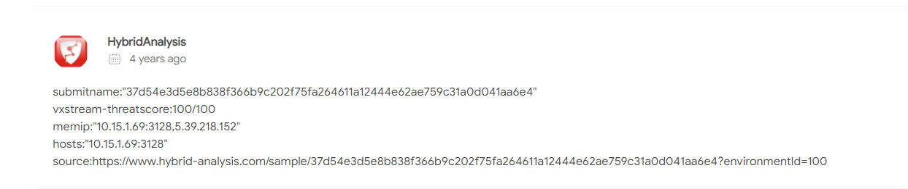

# 恶意软件后门分析

## 题目描述
---
> 工程师的笔记本上发现了恶意软件，经排查是一款著名针对工业领域的病毒，溯源分析远控样本文件，确认远程C&C连接地址。flag形式为 flag{}

## 题目来源
---
纵横网络靶场社区 https://game.fengtaisec.com/

## 主要知识点
---

## 附件
---

## 题目分值
---
10

## 部署方式
---

## 解题思路
---
将附件丢进云沙箱

5.39.218.152 是cc地址

## Flag
---
flag{5.39.218.152}

## 参考
---
