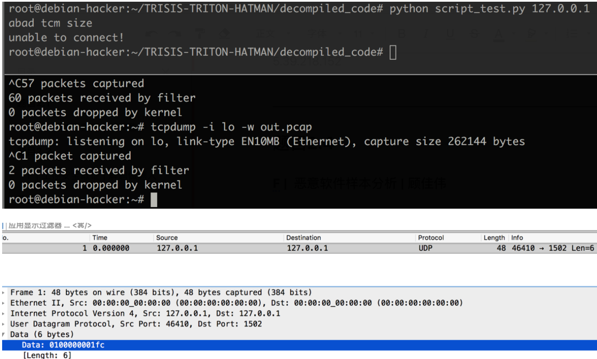

# 恶意软件样本分析

## 题目描述
---
> 某家工厂曾发生过宕机事件案例，为防止再发生此事找了技术人员分析攻击行为流量数据包后发现许多异常端口连接记录，最终得到了这个罪魁祸首的病毒样本，请分析病毒样本尝试复现事件案例帮助工厂实施应急演练,flag形式为 flag{}。

## 题目来源
---
纵横网络靶场社区 https://game.fengtaisec.com/

## 主要知识点
---

## 附件
---

## 题目分值
---
10

## 部署方式
---

## 解题思路
---
nc 监听 1502/udp 端口，然后把程序跑起来，用 tcpdump 抓包

## Flag
---
flag{0100000001fc}

## 参考
---
