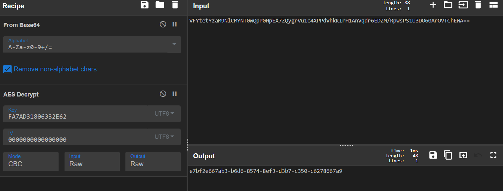

# 简单的工控固件逆向

## 题目描述
---
> 上位机上具有一个数据采集存储程序，检查登陆部分已经被抽取出来，你能获取到他的口令吗。flag形式为 flag{}

## 题目来源
---
纵横网络靶场社区 https://game.fengtaisec.com/

## 主要知识点
---


## 附件
---


## 题目分值
---
40

## 部署方式
---


## 解题思路
---

题目位c#编写。构造了一个vm再vm中实现了aes加密。找到密钥和IV然后解密比对的数据即可

```text
EncData ：VFYtetYzaM9NlCMYNT0wQpP0HpEX7ZQygrVu1c4XPPdVhkKIrH1AnVqdr6EDZM/RpwsPS1U3DO60ArOVTChEWA==
Key : FA7AD31806332E62
IV : 0000000000000000 
加密方式: AES-128-CBC PKCS7Padding 
```




## Flag
---

flag{e7bf2e667ab3-b6d6-8574-8ef3-d3b7-c350-c6278667a9}

## 参考
---
