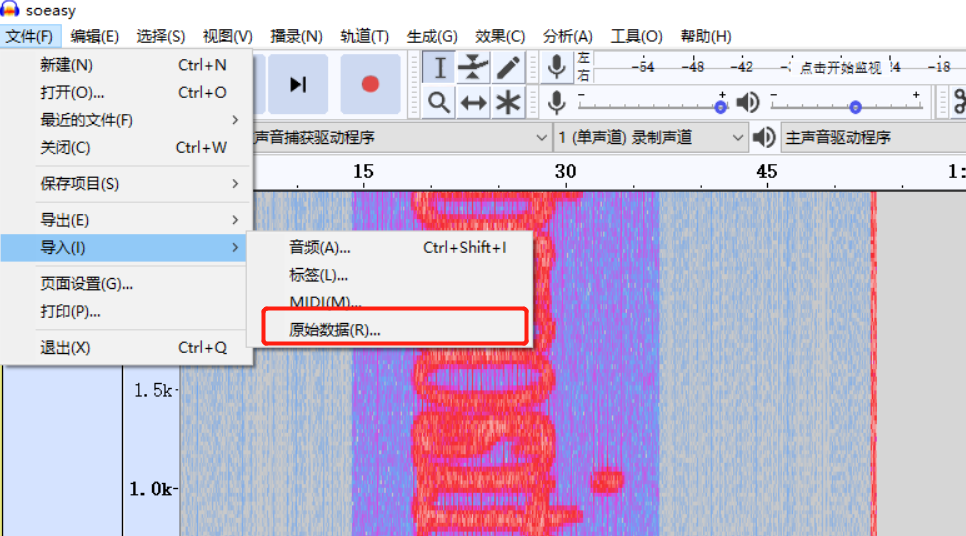

# 另一个隐藏的黑客

## 题目描述
---
> 根据情报得知在工控现场有黑客在对外传输无线信息，被我们捕获到。你能分析出来flag么?flag形式为 flag{}

## 题目来源
---
纵横网络靶场社区 https://game.fengtaisec.com/

## 主要知识点
---

## 附件
---

## 题目分值
---
40

## 部署方式
---

## 解题思路
---

使用`Audacity`导入文件，调整到频谱图看到flag

我也不知道别人是怎么看出来的

## Flag
---

flag{too simple too young}

## 参考
---
