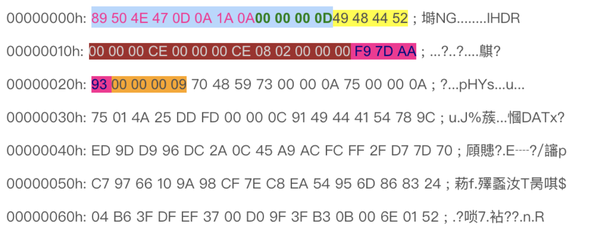

# 流密码

## 题目描述
---
> 流密码真的安全吗？请进行分析流密码中的flag。flag形式为 flag{}

## 题目来源
---
纵横网络靶场社区 https://game.fengtaisec.com/

## 主要知识点
---


## 附件
---


## 题目分值
---
50

## 部署方式
---


## 解题思路
---

根据附件名称`lfsr.png.encrypt`，可以得知是要求我们将使用了lfsr算法加密的png文件恢复。

PNG文件头如下




在一个正常的png图片中，前12字节一定是固定的: `89504E470D0A1A0A0000000D` 接着，我们取出加密后的png图片前12字节: `0C6746601FC907F586867B48` 对明文和密文进行按位异或，得到LFSR输出的密钥流 脚本如下：

```python
hexadecimalcontrast = {
        '0':'0000',
        '1':'0001',
        '2':'0010',
        '3':'0011',
        '4':'0100',
        '5':'0101',
        '6':'0110',
        '7':'0111',
        '8':'1000',
        '9':'1001',
        'a':'1010',
        'b':'1011',
        'c':'1100',
        'd':'1101',
        'e':'1110',
        'f':'1111',
        }

def Binxor(string1,string2):
    "If the length is different, only the short one is returned."
    strlen = 0
    xorstr = ""
    if len(string1) > len(string2):
        strlen = len(string2)
    else:
        strlen = len(string1)
    for i in range(strlen):
        if string1<i> == string2<i>:
            xorstr += '0'
        else:
            xorstr += '1'
    return xorstr

def BinToStr(strbin):
    "Turn the binary string to a ASCII string"
    strten = ""
    for i in range(len(strbin)//8):
        num = 0
        test = strbin[i*8:i*8+8]
        for j in range(8):
            num += int(test[j])*(2**(7-j))
        strten += chr(num)
    return strten

def Textxor(string,num):
    "A different or a string and number"
    xorstr = ""
    if int == type(num):
        for i in string:
            xorstr += chr(ord(i) ^ num)
        return xorstr
    else:
        return -1

def HexToBin(string):
    "Convert sixteen to binary"
    Binstring = ""
    string = string.lower()
    for i in string:
        try:
            Binstring += hexadecimalcontrast<i>
        except:
            return -1
    return Binstring

def StrToHex(string):
    "Converts a string to HEX"
    hexStr = ''
    for i in string:
        tmp = str(hex(ord(i)))
        if len(tmp) == 3:
            hexStr += tmp.replace('0x','0')
        else:
            hexStr += tmp.replace('0x','')
    return hexStr

def NumToBin(number):
    tmp = str(hex(number))
    hexStr = ''
    tmp = tmp.replace('0x','')
    hexStr = '0'*(2-len(tmp)) + tmp
    hexStr = HexToBin(hexStr)
    hexStr = hexStr[2:]
    return hexStr
    
if "__main__" == __name__:
    print(Binxor(HexToBin('89504E470D0A1A0A0000000D'),HexToBin('43AE212C403363C000E4FD68')))
```

我们的到了LFSR输出的密钥流： `100001010011011100001000001001110001001011000011000111011111111110000110100001100111101101000101` 但是我们现在并不知道度m为多少，因此我们需要从2开始爆破，一直到已知密钥流长度的1/2位。 脚本如下：

```python

```

## Flag
---


## 参考
---
https://www.t00ls.net/articles-49265.html