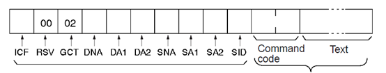
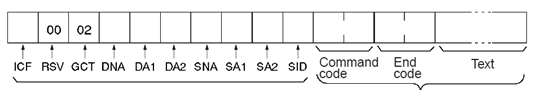
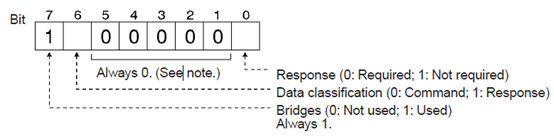
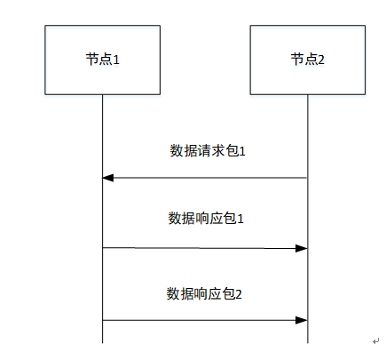

> 本文由 [简悦 SimpRead](http://ksria.com/simpread/) 转码， 原文地址 [www.freebuf.com](https://www.freebuf.com/articles/ics-articles/204513.html)

> 使用 FINS 指令可实现各种网络间的无缝通信，包括用于信息网络的 Ethernet（以太网），用于控制网络的 ControllerLink 和 SYSMAC LINK。

**FINS（factoryinterface network service）通信协议是欧姆龙公司开发的用于工业自动化控制网络的指令 / 响应系统。使用 FINS 指令可实现各种网络间的无缝通信，包括用于信息网络的 Ethernet（以太网），用于控制网络的 ControllerLink 和 SYSMAC LINK。通过编程发送 FINS 指令，上位机或 PLC 就能够读写另一个 PLC 数据区的内容，甚至控制其运行状态，从而简化了用户程序。FINS 协议支持工业以太网，这就为 OMRON PLC 与上位机以太网通信的实现提供了可能。**

**一、FINS** **报文格式**
-------------------

FINS 通信数据以 UDP/IP 包或 TCP/IP 的形式发送和接收包，默认通讯端口为 9600。通信过程中包含请求报文和响应报文，每个报文由 FINS 报文头和 FINS 请求帧 / 响应帧组成，报文具体格式如下：

_FINS 请求报文_

 

_FINS 响应报文_

当一个 FINS 命令发送时，一个 FINS 报文头将发送自动生成并附加，FINS 报文头格式说明如下：

### ICF

### RSV

RSV(预留) 总是 00 十六进制。这些位元被系统使用。不在响应中访问它们。

### GCT

当跨 8 个网络层与 CPU 单元通信时在 2.0 或更高版本中，设置 GCT(网关计数: 通过的桥的数量)通过)到 07 十六进制当发送一个鳍命令。否则，设置 GCT 到 02 十六进制 (见注) 时发送。当接收到鳍响应时，GCT 为为通过的每个桥 (网络) 和接收结果值。此值供系统使用。

### DNA

目的网络地址。在以下范围内指定 (十六进制)。

00: 本地网络

01 至 7F: 远程网络地址 (小数: 1 至 127)

### DA1

目的节点的地址。在以下范围内指定 (十六进制)：

00: 本地 PLC 内部通讯

01 ~ 20: 控制器链路网络节点地址 (1 ~ 32 位小数)

01 至 FE: 以太网 (1 至 254 十进制，以 ETN21 结尾的以太网单元)

FF: 广播传输

### DA2

目标单位地址。在以下范围内指定 (十六进制)：

00:CPU 单元

FE: 连接到网络的控制器链路单元或以太网单元

10 到 1F: CPU 总线单元

### SNA

源网络地址。在以下范围内指定 (十六进制)：

00: 本地网络

01 至 7F: 远程网络 (1 至 127 位小数)

### SA1

源节点的地址。在以下范围内指定 (十六进制)：

00: PLC 内部通讯

01 ~ 20: 控制器链路网络节点地址 (1 ~ 32 位小数)

01 至 FE: 以太网 (1 至 254 十进制，以 ETN21 结尾的以太网单元)

### SA2

源单位地址。在以下范围内指定 (十六进制)。

00:CPU 单元

10 到 1F: CPU 总线单元

### SID

服务 ID。用于标识生成传输的进程。设置 SID 到 00 到 FF 之间的任意数字。

FINS 请求帧由功能码 (四位十六进制) 和参数 (数据内容) 组成。命令代码是表示命令内容的 2 字节代码。fins 命令必须以 2 字节的命令代码开始。如果有同样是文本，它是在命令代码之后添加的。

FINS 响应帧由功能码 (四位十六进制)、结束码（篇幅有限就不展开了）和参数(文本) 组成。结束码是显示命令执行结果的 2 字节代码。(第一个字节显示一般类别，第二个字节显示详细结果。) 

**二、FINS** **功能码**
------------------

<table><colgroup><col width="19%"> <col width="19%"> <col width="20%"> <col width="20%"> </colgroup><thead><tr><th>类型</th><th>功能码</th><th>名称</th><th>功能</th><th>功能</th></tr></thead><tbody><tr><td rowspan="5">I/O 区读写</td><td>01</td><td>01</td><td>内存读取</td><td>读取连续 I/O 内存区域数据</td></tr><tr><td>01</td><td>02</td><td>内存写入</td><td>向连续 I/O 内存区</td></tr><tr><td>01</td><td>03</td><td>内存填充</td><td>向特定范围 I/O 内存区填充相同的数据</td></tr><tr><td>01</td><td>04</td><td>非连续内存读取</td><td>读取指定的非连续 I/O 内存区域数据</td></tr><tr><td>01</td><td>05</td><td>内存转移</td><td>将非连续内存区的</td></tr><tr><td rowspan="3">参数区读写</td><td>02</td><td>01</td><td>参数区读取</td><td>读取连续参数区内容</td></tr><tr><td>02</td><td>02</td><td>参数区写入</td><td>写入连续参数区内容</td></tr><tr><td>02</td><td>03</td><td>参数区填充</td><td>向特定范围参数区填充相同的内容</td></tr><tr><td rowspan="3">程序区读写</td><td>03</td><td>06</td><td>程序读取</td><td>读取 UM（用户内存）区</td></tr><tr><td>03</td><td>07</td><td>程序写入</td><td>写入 UM（用户内存）区</td></tr><tr><td>03</td><td>08</td><td>程序清除</td><td>清除 UM（用户内存）区</td></tr><tr><td rowspan="2">操作模式切换</td><td>04</td><td>01</td><td>运行</td><td>将 CPU 单元操作模式切换为运行或监视</td></tr><tr><td>04</td><td>02</td><td>停止</td><td>将 CPU 单元操作模式切换为编程</td></tr><tr><td rowspan="2">设备配置读取</td><td>05</td><td>01</td><td>CPU 单元数据读取</td><td>读取 CPU 单元数据</td></tr><tr><td>05</td><td>02</td><td>连接状态读取</td><td>读取对应地址的模块数量</td></tr><tr><td rowspan="2">状态读取</td><td>06</td><td>01</td><td>CPU 单元状态读取</td><td>读取 CPU 单元状态</td></tr><tr><td>06</td><td>20</td><td>循环时间读取</td><td>读取最大、最小和平均循环时间</td></tr><tr><td rowspan="2">时间数据读写</td><td>07</td><td>01</td><td>时钟读取</td><td>读取当前年、月、日、分、秒和星期几</td></tr><tr><td>07</td><td>02</td><td>时钟写入</td><td>改变当前年、月、日、分、秒和星期几</td></tr><tr><td>故障信息显示</td><td>09</td><td>20</td><td>信息读取 / 清除</td><td>读取和清除信息，读取故障和严重故障信息</td></tr><tr><td rowspan="3">访问控制权限</td><td>0C</td><td>01</td><td>获取访问权限</td><td>只要没有其它设备持有访问权限，则获得访问权限</td></tr><tr><td>0C</td><td>02</td><td>强制获取访问权限</td><td>即使有其它设备持有访问权限，仍获得访问权限</td></tr><tr><td>0C</td><td>03</td><td>释放访问权限</td><td>即使已经持有访问权限，仍释放访问权限</td></tr><tr><td rowspan="3">错误日志</td><td>21</td><td>01</td><td>清除错误</td><td>清除错误或报警</td></tr><tr><td>21</td><td>02</td><td>读取错误日志</td><td>读取错误日志</td></tr><tr><td>21</td><td>03</td><td>清除若无日志</td><td>清除错误日志指针</td></tr><tr><td rowspan="2">FINS 登入日志</td><td>21</td><td>40</td><td>FINS 登入日志读取</td><td>CPU 单元自动保存有执行过 FINS 登入命令的日志。这条命令读取此日志。</td></tr><tr><td>21</td><td>41</td><td>FINS 登入日志清除</td><td>清除 FINS 登入列表</td></tr><tr><td rowspan="12">文件内存</td><td>22</td><td>01</td><td>文件名读取</td><td>读取文件内存区数据</td></tr><tr><td>22</td><td>02</td><td>单个文件读取</td><td>从某个文件中的指定位置读取特定长度的文件数据</td></tr><tr><td>22</td><td>03</td><td>单个文件写入</td><td>从某个文件中的指定位置写入特定长度的文件数据</td></tr><tr><td>22</td><td>04</td><td>文件内存格式化</td><td>格式化文件内存</td></tr><tr><td>22</td><td>05</td><td>文件删除</td><td>从文件内存中删除指定文件</td></tr><tr><td>22</td><td>07</td><td>文件复制</td><td>在系统中将某些文件复制到其他位置</td></tr><tr><td>22</td><td>08</td><td>重命名文件</td><td>改变一个文件的名字</td></tr><tr><td>22</td><td>0A</td><td>内存区间数据转移 1</td><td>在 I/O 内存和文件内存间转移或比较数据</td></tr><tr><td>22</td><td>0B</td><td>内存区间数据转移 2</td><td>在参数区和文件内存间转移或比较数据</td></tr><tr><td>22</td><td>0C</td><td>内存区间数据转移 3</td><td>在用户内存和文件内存间转移或比较数据</td></tr><tr><td>22</td><td>15</td><td>创建 / 删除文件夹</td><td>创建或删除一个文件夹</td></tr><tr><td>22</td><td>20</td><td>存储盒转移（只针对 CP1H，CP1L CPU 单元）</td><td>在存储盒与 CPU 单元间转移和修改数据</td></tr><tr><td rowspan="2">调试</td><td>23</td><td>01</td><td>强制设置 / 重置</td><td>强制设置或重置位，或推出强制设置状态</td></tr><tr><td>23</td><td>02</td><td>强制设置 / 重置取消</td><td>取消所有强制设置或重置过的位</td></tr></tbody></table>

**三、FINS** **通信过程**
-------------------

以 FINS/UDP 为例，（FINS/TCP 通信过程更复杂，现有资料介绍的比较少，下次会仔细介绍）UDP/IP 是一种无连接的通信协议。当一个消息从一个节点发送到另一个节点，这两个节点具有相等的关系，两者之间没有明显的联系。如果使用 TCP 就像打电话一样呼叫时，UDP 更像是手工传递备忘录。虽然 UDP 协议速度快，数据通信不如 TCP 可靠。特别是，当发送大量涉及重要路由的数据时，用户必须在应用程序中编写度量 (如重试)，以便提高可靠性。通信过程如下图所示。

 *** 本文作者：工控安全 123，转载请注明来自 FreeBuf.COM**