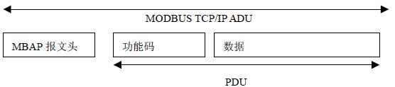

> 本文由 [简悦 SimpRead](http://ksria.com/simpread/) 转码， 原文地址 [blog.csdn.net](https://blog.csdn.net/sgmcumt/article/details/87435191)

### 文章目录

*   *   [1 ModbusTcp](#1_ModbusTcp_1)
    *   *   [1.1 MBAP 报文](#11_MBAP_6)
        *   [1.2 MODBUS 请求的生成](#12_MODBUS_30)
        *   [1.3 MODBUS 响应的生成](#13_MODBUS_85)
    *   [2 Modbus 介绍](#2_Modbus_148)
    *   *   [2.1 MODBUS 数据模型](#21_MODBUS_150)
        *   [2.2 公共功能码定义](#22__185)
    *   [3 功能码描述](#3__281)
    *   *   [3.1 01(0x01) 功能码 --- 读线圈](#31_010x01_285)
        *   [3.2 02(0x02) 功能码 --- 读离散量输入](#32__020x02_370)
        *   [3.3 03(0x03) 功能码 --- 读保持寄存器](#33__030x03_452)
        *   [3.4 04(0x04) 功能码 --- 读输入寄存器](#34__040x04_540)
        *   [3.5 05(0x05) 功能码 --- 写单个线圈](#35__050x05_614)
        *   [3.6 06(0x06) 功能码 --- 写单个寄存器](#36__060x06_681)
        *   [3.7 15(0x0F) 功能码 --- 写多个线圈](#37__150x0F_752)
        *   [3.8 16(0x10) 功能码 --- 写多个寄存器](#38__160x10_848)

1 ModbusTcp
-----------

简单的理解一下 Modbus TCP/IP 协议的内容，就是去掉了 modbus 协议本身的 CRC 校验，增加了 MBAP 报文头。TCP/IP 上的 MODBUS 的请求 / 响应如下图所示：  

### 1.1 MBAP 报文

首先来看一下，MBAP 报文头都包括了哪些信息和内容

<table><thead><tr><th>域</th><th>长度</th><th>描述</th><th>客户机</th><th>服务器</th></tr></thead><tbody><tr><td>事务元标识符</td><td>2 个字节</td><td>MODBUS 请求 / 响应事务处理的识别码</td><td>客户机启动</td><td>服务器从接收的请求中重新复制</td></tr><tr><td>协议标识符</td><td>2 个字节</td><td>0=MODBUS 协议</td><td>客户机启动</td><td>服务器从接收的请求中重新复制</td></tr><tr><td>长度</td><td>2 个字节</td><td>以下字节的数量</td><td>客户机启动（请求）</td><td>服务器（响应）启动</td></tr><tr><td>单元标识符</td><td>1 个字节</td><td>串行链路或其它总线上连接的远程从站的识别码</td><td>客户机启动</td><td>服务器从接收的请求中重新复制</td></tr></tbody></table>

**事务元标识符（2 个字节**）：用于事务处理配对。在响应中，MODBUS 服务器复制请求的事务处理标识符。这里在以太网传输中存在一个问题，就是先发后至，我们可以利用这个事务处理标识符做一个 TCP 序列号，来防止这种情况所造成的数据收发错乱（这里我们先不讨论这种情况，这个事务处理标识符我们统一使用 0x00，0x01）  
**协议标识符（2 个字节）**：modbus 协议标识符为 0x00，0x00  
**长度（2 个字节）**：长度域是下一个域的字节数，包括单元标识符和数据域。  
**单元标识符（1 个字节）**：该设备的编号。（可以使用 PLC 的 IP 地址标识）。

在 MODBUS MODBUS + 串行链路子网中对设备进行寻址时，这个域是标识设备地址。在这种情况下，“Unit Identifier” 携带一个远端设备的 MODBUS 从站地址：

*   如果 MODBUS 服务器连接到 MODBUS + 或 MODBUS 串行链路子网，并通过一个桥或网关配置地址这个服务器，MODBUS 单元标识符对识别连接到网桥或网关后的子网的从站设备是必需的。目的 IP 地址识别了网桥本身的地址，而网桥则使用 MODBUS 单元标识符将请求转交给正确的从站设备。
*   分配串行链路上 MODBUS 从站设备地址为 1～247（10 进制），地址 0 作为广播地址。  
    **对 TCP/IP 来说，利用 IP 地址寻址 MODBUS 服务器；因此，MODBUS 单元标识符是无用的。必需使用值 0xFF。**
*   当对直接连接到 TCP/IP 网络上的 MODBUS 服务器寻址时，建议不要在 “单元标识符” 域使用有效的 MODBUS 从站地址。在一个自动系统中重新分配 IP 地址的情况下，并且如果以前分配给 MODBUS 服务器的 IP 地址又被指配给网关，使用一个有效的从站地址可能会由于网关的路由不畅而引起麻烦。使用无效的从站地址，网关仅是简单地废弃 MODBUD PDU，而不会有任何问题。建议：在采用 0xFF 作为 “单元标识符” 的无效值。  
    **注：0 也可以用作与 MODBUS/TCP 设备直接通信。**  
    

### 1.2 MODBUS 请求的生成

在收到来自用户应用的需求后，客户端必须生成一个 MODBUS 请求，并发送到 TCP 管理。下表显示 MODBUS 请求 ADU 编码：

<table><tbody><tr><th>类型</th><th>描述</th><th>字节大小</th><th>实例</th></tr><tr><td rowspan="5">MBAP 报文头</td><td>事务处理标识符 Hi</td><td>1</td><td>0x15</td></tr><tr><td>事务处理标识符 Lo</td><td>1</td><td>0x01</td></tr><tr><td>协议标识符</td><td>2</td><td>0x0000</td></tr><tr><td>长度</td><td>2</td><td>0x0006</td></tr><tr><td>单元标识符</td><td>1</td><td>0xFF</td></tr><tr><td rowspan="3">MODBUS 请求</td><td>功能码</td><td>1</td><td>0x03</td></tr><tr><td>起始地址</td><td>2</td><td>0x0005</td></tr><tr><td>寄存器数量</td><td>2</td><td>0x0001</td></tr></tbody></table>

### 1.3 MODBUS 响应的生成

一旦处理请求，MODBUS 服务器必须使用适当的 MODBUS 服务器事务处理生成一个响应，并且必须将响应发送到 TCP 管理组件。

根据处理结果，可以生成两类响应：

*   肯定的 MODBUS 响应：
    *   响应功能码 = 请求功能码
*   MODBUS 异常响应：
    *   目的是为客户机提供与处理过程检测到的错误相关的信息
    *   响应功能码 = 请求功能码 + 0x80
    *   提供异常码来表明出错的原因。

<table><tbody><tr><th width="15%" align="center">异常码</th><th width="20%">MODBUS 名称</th><th>备注</th></tr><tr><td align="center">01</td><td>非法的功能码</td><td>服务器不了解功能码</td></tr><tr><td align="center">02</td><td>非法的数据地址</td><td>与请求有关</td></tr><tr><td align="center">03</td><td>非法的数据值</td><td>与请求有关</td></tr><tr><td align="center">04</td><td>服务器故障</td><td>在执行过程中，服务器故障</td></tr><tr><td align="center">05</td><td>确认</td><td>服务器接受服务调用，但是需要相对长的时间完成服务。因此，服务器仅返回一个服务调用接收的确认。</td></tr><tr><td align="center">06</td><td>服务器繁忙</td><td>服务器不能接受 MODBUS 请求 PDU。客户应用由责任决定是否和何时重发请求。</td></tr><tr><td align="center">0A</td><td>网关故障</td><td>网关路经是无效的。</td></tr><tr><td align="center">0B</td><td>网关故障</td><td>目标设备没有响应。网关生成这个异常信息。</td></tr></tbody></table>

通过上面的两步，一个 Modbus TCP 的客户端连接已经建立起来了，下面我们就来分析 Modbus TCP 协议的具体内容与实现方式了。

2 Modbus 介绍
-----------

### 2.1 MODBUS 数据模型

<table><tbody><tr><td>基本表格</td><td>对象类型</td><td>访问类型</td><td>内容</td></tr><tr></tr><tr><td>离散量输入</td><td>单个比特</td><td>只读</td><td>I/O 系统提供这种类型数据</td></tr><tr></tr><tr><td>线圈</td><td>单个比特</td><td>读写</td><td>通过应用程序改变这种类型数据</td></tr><tr></tr><tr><td>输入寄存器</td><td>16 比特字</td><td>只读</td><td>I/O 系统提供这种类型数据</td></tr><tr></tr><tr><td>保持寄存器</td><td>16 比特字</td><td>读写</td><td>通过应用程序改变这种类型数据</td></tr><tr></tr></tbody></table>

### 2.2 公共功能码定义

<table><tbody><tr><td rowspan="2" colspan="3"></td><td colspan="2">功能码</td><td></td></tr><tr><td>码</td><td>子码</td><td>十六进制</td></tr><tr><td rowspan="5">比特访问</td></tr><tr><td>物理离散量输入</td><td>读输入离散量</td><td>02</td><td></td><td>02</td></tr><tr><td rowspan="3">内部比特或物理线圈</td><td>读线圈</td><td>01</td><td></td><td>01</td></tr><tr><td>写单个线圈</td><td>05</td><td></td><td>05</td></tr><tr><td>写多个线圈</td><td>15</td><td></td><td>0F</td></tr><tr><td rowspan="6">16 比特访问</td><td>输入寄存器</td><td>读输入寄存器</td><td>04</td><td></td><td>04</td></tr><tr><td rowspan="5">内部存储器或物理输出存储器</td><td>读多个寄存器</td><td>03</td><td></td><td>03</td></tr><tr><td>写单个寄存器</td><td>06</td><td></td><td>06</td></tr><tr><td>写多个寄存器</td><td>16</td><td></td><td>10</td></tr><tr><td>读 / 写多个寄存器</td><td>23</td><td></td><td>17</td></tr><tr><td>屏蔽写寄存器</td><td>22</td><td></td><td>16</td></tr><tr><td rowspan="2" colspan="2">文件记录访问</td><td>读文件记录</td><td>20</td><td>6</td><td>14</td></tr><tr><td>写文件记录</td><td>21</td><td>6</td><td>15</td></tr></tbody></table>

3 功能码描述
-------

我们直接用实例来说明。

### 3.1 01(0x01) 功能码—读线圈

在一个远程设备中，使用该功能码读取线圈的 1 至 2000 连续状态。请求 PDU 详细说明了起始地址，即指定的第一个线圈地址和线圈编号。从零开始寻址线圈。因此寻址线圈 1-16 为 0-15。

根据数据域的每个比特将响应报文中的线圈分成为一个线圈。指示状态为 1= ON 和 0= OFF。

第一个数据字节的 LSB（最低有效位）包括在询问中寻址的输出。其它线圈依次类推，一直到这个字节的高位端为止，并在后续字节中从低位到高位的顺序。

如果返回的输出数量不是八的倍数，将用零填充最后数据字节中的剩余比特（一直到字节的高位端）。字节数量域说明了数据的完整字节数。

**请求与响应格式**  
**请求 PDU**

<table><thead><tr><th>功能码</th><th>1 个字节</th><th>0x01</th></tr></thead><tbody><tr><td>起始地址</td><td>2 个字节</td><td>0x0000 至 0xFFFF</td></tr><tr><td>线圈数量</td><td>2 个字节</td><td>1 至 2000（0x7D0）</td></tr></tbody></table>

**响应 PDU**

<table><thead><tr><th>功能码</th><th>1 个字节</th><th>0x01</th></tr></thead><tbody><tr><td>字节数</td><td>1 个字节</td><td>N*</td></tr><tr><td>线圈状态</td><td>N 个字节</td><td>n=N 或 N+1</td></tr></tbody></table>

注：*N = 输出数量 / 8，如果余数不等于 0，那么 N=N+1

**错误**

<table><thead><tr><th>差错码</th><th>1 个字节</th><th>功能码 + 0x80</th></tr></thead><tbody><tr><td>异常码</td><td>1 个字节</td><td>01 或 02 或 03 或 04</td></tr></tbody></table>

这是一个请求读离散量输出 20-38 的实例：  

<table><tbody><tr><td colspan="2">请求</td><td colspan="2">响应</td></tr><tr><td>域名</td><td>十六进制</td><td>域名</td><td>十六进制</td></tr><tr><td>功能</td><td>01</td><td>功能</td><td>01</td></tr><tr><td>起始地址 Hi</td><td>00</td><td>字节数</td><td>03</td></tr><tr><td>起始地址 Lo</td><td>13</td><td>输出状态 27-20</td><td>CD</td></tr><tr><td>输出数量 Hi</td><td>00</td><td>输出状态 35-28</td><td>6B</td></tr><tr><td>输出数量 Lo</td><td>13</td><td>输出状态 38-36</td><td>05</td></tr></tbody></table>

将输出 27-20 的状态表示为十六进制字节值 CD，或二进制 1100 1101。输出 27 是这个字节的 MSB，输出 20 是 LSB。  
通常，将一个字节内的比特表示为 MSB 位于左侧，LSB 位于右侧。第一字节的输出从左至右为 27 至 20。下一个字节的输出从左到右为 35 至 28。当串行发射比特时，从 LSB 向 MSB 传输：20 . . .27、28 . . . 35 等等。  
在最后的数据字节中，将输出状态 38-36 表示为十六进制字节值 05，或二进制 0000 0101。输出 38 是左侧第六个比特位置，输出 36 是这个字节的 LSB。用零填充五个剩余高位比特。

**注：用零填充五个剩余比特（一直到高位端）。**

### 3.2 02(0x02) 功能码—读离散量输入

在一个远程设备中，使用该功能码读取离散量输入的 1 至 2000 连续状态。请求 PDU 详细说明了起始地址，即指定的第一个输入地址和输入编号。从零开始寻址输入。因此寻址输入 1-16 为 0-15。

根据数据域的每个比特将响应报文中的离散量输入分成为一个输入。指示状态为 1= ON 和 0=OFF。第一个数据字节的 LSB（最低有效位）包括在询问中寻址的输入。其它输入依次类推，一直  
到这个字节的高位端为止，并在后续字节中从低位到高位的顺序。

如果返回的输入数量不是八的倍数，将用零填充最后数据字节中的剩余比特（一直到字节的高位端）。字节数量域说明了数据的完整字节数。

**请求 PDU**

<table><thead><tr><th>功能码</th><th>1 个字节</th><th>0x02</th></tr></thead><tbody><tr><td>起始地址</td><td>2 个字节</td><td>0x0000 至 0xFFFF</td></tr><tr><td>线圈数量</td><td>2 个字节</td><td>1 至 2000（0x7D0）</td></tr></tbody></table>

**响应 PDU**

<table><thead><tr><th>功能码</th><th>1 个字节</th><th>0x82</th></tr></thead><tbody><tr><td>字节数</td><td>1 个字节</td><td>N*</td></tr><tr><td>线圈状态</td><td>N*x1 个字节</td><td></td></tr></tbody></table>

注：*N = 输出数量 / 8，如果余数不等于 0，那么 N=N+1

**错误**

<table><thead><tr><th>差错码</th><th>1 个字节</th><th>功能码 + 0x82</th></tr></thead><tbody><tr><td>异常码</td><td>1 个字节</td><td>01 或 02 或 03 或 04</td></tr></tbody></table>

这是一个请求读离散量输入 197-218 的实例：  

<table><tbody><tr><td colspan="2">请求</td><td colspan="2">响应</td></tr><tr><td>域名</td><td>十六进制</td><td>域名</td><td>十六进制</td></tr><tr><td>功能</td><td>02</td><td>功能</td><td>02</td></tr><tr><td>起始地址 Hi</td><td>00</td><td>字节数</td><td>03</td></tr><tr><td>起始地址 Lo</td><td>C4</td><td>输出状态 204-197</td><td>AC</td></tr><tr><td>输出数量 Hi</td><td>00</td><td>输出状态 212-205</td><td>DB</td></tr><tr><td>输出数量 Lo</td><td>16</td><td>输出状态 218-213</td><td>35</td></tr></tbody></table>

将离散量输入状态 204-197 表示为十六进制字节值 AC，或二进制 1010 1100。输入 204 是这个字节的 MSB，输入 197 是这个字节的 LSB。

将离散量输入状态 218-213 表示为十六进制字节值 35，或二进制 0011 0101。输入 218 位于左侧第 3 比特，输入 213 是 LSB。

**注：用零填充 2 个剩余比特（一直到高位端）。**

### 3.3 03(0x03) 功能码—读保持寄存器

在一个远程设备中，使用该功能码读取保持寄存器连续块的内容。请求 PDU 说明了起始寄存器地址和寄存器数量。从零开始寻址寄存器。因此，**寻址寄存器 1-16 为 0-15**。  
将响应报文中的寄存器数据分成每个寄存器有两字节，在每个字节中直接地调整二进制内容。  
对于每个寄存器，第一个字节包括高位比特，并且第二个字节包括低位比特。

**请求**

<table><thead><tr><th>功能码</th><th>1 个字节</th><th>0x03</th></tr></thead><tbody><tr><td>起始地址</td><td>2 个字节</td><td>0x0000 至 0xFFFF</td></tr><tr><td>寄存器数量</td><td>2 个字节</td><td>1 至 125（0x7D）</td></tr></tbody></table>

**响应**

<table><thead><tr><th>功能码</th><th>1 个字节</th><th>0x03</th></tr></thead><tbody><tr><td>字节数</td><td>1 个字节</td><td>2xN*</td></tr><tr><td>寄存器值</td><td>N*x2 个字节</td><td></td></tr></tbody></table>

注：*N = 输出数量 / 8，如果余数不等于 0，那么 N=N+1

**错误**

<table><thead><tr><th>差错码</th><th>1 个字节</th><th>0x83</th></tr></thead><tbody><tr><td>异常码</td><td>1 个字节</td><td>01 或 02 或 03 或 04</td></tr></tbody></table>

这是一个请求读保持寄存器 108-110 的实例：  

<table><tbody><tr><td colspan="2">请求</td><td colspan="2">响应</td></tr><tr><td>域名</td><td>十六进制</td><td>域名</td><td>十六进制</td></tr><tr><td>功能</td><td>03</td><td>功能</td><td>03</td></tr><tr><td>高起始地址</td><td>00</td><td>字节数</td><td>06</td></tr><tr><td>低起始地址</td><td>6B</td><td>寄存器值 Hi(108)</td><td>02</td></tr><tr><td>高寄存器编号</td><td>00</td><td>寄存器值 Lo(108)</td><td>2B</td></tr><tr><td>低寄存器编号</td><td>03</td><td>寄存器值 Hi(109)</td><td>00</td></tr><tr><td rowspan="4" colspan="2"></td><td>寄存器值 Lo(109)</td><td>00</td></tr><tr><td>寄存器值 Hi(110)</td><td>00</td></tr><tr><td>寄存器值 Lo(110)</td><td>64</td></tr></tbody></table>

将寄存器 108 的内容表示为两个十六进制字节值 02 2B，或十进制 555。将寄存器 109-110 的内容分别表示为十六进制 00 00 和 00 64，或十进制 0 和 100。

### 3.4 04(0x04) 功能码—读输入寄存器

在一个远程设备中，使用该功能码读取 1 至大约 125 的连续输入寄存器。请求 PDU 说明了起始地址和寄存器数量。从零开始寻址寄存器。因此，**寻址输入寄存器 1-16 为 0-15**。  
将响应报文中的寄存器数据分成每个寄存器为两字节，在每个字节中直接地调整二进制内容。  
对于每个寄存器，第一个字节包括高位比特，并且第二个字节包括低位比特。

**请求**

<table><thead><tr><th>功能码</th><th>1 个字节</th><th>0x04</th></tr></thead><tbody><tr><td>起始地址</td><td>2 个字节</td><td>0x0000 至 0xFFFF</td></tr><tr><td>寄存器数量</td><td>2 个字节</td><td>0x0000 至 0x007D</td></tr></tbody></table>

**响应**

<table><thead><tr><th>功能码</th><th>1 个字节</th><th>0x04</th></tr></thead><tbody><tr><td>字节数</td><td>1 个字节</td><td>2xN*</td></tr><tr><td>寄存器值</td><td>N*x2 个字节</td><td></td></tr></tbody></table>

注：*N = 输入寄存器的数量

**错误**

<table><thead><tr><th>差错码</th><th>1 个字节</th><th>0x84</th></tr></thead><tbody><tr><td>异常码</td><td>1 个字节</td><td>01 或 02 或 03 或 04</td></tr></tbody></table>

这是一个请求读输入寄存器 9 的实例：

<table><tbody><tr><td colspan="2">请求</td><td colspan="2">响应</td></tr><tr><td>域名</td><td>十六进制</td><td>域名</td><td>十六进制</td></tr><tr><td>功能</td><td>04</td><td>功能</td><td>04</td></tr><tr><td>起始地址 Hi</td><td>00</td><td>字节数</td><td>02</td></tr><tr><td>起始地址 Lo</td><td>08</td><td>输入寄存器值 Hi(9)</td><td>00</td></tr><tr><td>输入寄存器数量 Hi</td><td>00</td><td>输入寄存器值 Lo(9)</td><td>0A</td></tr><tr><td>输入寄存器 Lo</td><td>01</td><td colspan="2"></td></tr></tbody></table>

将输入寄存器 9 的内容表示为两个十六进制字节值 00 0A，或十进制 10。

### 3.5 05(0x05) 功能码—写单个线圈

在一个远程设备上，使用该功能码写单个输出为 ON 或 OFF。  
请求数据域中的常量说明请求的 ON/OFF 状态。十六进制值 FF 00 请求输出为 ON。十六进制值 00 00 请求输出为 OFF。其它所有值均是非法的，并且对输出不起作用。  
请求 PDU 说明了强制的线圈地址。从零开始寻址线圈。因此，寻址线圈 1 为 0。线圈值域的常量说明请求的 ON/OFF 状态。十六进制值 0XFF00 请求线圈为 ON。十六进制值 0X0000 请求线圈为  
OFF。其它所有值均为非法的，并且对线圈不起作用。  
正常响应是请求的应答，在写入线圈状态之后返回这个正常响应。

**请求**

<table><thead><tr><th>功能码</th><th>1 个字节</th><th>0x05</th></tr></thead><tbody><tr><td>输出地址</td><td>2 个字节</td><td>0x0000 至 0xFFFF</td></tr><tr><td>输出值</td><td>2 个字节</td><td>0x0000 至 0xFF00？</td></tr></tbody></table>

**响应**

<table><thead><tr><th>功能码</th><th>1 个字节</th><th>0x05</th></tr></thead><tbody><tr><td>输出地址</td><td>2 个字节</td><td>0x0000 至 0xFFFF</td></tr><tr><td>输出值</td><td>2 个字节</td><td>0x0000 至 0xFF00</td></tr></tbody></table>

**错误**

<table><thead><tr><th>差错码</th><th>1 个字节</th><th>0x85</th></tr></thead><tbody><tr><td>异常码</td><td>1 个字节</td><td>01 或 02 或 03 或 04</td></tr></tbody></table>

这是一个请求写线圈 173 为 ON 的实例：

<table><tbody><tr><td colspan="2">请求</td><td colspan="2">响应</td></tr><tr><td>域名</td><td>十六进制</td><td>域名</td><td>十六进制</td></tr><tr><td>功能</td><td>05</td><td>功能</td><td>05</td></tr><tr><td>输出地址 Hi</td><td>00</td><td>输出地址 Hi</td><td>00</td></tr><tr><td>输出地址 Lo</td><td>AC</td><td>输出地址 Lo</td><td>AC</td></tr><tr><td>输出值 Lo</td><td>00</td><td>输出值 Lo</td><td>00</td></tr></tbody></table>

### 3.6 06(0x06) 功能码—写单个寄存器

在一个远程设备中，使用该功能码写单个保持寄存器。  
请求 PDU 说明了被写入寄存器的地址。从零开始寻址寄存器。因此，寻址寄存器 1 为 0。  
正常响应是请求的应答，在写入寄存器内容之后返回这个正常响应。

**请求**

<table><thead><tr><th>功能码</th><th>1 个字节</th><th>0x06</th></tr></thead><tbody><tr><td>寄存器地址</td><td>2 个字节</td><td>0x0000 至 0xFFFF</td></tr><tr><td>寄存器值</td><td>2 个字节</td><td>0x0000 至 0xFFFF</td></tr></tbody></table>

**响应**

<table><thead><tr><th>功能码</th><th>1 个字节</th><th>0x06</th></tr></thead><tbody><tr><td>寄存器地址</td><td>2 个字节</td><td>0x0000 至 0xFFFF</td></tr><tr><td>寄存器值</td><td>N*x2 个字节</td><td>0x0000 至 0xFFFF</td></tr></tbody></table>

**错误**

<table><thead><tr><th>差错码</th><th>1 个字节</th><th>0x86</th></tr></thead><tbody><tr><td>异常码</td><td>1 个字节</td><td>01 或 02 或 03 或 04</td></tr></tbody></table>

这是一个请求将十六进制 00 03 写入寄存器 2 的实例：

<table><tbody><tr><td colspan="2">请求</td><td colspan="2">响应</td></tr><tr><td>域名</td><td>十六进制</td><td>域名</td><td>十六进制</td></tr><tr><td>功能</td><td>06</td><td>功能</td><td>06</td></tr><tr><td>寄存器地址 Hi</td><td>00</td><td>输出地址 Hi</td><td>00</td></tr><tr><td>寄存器地址 Lo</td><td>01</td><td>输出地址 Lo</td><td>01</td></tr><tr><td>寄存器值 Hi</td><td>00</td><td>输出值 Hi</td><td>00</td></tr><tr><td>寄存器值 Lo</td><td>03</td><td>输出值 Hi</td><td>03</td></tr></tbody></table>

### 3.7 15(0x0F) 功能码—写多个线圈

在一个远程设备中，使用该功能码强制线圈序列中的每个线圈为 ON 或 OFF。请求 PDU 说明了强制的线圈参考。从零开始寻址线圈。因此，寻址线圈 1 为 0。  
请求数据域的内容说明了被请求的 ON/OFF 状态。域比特位置中的逻辑 “1” 请求相应输出为 ON。域比特位置中的逻辑 “0” 请求相应输出为 OFF。  
正常响应返回功能码、起始地址和强制的线圈数量。

**请求 PDU**

<table><thead><tr><th>功能码</th><th>1 个字节</th><th>0x0F</th></tr></thead><tbody><tr><td>起始地址</td><td>2 个字节</td><td>0x0000 至 0xFFFF</td></tr><tr><td>输出数量</td><td>2 个字节</td><td>0x0001 至 0x07B0</td></tr><tr><td>字节数</td><td>1 个字节</td><td>N*</td></tr><tr><td>输出值</td><td>N*X1 个字节</td><td></td></tr></tbody></table>

注：*N = 输出数量 / 8，如果余数不等于 0，那么 N=N+1

**响应 PDU**

<table><thead><tr><th>功能码</th><th>1 个字节</th><th>0x0F</th></tr></thead><tbody><tr><td>起始地址</td><td>2 个字节</td><td>0x0000 至 0xFFFF</td></tr><tr><td>输出数量</td><td>2 个字节</td><td>0x0001 至 0x07B0</td></tr></tbody></table>

**错误**

<table><thead><tr><th>差错码</th><th>1 个字节</th><th>0x8F</th></tr></thead><tbody><tr><td>异常码</td><td>1 个字节</td><td>01 或 02 或 03 或 04</td></tr></tbody></table>

这是一个请求从线圈 20 开始写入 10 个线圈的实例：

请求的数据内容为两个字节：十六进制 CD 01 (二进制 1100 1101 0000 0001)。使用下列方法，二进制比特对应输出。

<table><thead><tr><th><strong>比特</strong></th><th>1</th><th>1</th><th>0</th><th>0</th><th>1</th><th>1</th><th>0</th><th>1</th><th>0</th><th>0</th><th>0</th><th>0</th><th>0</th><th>0</th><th>0</th><th>1</th></tr></thead><tbody><tr><td><strong>输出</strong></td><td>27</td><td>26</td><td>25</td><td>24</td><td>23</td><td>22</td><td>21</td><td>20</td><td>–</td><td>–</td><td>–</td><td>–</td><td>–</td><td>–</td><td>29</td><td>28</td></tr></tbody></table>

传输的第一字节 (十六进制 CD) 寻址为输出 27-20，在这种设置中，最低有效比特寻址为最低输出（20）。  
传输的下一字节 (十六进制 01) 寻址为输出 29-28，在这种设置中，最低有效比特寻址为最低输出（28）。  
应该用零填充最后数据字节中的未使用比特。

<table><tbody><tr><td colspan="2">请求</td><td colspan="2">响应</td></tr><tr><td>域名</td><td>十六进制</td><td>域名</td><td>十六进制</td></tr><tr><td>功能</td><td>0F</td><td>功能</td><td>0F</td></tr><tr><td>起始地址 Hi</td><td>00</td><td>起始地址 Hi</td><td>00</td></tr><tr><td>起始地址 Lo</td><td>13</td><td>起始地址 Lo</td><td>13</td></tr><tr><td>输出数量 Hi</td><td>00</td><td>输出数量 Hi</td><td>00</td></tr><tr><td>输出数量 Lo</td><td>0A</td><td>输出数量 Lo</td><td>0A</td></tr><tr><td>字节数</td><td>02</td><td rowspan="3" colspan="2"></td></tr><tr><td>输出值 Hi</td><td>CD</td></tr><tr><td>输出数量 Lo</td><td>01</td></tr></tbody></table>

### 3.8 16(0x10) 功能码—写多个寄存器

在一个远程设备中，使用该功能码写连续寄存器块 (1 至约 120 个寄存器)。  
在请求数据域中说明了请求写入的值。每个寄存器将数据分成两字节。  
正常响应返回功能码、起始地址和被写入寄存器的数量。

**请求**

<table><thead><tr><th>功能码</th><th>1 个字节</th><th>0x10</th></tr></thead><tbody><tr><td>起始地址</td><td>2 个字节</td><td>0x0000 至 0xFFFF</td></tr><tr><td>寄存器数量</td><td>2 个字节</td><td>0x0001 至 0x0078</td></tr><tr><td>字节数</td><td>1 个字节</td><td>2xN*</td></tr><tr><td>寄存器值</td><td>N*x2 个字节</td><td></td></tr></tbody></table>

注：*N = 寄存器的数量

**响应**

<table><thead><tr><th>功能码</th><th>1 个字节</th><th>0x04</th></tr></thead><tbody><tr><td>起始地址</td><td>2 个字节</td><td>0x0000 至 0xFFFF</td></tr><tr><td>寄存器数量</td><td>2 个字节</td><td>1 至 123(0x7B)</td></tr></tbody></table>

**错误**

<table><thead><tr><th>差错码</th><th>1 个字节</th><th>0x90</th></tr></thead><tbody><tr><td>异常码</td><td>1 个字节</td><td>01 或 02 或 03 或 04</td></tr></tbody></table>

这是一个请求将十六进制 00 0A 和 01 02 写入以 2 开始的两个寄存器的实例：

<table><tbody><tr><td colspan="2">请求</td><td colspan="2">响应</td></tr><tr><td>域名</td><td>十六进制</td><td>域名</td><td>十六进制</td></tr><tr><td>功能</td><td>10</td><td>功能</td><td>10</td></tr><tr><td>起始地址 Hi</td><td>00</td><td>起始地址 Hi</td><td>00</td></tr><tr><td>起始地址 Lo</td><td>01</td><td>起始地址 Lo</td><td>01</td></tr><tr><td>寄存器数量 Hi</td><td>00</td><td>寄存器数量 Hi</td><td>00</td></tr><tr><td>寄存器数量 Lo</td><td>02</td><td>寄存器数量 Lo</td><td>02</td></tr><tr><td>字节数</td><td>04</td><td rowspan="5" colspan="2"></td></tr><tr><td>寄存器值 Hi</td><td>00</td></tr><tr><td>寄存器值 Lo</td><td>0A</td></tr><tr><td>寄存器值 Hi</td><td>01</td></tr><tr><td>寄存器值 Lo</td><td>02</td></tr></tbody></table>