> 本文由 [简悦 SimpRead](http://ksria.com/simpread/) 转码， 原文地址 [www.cnblogs.com](https://www.cnblogs.com/Db2k/p/12935705.html)

**阅读目录**

*   [前言 – Fins 欧姆龙这个协议网上极少有相关的模拟器、Tcp 的这一块倒是有但是 Udp 的基本都是不可用](#_label0)
*   [一、Read（TCP）](#_label1)
*   [二、读取控制器状态](#_label2)
*   [三、读周期时间](#_label3)
*   [四、看一下 fins 的连接吧](#_label4)
*    [五、写文件](#_label5)
*   [六、Read（UDP）](#_label6)

[回到顶部](#_labelTop)

### 前言 – Fins 欧姆龙这个协议网上极少有相关的模拟器、Tcp 的这一块倒是有但是 Udp 的基本都是不可用

1、 Fins 协议结构也很简单 协议分为两种 一种 tcp 一种 udp

2、 Tcp 比 Udp 的报文会多一层 tcp 的 head 头部

3、 Udp 回应报文在 Wireshark 中是解析不到（因为他按照 UDP 的格式去解那指定是解不到）

好长时间没有更新过博客了、也比较懒 = = 。

[回到顶部](#_labelTop)

### 一、Read（TCP）

#### 发包

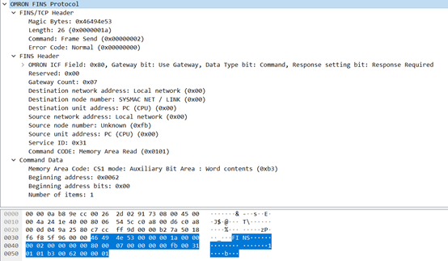

那么这个就很轻易的看出来这是个 tcp 的

Magic byte[0]-[3] 46 49 4e 53  ASCII 码：FINS

Length byte[4]-[7] 00 00 00 1a 从 command 之后的数据长度

Command byte[8]-[11] 00 00 00 02  命令 就是发送帧

Eroor code byte[12]-[15] 00 00 00 00 没用，接收结束后不需要检测错误

走完这一层接下来就是 fins header 这一层

ICF byte[0] 80 请求位 看下面的这张图

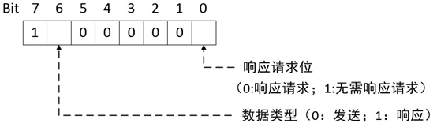

RSV byte[1] 00 预留 这些位被系统使用。不在响应中访问它们 默认为 00 即可

GCT byte[2] 07 此值供系统使用

DNA byte[3] 00 目的网络地址

DNA1 byte[4] 00 目的节点的地址

DA2 byte[5] 00 目标单位地址

SNA byte[6] 00 源网络地址

SA1 byte[7] fb 源节点的地址

SA2 byte[8] 00 源单位地址

SID byte[9] 31 服务 ID 用于标识生成传输的进程

Command Code byte[10][11] 01 01 核心部位 这个就是功能码了

接下来就是 data 这一部分 这一部分通常携带的就是数据

Memory Area code byte[0] b3 磁盘号

Beginning address byte[1][2]00 62 读取的起始位置

Beginning address bits byte[3] 00  固定为 00

Number of items byte[4][5] 00 01 读取的数量

#### 发包看完了接下来看回包

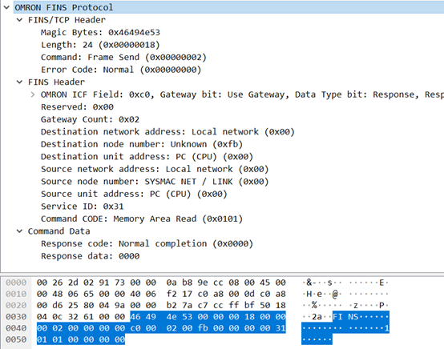

也很为简单、要读取数据那么肯定要回复读取的内容

而且可以对照一下发包、基本上是一直的无非是 data 部分不太一样那我们直接说 data 部分吧

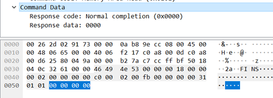

Response code byte[0][1] 00 00 这个就是 Fins 协议的返回码、不论其他包如何变化 data 部分的第一条一定是这个

Response data byte[2][3]00 00 这个就是读取到的数据、但是我这个是没有数据所以是 00 00

**Fins 协议有很多功能、比如说 I/O 区读写、参数区读写、程序区读写、但是他们的报文的格式都一样（除了功能码不一样）所以我就不过多介绍截几张图就好了**

[回到顶部](#_labelTop)

### **二、读取控制器状态**

**发包**

**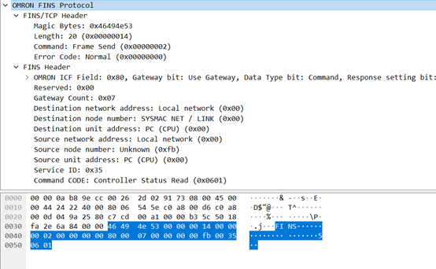**

这个就是为读取控制器的状态 那么他就只发送了请求并没有携带任何的数据 所以没有 data 部分

**回包**

**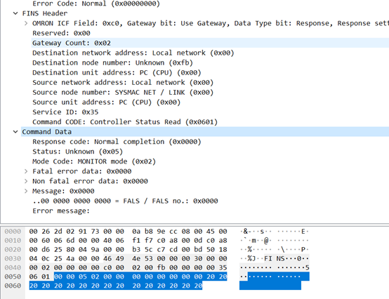**

前面的就不用看了 直接看 data 部分就可以了

那么跟我说的是一样、他的返回码是在 data 部分的第一条。

剩下的就是返回一些系统的状态了

[回到顶部](#_labelTop)

### 三、读周期时间

**发包**

**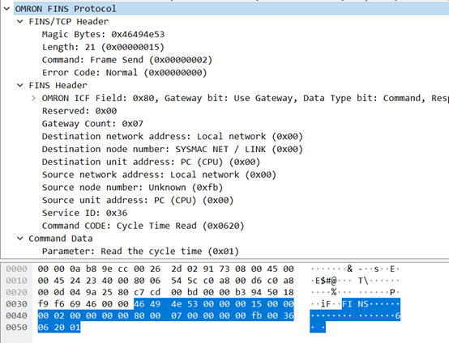**

**回包**

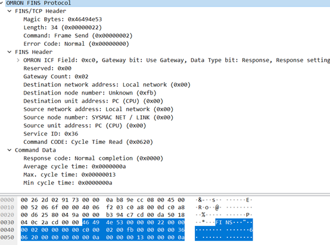

这种协议的结构很清晰、变化的地方也只有 data 部分 很容易理解

[回到顶部](#_labelTop)

### 四、看一下 fins 的连接吧

**发包**

**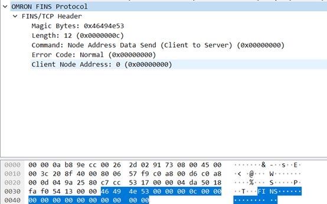**

46 49 4e 53 是 Fins 的 ASCII 码

00 00 00 0c 则为至此往后的长度

00 00 00 00 则为命令 为客户端连接服务端

00 00 00 00 没啥用

00 00 00 00 客户端的节点地址

**回包**

**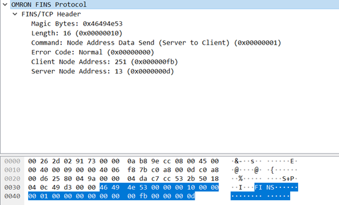**

清晰无比 Server node address 就是服务端的节点地址 其他都是与发包一致

[回到顶部](#_labelTop)

###  五、写文件

**发包**

**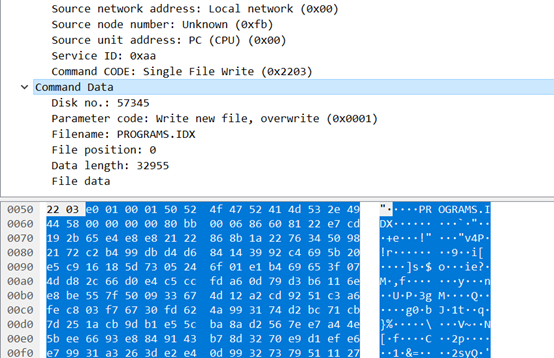**

之前的图就不截了 跟 read 都是一样的

Disk no byte[0][1] e0 01 磁盘号

Parameter code byte[2][3] 参数的代码

Filename byte[4][15] 文件名

File position byte[16][19] 00 00 00 00 文件的位置

Data length byte[20][21]  80 bb file data 的长度

File data byte[22] 到尾 为要写的数据

**回包**

**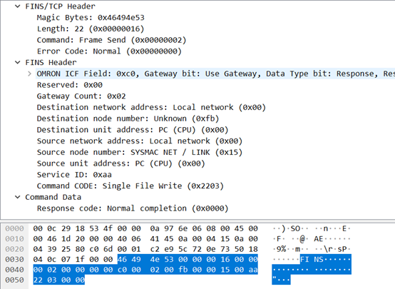**

只回复了错误码、00 00 代表的就是无错误

**其他的的功能与我介绍的也都差不多一致、看懂了 read 和 write 其他的也都可以看懂，那么接下来就再说一下 udp 的**

[回到顶部](#_labelTop)

### 六、Read（UDP）

**发包**

**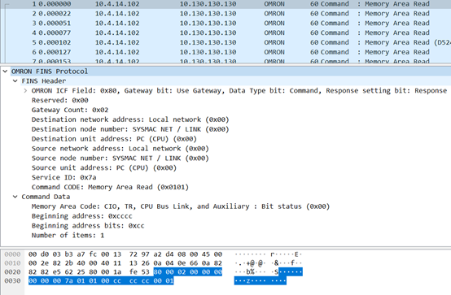**

可以看到跟 tcp 的是完全一样 但是只是少了个 tcp 的 head 头部

那么可以对照 tcp 的去看 udp 的协议

**回包**

因为 Wireshark 没有解析到所以也没有什么价值就不贴出来了。

但是根据他回应的报文与 TCP 的回应报文相比较是为一致。

....

忒懒不写了

没有排版

这只是我个人的理解、当然也借鉴了网上的一些文章。如有错误望请见谅。

相关文件文档下载: https://download.csdn.net/download/Db2k_/12887075