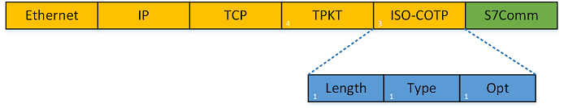
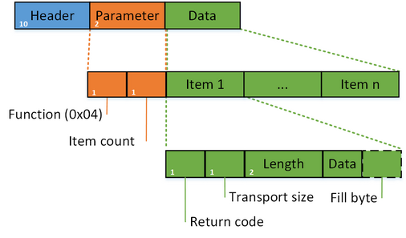

> 本文由 [简悦 SimpRead](http://ksria.com/simpread/) 转码， 原文地址 [www.freebuf.com](https://www.freebuf.com/articles/ics-articles/188159.html)

> 随着网络强国、工业 4.0，工控安全市场今年明显有相当大的改善，无论从政策还是客户需求，都在逐步扩大中。但是，搞工控安全研究的人员却寥寥无几。

***** 本文原创作者：LiukerTeam，本文属 FreeBuf 原创奖励计划文章，未经许可禁止转载****

**随着网络强国、工业 4.0，工控安全市场今年明显有相当大的改善，无论从政策还是客户需求，都在逐步扩大中。但是，搞工控安全研究的人员却寥寥无几，一方面，没有可以研究和学习的便利的环境；另一方面工控安全是个跨学课的技术，需要了解多方面的知识，有比较高的技术上的门槛。特别是工控系统中通信协议，在工控系统中通信协议存在众多标准，也存在众多私有协议，如果你有过使用组态软件的经历，你便会发现，在第一步连接设备时除连接设备的方式有以太网 / 串行等方式外，各家基本上都存在自己的私有通信协议。比如：西门子的是 S7Comm 协议。**  

所以，本文主要介绍西门子的 S7Comm 协议（适用于 S7-300、S7-400、S7-1200）。本文中 S7Comm 协议结构都是逆向而来，如有错误之处，请拍砖。

一、西门子 PLC 系统构成
--------------

在介绍西门子 S7Comm 协议，首先得明白西门子 PLC 的大概构造。虽然我们不必像专门编写 PLC 程序员那样。下图 1 就是一个组态完毕的西门子 S7 300 的模型：

图 1 西门子 S7-300

根据标号，各模块分别是：

1. 电源模块（PS），供电专用

2.CPU 模块（CPU），负责处理信息

3. 通信模块（IM）

4. 数字量输入模块（DI）

5. 数字量输出模块（DO）

6. 模拟量输入模块（AI）

7. 模拟量输出模块（AO）

想具体了解的，请阅读[西门子 S7-300 教程 第 2 章](https://wenku.baidu.com/view/86d25c104431b90d6c85c7cf.html)。

二、S7 协议结构
---------

S7Comm（S7 Communication）是西门子专有的协议，是西门子 S7 通讯协议簇里的一种。

S7 协议的 TCP/IP 实现依赖于面向块的 ISO 传输服务。S7 协议被封装在 TPKT 和 ISO-COTP 协议中，这使得 PDU（协议数据单元）能够通过 TCP 传送。

它用于 PLC 编程，在 PLC 之间交换数据，从 SCADA（监控和数据采集）系统访问 PLC 数据以及诊断目的。

S7Comm 以太网协议基于 OSI 模型：

<table><colgroup><col> <col> </colgroup><thead><tr><th>OSI layer</th><th>Protocol</th></tr></thead><tbody><tr><td>7 Application Layer</td><td>S7 communication</td></tr><tr><td>6 Presentation Layer</td><td>S7 communication (COTP)</td></tr><tr><td>5 Session Layer</td><td>S7 communication (TPKT)</td></tr><tr><td>4 Transport Layer</td><td>ISO-on-TCP (RFC 1006)</td></tr><tr><td>3 Network Layer</td><td>IP</td></tr><tr><td>2 Data Link Layer</td><td>Ethernet</td></tr><tr><td>1 Physical Layer</td><td>Ethernet</td></tr></tbody></table>

其中，第 1-4 层会由计算机自己完成（底层驱动程序），关于这些神马的定义，大家可以上网查一下；

第 5 层 TPKT，应用程数据传输协议，介于 TCP 和 COTP 协议之间。这是一个传输服务协议，主要用来在 COTP 和 TCP 之间建立桥梁；

第 6 层 COTP，按照维基百科的解释，COTP 是 OSI 7 层协议定义的位于 TCP 之上的协议。COTP 以 “Packet” 为基本单位来传输数据，这样接收方会得到与发送方具有相同边界的数据；

第 7 层，S7 communication，这一层和用户数据相关，对 PLC 数据的读取报文在这里完成。

可能会对 TPKT 和 COPT 迷惑，其实在具体的报文中，TPKT 的作用是包含用户协议（5~7 层）的数据长度（字节数）；COTP 的作用是定义了数据传输的基本单位（在 S7Comm 中 PDU TYPE：DT data）。

图 2 S7Comm 协议 OSI 模型

三、TPKT 协议
---------

TPKT 协议是应用程数据传输协议，介于 TCP 和 COTP 协议之间。这是一个传输服务协议，主要用来在 COTP 和 TCP 之间建立桥梁。

其英文介绍如下：

TPKT is an "encapsulation" protocol. It carries the OSI packet in its own packet's data payload and then passes the resulting structure to TCP, from then on, the packet is processed as a TCP/IP packet. The OSI programs passing data to TPKT are unaware that their data will be carried over TCP/IP because TPKT emulates the OSI protocol Transport Service Access Point(TSAP).

TPKT 结构如图 3：

图 3 TPKT 协议结构  

其中，TPKT 的结构为：

0 (Unsigned integer, 1 byte): Version，版本信息。

1 (Unsigned integer, 1 byte): Reserved，保留 (值为 0x00)。

2-3 (Unsigned integer, 2 bytes): Length，TPKT、COTP、S7 三层协议的总长度，也就是 TCP 的 payload 的长度。

举个例子，如图 4 所示：

图 4 一个 TPKT 的例子

从图 4 中可知，其 version=3，length=25（0x0019）。

四、COTP 协议
---------

COTP（[ISO 8073/X.224 COTP Connection-Oriented Transport Protocol](http://standards.iso.org/ittf/PubliclyAvailableStandards/index.html)）是 OSI 7 层协议定义的位于 TCP 之上的协议。COTP 以 “Packet” 为基本单位来传输数据，这样接收方会得到与发送方具有相同边界的数据。

COTP 协议分为两种形态，分别是 COTP 连接包（COTP Connection Packet）和 COTP 功能包（COTP Fuction Packet）。

### 4.1 COTP Connection Packet

COTP 连接包（COTP Connection Packet）也就是 S7Comm 的握手包，其格式如图 5 所示。

图 5 COTP 连接包的结构

其中， COTP 连接包的头结构为：

0 (Unsigned integer, 1 byte): Length，COTP 后续数据的长度（注意：长度不包含 length 的长度），一般为 17 bytes。

1 (Unsigned integer, 1 byte): PDU typ，类型有：

> 0x1: ED Expedited Data，加急数据
>
> 0x2: EA Expedited Data Acknowledgement，加急数据确认
>
> 0x4: UD，用户数据
>
> 0x5: RJ Reject，拒绝
>
> 0x6: AK Data Acknowledgement，数据确认
>
> 0x7: ER TPDU Error，TPDU 错误
>
> 0x8: DR Disconnect Request，断开请求
>
> 0xC: DC Disconnect Confirm，断开确认
>
> 0xD: CC Connect Confirm，连接确认
>
> 0xE: CR Connect Request，连接请求
>
> 0xF: DT Data，数据传输

2~3 (Unsigned integer, 2 bytes): Destination reference.

4~5 (Unsigned integer, 2 bytes): Source reference.

6 (1 byte): opt，其中包括 Extended formats、No explicit flow control，值都是 Boolean 类型。

7~? (length-7 bytes, 一般为 11 bytes): Parameter，参数。一般参数包含 Parameter code(Unsigned integer, 1 byte)、Parameter length(Unsigned integer, 1 byte)、Parameter data 三部分。

算了，还是来个例子，更加明了：

图 6 连接请求包

图 6 中，PDU 类型为连接请求（0x0e），表示该数据包是一个连接请求包。为了更好对比，图 7 为图 6 的连接请求的响应包：

图 7 连接确认包

### 4.2 COTP Fuction Packet

相对而言，COTP Fuction Packet 比 COTP Connection Packet 简单多了，其结构如图 8 所示：

图 8 COTP 功能包的格式

其中， COTPP 功能包的头结构为：

0 (Unsigned integer, 1 byte): Length，COTP 后续数据的长度（注意：长度不包含 length 的长度），一般为 2 bytes。

1 (Unsigned integer, 1 byte): PDU type，类型有：

> 0x1: ED Expedited Data，加急数据
>
> 0x2: EA Expedited Data Acknowledgement，加急数据确认
>
> 0x4: UD，用户数据
>
> 0x5: RJ Reject，拒绝
>
> 0x6: AK Data Acknowledgement，数据确认
>
> 0x7: ER TPDU Error，TPDU 错误
>
> 0x8: DR Disconnect Request，断开请求
>
> 0xC: DC Disconnect Confirm，断开确认
>
> 0xD: CC Connect Confirm，连接确认
>
> 0xE: CR Connect Request，连接请求
>
> 0xF: DT Data，数据传输

2 (1 byte): opt，其中包括 Extended formats、No explicit flow control，值都是 Boolean 类型。

举个例子，如图 9 所示：

图 9 数据传输包

上图中，PDU 类型为连接请求（0x0f），表示该数据包是一个数据传输的包。

OK，COTP 的两中结构介绍完了，接下来的 S7Comm 协议才是本文的重点。

五、S7Comm 协议
-----------

上面，介绍了 TPKT 和 COTP 协议，现在开始介绍 S7Comm 协议，Are u ready？

S7Comm 数据作为 COTP 数据包的有效载荷，第一个字节总是 0x32 作为协议标识符。

S7Comm 协议包含三部分：

> Header
>
> Parameter
>
> Data

图 10 S7Comm 协议结构

根据实现的功能不同，S7 comm 协议的结构会有所不同。

### 5.1 S7Comm Header

S7Comm 的头，定义了该包的类型、参数长度、数据长度等，其结构如图 11 所示：

图 11 S7Comm Header 结构

所以，S7Comm Header 的格式为：

0 (unsigned integer, 1 byte): Protocol Id，协议 ID，通常为 0x32；

1 (unsigned integer, 1 byte): ROSCTR，PDU type，PDU 的类型，一般有以下值：

> 0x01 - JOB(Request： job with acknowledgement)：作业请求。由主设备发送的请求（例如，读 / 写存储器，读 / 写块，启动 / 停止设备，设置通信）；
>
> 0x02 - ACK(acknowledgement without additional field)：确认响应，没有数据的简单确认（未遇到过由 S7 300/400 设备发送得）；
>
> 0x03 - ACK_DATA(Response： acknowledgement with additional field)：确认数据响应，这个一般都是响应 JOB 的请求；
>
> 0x07 - USERDATA：原始协议的扩展，参数字段包含请求 / 响应 ID（用于编程 / 调试，读取 SZL，安全功能，时间设置，循环读取...）。

2~3 (unsigned integer, 2 bytes): Redundancy Identification (Reserved)，冗余数据，通常为 0x0000；

4~5 (unsigned integer, 2 bytes): Protocol Data Unit Reference，it's increased by request event。协议数据单元参考，通过请求事件增加；

6~7 (unsigned integer, 2 bytes): Parameter length，the total length (bytes) of parameter part。参数的总长度；

8~9 (unsigned integer, 2 bytes): Data length，数据长度。如果读取 PLC 内部数据，此处为 0x0000；对于其他功能，则为 Data 部分的数据长度；

来看一个例子解释一下，如图 12 所示：

图 12 一个 S7Comm 头结构的例子

其中最重要的字段就是 ROSCTR，它决定了后续参数的结构，这个后面的章节中有详细的介绍。

在响应数据包中，还有可能存在错误信息。就拿图 12 为例，如果出错了，其响应包如图 13 所示：

图 13 带有错误信息的响应包  

其错误信息结构为：

10 (unsigned integer, 1 bytes): Error class，错误类型：

> 其详细的 Error class，参考 [6.1.1 头结构的错误类型](https://laucyun.com/3aa43ada8cfbd7eca51304b0c305b523.html#6-1-1)；

11 (unsigned integer, 1 bytes): Error code，错误代码；

由此，可见图 13 的错误类型是 No error，至于错误代码，啥含义我也母知道。

为了更好理解，接下来就不按照 Parameter、Data 的顺序介绍，而是按照 PDU 类型进行介绍，尿急的赶紧上厕所哈！

### 5.2 作业请求（Job）和确认数据响应（Ack_Data）

上面介绍了 S7Comm PDU 的结构和通用协议头其头部结构。

S7Comm 中 Job 和 Ack_Data 中的 Parameter 项的第一个字段是 function（功能码），其类型为 Unsigned integer，大小为 1 byte，其详细的功能码，请参考 [6.2.1 Job 和 Ack_Data 的功能码](https://laucyun.com/3aa43ada8cfbd7eca51304b0c305b523.html#6-2-1)。决定了其余字段的结构、消息的目的。

所以接下来，将进一步介绍各功能码对应的结构和作用。

**5.2.1 建立通信（Setup communication [0xF0]）**

建立通信在每个会话开始时被发送，然后可以交换任何其他消息。它用于协商 ACK 队列的大小和最大 PDU 长度，双方声明它们的支持值。ACK 队列的长度决定了可以同时启动而不需要确认的并行作业的数量。PDU 和队列长度字段都是大端。

先说 Job 吧！当 PDU 类型为 Job 时，建立通信功能中 Parameter 的结构，如下图：

图 14 S7comm 的结构（建立通信的作业请求）

具体的 Parameter 结构，如下：

1 (Unsigned integer, 1 byte): Parameter part: Reserved byte in communication setup pdu，保留字节；

2 (Unsigned integer, 2 bytes): Max AmQ (parallel jobs with ack) calling；

3 (Unsigned integer, 2 bytes): Max AmQ (parallel jobs with ack) called；

4 (Unsigned integer, 2 bytes): Parameter part: Negotiate PDU length。协商 PDU 长度。

举个例子：

图 15 建立通信的请求

那么其确认响应的结构如何呢？跟请求时一样的，如图 14 所示。那么图 16 为图 15 的确认响应：

图 16 建立通信的确认响应

如图 15、16 所示，其协商结果为：ACK 队列的大小为 1；最大 PDU 长度为 240。

**5.2.2 读取值（Read Var [0x04]）**

数据读写操作通过指定变量的存储区域（参考 [6.3 区域（Area names）](https://laucyun.com/3aa43ada8cfbd7eca51304b0c305b523.html#6-3)），地址（偏移量）及其大小或类型（参考 [6.4.1 Transport sizes in item data](https://laucyun.com/3aa43ada8cfbd7eca51304b0c305b523.html#6-4-1)）来执行。

先说 Job 吧！当 PDU 类型为 Job 时，那么其 S7Comm 结构，如图 17 所示：

图 17  S7comm 的结构（读取值的作业请求）

所以，接下来的 Parameter 字段是 item count（项目个数），其类型为 Unsigned integer，大小为 1 byte。

那么一个 item 的结构是咋样的呢？如下（图 17 中 item1）：

0 (Unsigned integer, 1 byte): Variable specification，确定项目结构的主要类型，通常为 0x12，代表变量规范；

1 (Unsigned integer, 1 byte): Length of following address specification，本 Item 其余部分的长度；

2 (Unsigned integer, 1 byte): Syntax Ids of variable specification，确定寻址模式和其余项目结构的格式；

> 其详细的 Syntax Id，参考 [6.5 Syntax Ids of variable specification](https://laucyun.com/3aa43ada8cfbd7eca51304b0c305b523.html#6-5)；

3(Unsigned integer, 1 byte): Transport sizes in item data，确定变量的类型和长度：

> 其详细的 Transport size，参考 [6.4.1 transport sizes in item data](https://laucyun.com/3aa43ada8cfbd7eca51304b0c305b523.html#6-4-1)；

4~5 (Unsigned integer ,2 byte): Request data length，请求的数据长度；

6~7 (Unsigned integer, 2 byte): DB number，DB 模块的编号，如果访问的不是 DB 区域，此处为 0x0000；

8 (Unsigned integer, 1 byte)：: Area，区域类型：

> 其详细的区域类型，参考 [6.3 区域（Area names）](https://laucyun.com/3aa43ada8cfbd7eca51304b0c305b523.html#6-3)；

9~11(Unsigned integer, 3 byte): Address，地址。

头晕了吧？哈哈哈~~ 先举个例子：

图 18 读值操作的作业请求

图 17 中 item1 是读取 DB1 的 0x000010（DB1.DBX 2.0 BIT 1）值，并且类型为 BIT 的请求。

PDU 类型为 Job 时，S7Comm 结构介绍完了，那 PDU 类型为 Ack_Data 时，其 S7Comm 的结构如何呢？

图 19  S7comm 的结构（读取值的确认数据响应）

是的，其 Parameter 只有 function、item count 两个字段。

继续，那么接下来的是 Data 啦！其结构如下：

0 (Unsigned integer, 1 byte): Return code，返回代码：

> 详细的 Return code，请参考 [6.6.1 Return values of an item response](https://laucyun.com/3aa43ada8cfbd7eca51304b0c305b523.html#6-6-1)；

1 (Unsigned integer, 1 byte): Transport size，数据的传输尺寸：

> 其详细的 Transport size，参考 [6.4.2 Transport sizes in data](https://laucyun.com/3aa43ada8cfbd7eca51304b0c305b523.html#6-4-2)；

2~3 (Unsigned integer, 2 bytes): Length，数据的长度；

4~4+length (?): Data，数据；

? (Unsigned integer, 1 byte): Fill byte，填充字节。

继续看图 18 响应的数据包，如图 20 所示：

图 20 读值操作的确认数据响应

图 20 中，item1 是读取 DB1 的 0x000010（DB1.DBX 2.0 BIT 1）值，并且类型为 BIT 的响应，其响应的数据为 01

**5.2.3 写入值（Write Var [0x05]）**

Write Var 中 Parameter 的结构跟 [5.2.2 读取值（Read Var[0x04]）](https://laucyun.com/3aa43ada8cfbd7eca51304b0c305b523.html#5-2-2)一样，但是 Write Va 还需写入值，所以 Write Var 比 Read Var 多 Data 项。结构如下：

图 21 S7comm 的结构（写入值的作业请求）

由此，Data 的结构为：

0 (Unsigned integer, 1 byte): Return code，返回代码，这里是未定义，所以为 Reserved（0x00）；

1 (unsigned integer, 1 byte): Transport size，确定变量的类型和长度：

> 详细的 Transport size，参考 [6.4.2 Transport sizes in data](https://laucyun.com/3aa43ada8cfbd7eca51304b0c305b523.html#6-4-2)；

2-3 (unsigned integer, 2 bytes): Length，写入值的数据长度；

4 (1 byte): Data，写入的值；

5 (unsigned integer, 1 byte): Fill byte，填充字节，如果数据的长度不足 Length 的话，则填充；

举个例子：

图 22 向地址为 0x000008 的 Flags（M）写入 0x00 的作业请求

图 22 中，是一个向地址为 0x000008 的 Flags（M）写入 0x00 的作业请求。

那 PDU 类型为 Ack_Data 时，其 S7Comm 的结构如何呢？

图 23 S7comm 的结构（写入值的确认数据响应）

对的，Parameter 也只有 function、item count 两个字段。而 Data 中也只有一个 Return code 字段，其结构如下：

0 (Unsigned integer, 1 byte): Return code，返回代码：

> 详细的 Return code，请参考 [6.6.1 Return values of an item response](https://laucyun.com/3aa43ada8cfbd7eca51304b0c305b523.html#6-6-1)；

继续看图 22 的响应数据包，如图 24 所示：

图 24 向地址为 0x000008 的 Flags（M）写入 0x00 的确认响应

图 24 中的 item1，说明向地址为 0x000008 的 Flags（M）写入 0x00 成功！

未完待续。

***** 本文原创作者：LiukerTeam，本文属 FreeBuf 原创奖励计划文章，未经许可禁止转载****