> 本文由 [简悦 SimpRead](http://ksria.com/simpread/) 转码， 原文地址 [www.freebuf.com](https://www.freebuf.com/articles/ics-articles/188606.html)

> 本文上一篇文章《工控安全 | 西门子通信协议 S7COMM（Part 1）》的 S7Comm 协议章节继续开展，没看过上一篇的小伙伴需要补补课哦，不然会不知所云~

*** 本文原创作者：LiukerTeam，本文属 FreeBuf 原创奖励计划文章，未经许可禁止转载**

前言
--

**随着网络强国、工业 4.0，工控安全市场今年明显有相当大的改善，无论从政策还是客户需求，都在逐步扩大中。但是，搞工控安全研究的人员却寥寥无几，一方面，没有可以研究和学习的便利的环境；另一方面工控安全是个跨学课的技术，需要了解多方面的知识，有比较高的技术上的门槛。特别是工控系统中通信协议，在工控系统中通信协议存在众多标准，也存在众多私有协议，如果你有过使用组态软件的经历，你便会发现，在第一步连接设备时除连接设备的方式有以太网 / 串行等方式外，各家基本上都存在自己的私有通信协议。比如：西门子的是 S7Comm 协议。**

上一篇文章[《工控安全 | 西门子通信协议 S7COMM（Part 1）》](https://www.freebuf.com/articles/ics-articles/188159.html)带来了**西门子 PLC 系统构成**、**S7 协议结构**、**TPKT 协议**、**COTP 协议**、**S7Comm 协议**五大块内容，本文紧接着上文中的 **S7Comm 协议**章节继续开展，没看过上一篇的小伙伴需要补补课哦，不然会不知所云~

**5.2.4 下载**

下载是 Step7 发送块数据给 PLC（图 25）。在西门子设备上，程序代码和（大部分）程序数据存储在块中，这些块有自己的头和编码格式。

在西门子设备中有 8 种不同类型的功能块，具体的请参考 [6.7](https://laucyun.com/3aa43ada8cfbd7eca51304b0c305b523.html#6-7)。

这些块在上 / 下载请求中用特殊的 ASCII 文件名寻址。这个文件名的结构如下：

```
1 (1 byte): File identifier（ASCII），文件标识符。其有_ (Complete Module)、$ (Module header for up-loading)两种文件标识符；

2 (2 bytes): Block type，块类型。具体类型，请参考6.7；

3 (5 bytes): Block number，块编号；

4 (1 byte): Destination filesystem（ASCII），目标的文件系统。其有三种文件系统：

  P（Passive (copied, but not chained) module)：被动文件系统

  A (Active embedded module)：主动文件系统

  B (Active as well as passive module)：既主既被文件系统

```

例如：文件名为_0A00001P（文件标识是_，块类型为 DB，块的编号为 00001，目标块的文件系统是 P。），用于将 DB 1 复制到被动文件系统或从被动文件系统复制。

下载有 3 中不同的功能类型：

```
请求下载（Request download [0x1A]）

下载块（Download block [0x1B]）

下载结束（Download ended [0x1C]）

```

在下载过程中，先是 Step7 向 PLC 发送一个请求下载的 Job，PLC 收到后则回复一个 Ack_Data。在发送完所有字节后，Step7 向 PLC 发送一个下载结束的 Job 来关闭下载会话。 时序图如下：

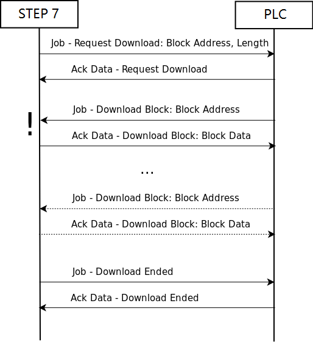

图 25 下载时序图（图片来源：互联网）

好了，开始介绍下载的结构啦！

如图 26 所示，即为一个完整的下载过程：

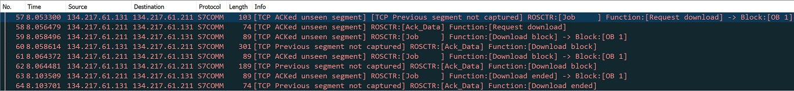

图 26 一个完整的下载过程例子

5.2.4.1 请求下载（Request download [0x1A]）

先来介绍，当 PDU 类型为 Job 时，Request download [0x1A] 没有 Data，其 Parameter 的结构，如下：

```
1 (1 byte): Function Status，功能码状态；

2 (2 bytes): for all unknown bytes in blockcontrol；

3 (4 bytes): 无意义，一般为0x00000000；

4 (1 byte): filename length，文件名长度；

5 (? bytes): filename, default is 9 byte，文件名，长度一般为9个字节；

  1 (1 byte): File identifier（ASCII），文件标识符。其有_ (Complete Module)、$ (Module header for up-loading)两种文件标识符；

  2 (2 bytes): Block type，块类型。具体类型，请参考6.7；

  3 (5 bytes): Block number，块编号；

  4 (1 byte): Destination filesystem（ASCII），目标的文件系统。其有P（Passive (copied, but not chained) module)、A (Active embedded module)、B (Active as well as passive module)三种文件系统；

6 (1 byte): Length part 2 in bytes，参数的第二部分长度，也就是接下来的字段长度；

7 (1 byte): Unknown char（ASCII）；

8 (6 bytes): Length load memory in bytes（ASCII）；

9 (6 bytes): Length of MC7 code in bytes（ASCII）。

```

其实就是告诉 PLC 要下载块。举个例子：

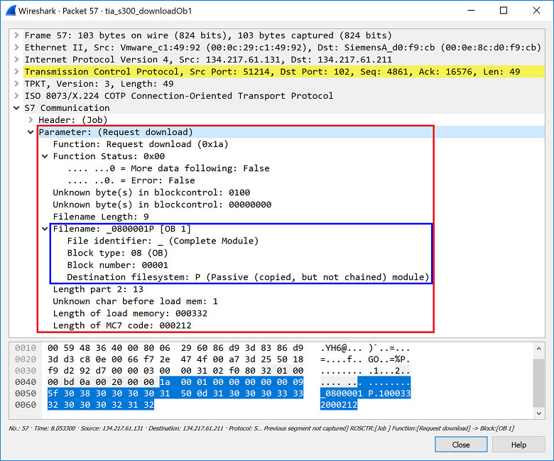

图 27 请求下载_0800001P 的作业请求

如图 27 所示，文件标识是_ (Complete Module)，块类型为 OB，块的编号为 00001，目标块的文件系统是 P (Passive (copied, but not chained) module)，所以文件名为_0800001P。

那 PDU 类型为 Ack_Data 时，Request download [0x1A] 的 Parameter 中只有一个 function。下图即为图 27 的响应：

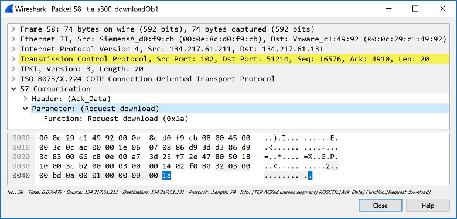

图 28 请求下载_0800001P 的确认数据响应

OK，请求下载完成后，接下来就可以 Download block 了！

5.2.4.2 下载块（Download block [0x1B]）

上面说了，下载是 Step7 发送块数据给 PLC。

当 PDU 类型为 Job 时，Download block [0x1B] 也没有 Data，其 Parameter 的结构，如下：

```
1 (1 byte): Function Status，功能码状态；

2 (2 bytes): for all unknown bytes in blockcontrol；

3 (4 bytes): 无意义，一般为0x00000000；

4 (1 byte): filename length，文件名长度；

5 (? bytes): filename, default is 9 byte，文件名，长度一般为9个字节；

  1 (1 byte): File identifier（ASCII），文件标识符。其有_ (Complete Module)、$ (Module header for up-loading)两种文件标识符；

  2 (2 bytes): Block type，块类型。具体类型，请参考6.7；

  3 (5 bytes): Block number，块编号；

  4 (1 byte): Destination filesystem（ASCII），目标的文件系统。其有P（Passive (copied, but not chained) module)、A (Active embedded module)、B (Active as well as passive module)三种文件系统；

```

是的，Download block [0x1B] 的 Parameter 比 Request download [0x1A] 的 Parameter 的第一部分相同！

为了更好比较，举个例子：

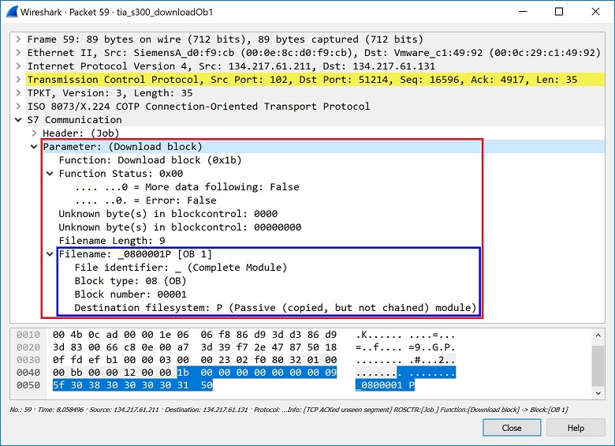

图 29 下载块_0800001P 的作业请求

上图是下载_0800001P 的作业请求。

那 PDU 类型为 Ack_Data 时，Download block [0x1B] 有 Parameter 和 Data，其 Parameter 的结构，如下：

```
1 (1 byte): Function Status，功能码状态；

```

而其 Data 的结构，如下：

```
1 (Unsigned integer, 2 bytes): Length，数据长度；

2 (Unsigned integer, 2 bytes): Unknown byte(s) in blockcontrol，未知字节；

3 (Label，data_length-4 bytes): Data，数据；

```

下图即为图 29 的响应：

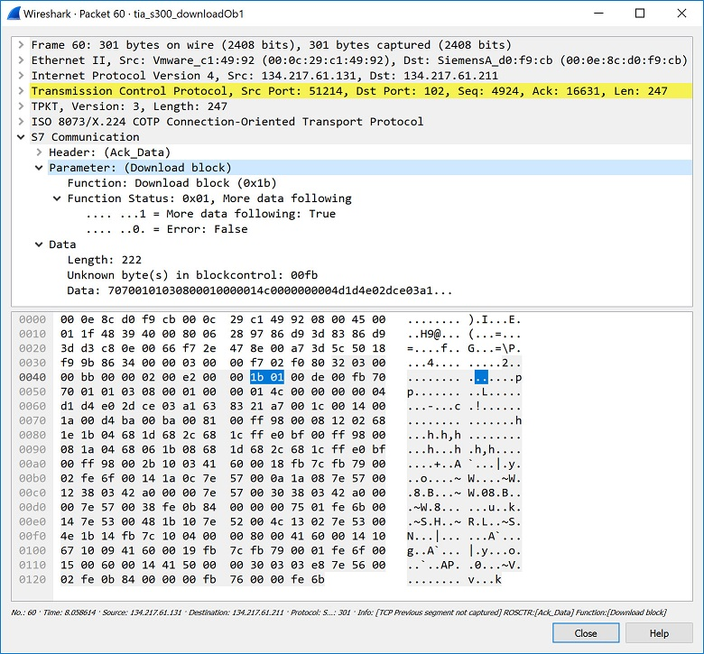

图 30 下载块_0800001P 的响应

5.2.4.3 下载结束（Download ended [0x1C]）

当 PDU 类型为 Job 时，Download ended [0x1C] 也没有 Data，其 Parameter 的结构，如下：

```
1 (1 byte): Function Status，功能码状态；

2 (2 bytes): for all unknown bytes in blockcontrol；

3 (4 bytes): 无意义，一般为0x00000000；

4 (1 byte): filename length，文件名长度；

5 (? bytes): filename, default is 9 byte，文件名，长度一般为9个字节；

  1 (1 byte): File identifier（ASCII），文件标识符。其有_ (Complete Module)、$ (Module header for up-loading)两种文件标识符；

  2 (2 bytes): Block type，块类型。具体类型，请参考6.7；

  3 (5 bytes): Block number，块编号；

  4 (1 byte): Destination filesystem（ASCII），目标的文件系统。其有P（Passive (copied, but not chained) module)、A (Active embedded module)、B (Active as well as passive module)三种文件系统；

```

是的，Download ended [0x1C] 跟 Download block [0x1B] 的 Parameter 和 Request download [0x1A] 的 Parameter 的第一部分相同！

举个例子：

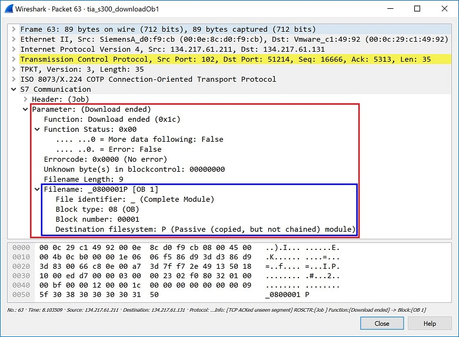

图 31 结束下载_0800001P 的作业请求

那 PDU 类型为 Ack_Data 时，Download ended [0x1C] 的 Parameter 中只有一个 function。下图即为图 31 的响应：

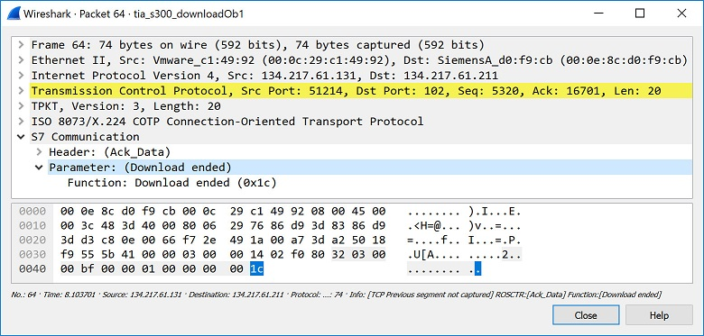

图 32 结束下载_0800001P 的响应

这样，整个下载过程就完成了！

下载到这就介绍完了，接着就介绍上传啦！

**5.2.5 上传**

上传是 PLC 发送块数据给 Step7（如图 33）。

上传有 3 中不同的功能类型：

```
开始上传（Start upload [0x1D]）

上传（Upload [0x1E]）

上传结束（End upload [0x1F]）

```

在上传过程中，先是 Step7 向 PLC 发送一个开始上传的 Job，PLC 收到后则回复一个 Ack_Data，并告诉 Step7 块的长度、上传会话 ID。然后 PLC 继续上传块数据到 Step7，直到 Step7 收到所有字节。最后，Step7 发送结束上传的作业请求来关闭上传会话。时序图如下：

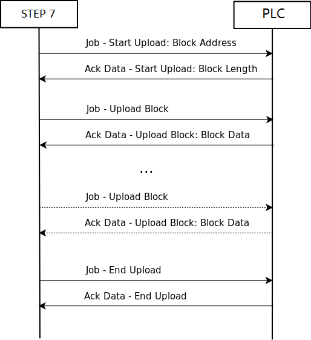

图 33 上传的时序图（图片来源：互联网）

好了，开始介绍上传的结构啦！

如图 34 所示，即为一个完整的下载过程：

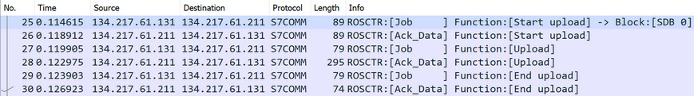

图 34 一个完整的上传过程例子

5.2.5.1 开始上传（Start upload [0x1D]）

先来介绍，当 PDU 类型为 Job 时，Start upload [0x1D] 没有 Data，其 Parameter 的结构，如下：

```
1 (1 byte): Function Status，功能码状态；

2 (2 bytes): for all unknown bytes in blockcontrol；

3 (4 bytes): 上传的会话ID，此时为0x00000000；

4 (1 byte): filename length，文件名长度；

5 (? bytes): filename, default is 9 byte，文件名，长度一般为9个字节；

  1 (1 byte): File identifier（ASCII），文件标识符。其有_ (Complete Module)、$ (Module header for up-loading)两种文件标识符；

  2 (2 bytes): Block type，块类型。具体类型，请参考6.7 功能块；

  3 (5 bytes): Block number，块编号；

  4 (1 byte): Destination filesystem（ASCII），目标的文件系统。其有P（Passive (copied, but not chained) module)、A (Active embedded module)、B (Active as well as passive module)三种文件系统；

```

其实就是告诉 PLC 你上传的位置。举个例子：


图 35 开始上传的作业请求

如图 35 所示，文件标识是_ (Complete Module)，块类型为 0B（SDB），块的编号为 00000，目标块的文件系统是 A (Active embedded module)，所以文件名为_0B00000A。

那 PDU 类型为 Ack_Data 时，Start upload [0x1D] 的 Parameter 的结构，如下：

```
1 (1 byte): Function Status，功能码状态；

2 (2 bytes): for all unknown bytes in blockcontrol；

3 (4 bytes): 上传的会话ID，告诉Step7上传会话ID；

4 (Unsigned integer, 1 byte): Blocklengthstring Length；

5 (Character string): Blocklength，块的长度；

```

下图即为图 35 的响应：

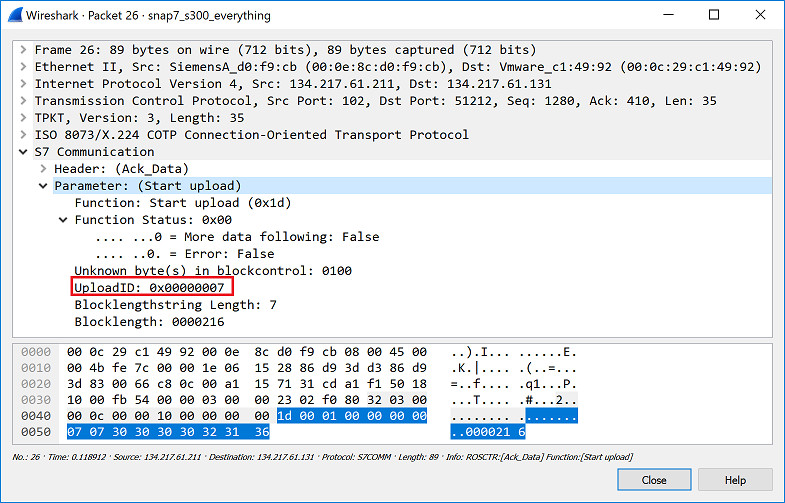

图 36 开始上传的响应

图 36 中，其上传会话 ID 为 0x00000007。

5.2.5.2 上传（Upload [0x1E]）

上面说了，上传是 PLC 发送块数据给 Step7。

当 PDU 类型为 Job 时，Upload [0x1E] 也没有 Data，其 Parameter 的结构，如下：

```
1 (1 byte): Function Status，功能码状态；

2 (2 bytes): for all unknown bytes in blockcontrol；

3 (4 bytes): 上传的会话ID，告诉Step7上传会话ID；

```

为了更好比较，举个例子：

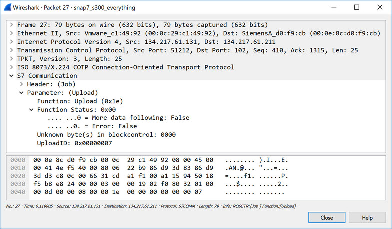

图 37 上传的作业请求

那 PDU 类型为 Ack_Data 时，Upload [0x1E] 有 Parameter 和 Data，其 Parameter 的结构，如下：

```
1 (1 byte): Function Status，功能码状态；

```

而其 Data 的结构，如下：

```
1 (Unsigned integer, 2 bytes): Length，数据长度；

2 (Unsigned integer, 2 bytes): Unknown byte(s) in blockcontrol，未知字节；

3 (Label，data_length-4 bytes): Data，数据；

```

下图即为图 37 的响应：

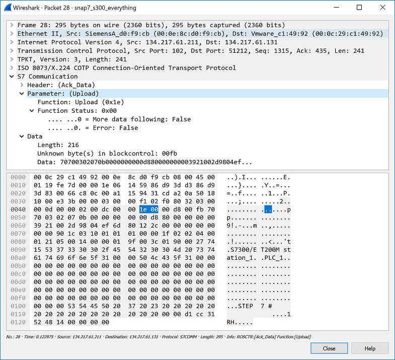

图 38 上传的确认数据响应

5.2.5.3 上传结束（End upload [0x1F]）

上传结束的过程，即为所有数据上传完成后，Step7 发送结束上传的作业请求，PLC 收到后就关闭会话，然后返回一个响应。

当 PDU 类型为 Job 时，End upload [0x1F] 也没有 Data，其 Parameter 的结构，如下：

```
1 (1 byte): Function Status，功能码状态；

2 (2 bytes): Error code，错误代码：

```

详细的 Error code，参考 [6.1.2 Error code in parameter part](https://laucyun.com/3aa43ada8cfbd7eca51304b0c305b523.html#6-1-2)；

```
3 (4 bytes): 上传的会话ID，告诉Step7上传会话ID；

```

举个例子：


图 39 上传结束的作业请求

那 PDU 类型为 Ack_Data 时，End upload [0x1F] 的 Parameter 中只有一个 function。

图 40 所示，即为图 39 的响应：


图 40 上传结束的响应

这样，整个上传过程就完成了！

**5.2.6 程序调用服务（PI service [0x28]）**

程序调用是用于在 PLC 执行修改执行 / 内存状态的日常工作。这些命令可以用于启动或停止 PLC 控制程序、激活或删除程序块。

当 PDU 类型为 Job 时，PI service [0x28] 没有 Data，只有 Parameter，那 Parameter 的结构，如下：

```
1 (7 bytes): Unknown；

2 (Unsigned integer, 2 bytes): Parameter block length；

3 (?bytes): Parameter block，参数；

4 (Unsigned integer, 1 byte):String length，PI service的字符串长度；

5 (Character string, ASCII):PI (program invocation) Service name，程序调用服务名，参考6.8 程序调用服务名（PI service names）。

```

Parameter 包含两个主要部分：

> 服务名称
>
> 参数：取决于方法类型，可以将它们看作是它的参数

服务名称及其相关参数的示例：

> _INSE：激活设备上下载的块，参数是块的名称（比如：OB 1）。
>
> _DELE：从设备的文件系统中删除一个块，该参数也是该块的名称。
>
> P_PROGRAM：设置设备的运行状态（启动、停止、复位）。
>
> _GARB：压缩 PLC 内存。
>
> _MODU：将 ram 复制到 ROM，参数包含文件系统标识符（A/E/P）。

如果服务调用的参数是块的话，那么 Parameter block 的结构如下：

```
1 (1 byte): Number of block；

2 (1 byte): Unknown，默认为0x00；

3 (? bytes): filename，文件名：

  1 (2 bytes, ASCII): Block type，块类型。具体类型，请参考6.7 功能块；

  2 (5 bytes, ASCII): Block number，块编号；

  3 (1 byte, ASCII): Destination filesystem（ASCII），目标的文件系统。其有P（Passive (copied, but not chained) module)、A (Active embedded module)、B (Active as well as passive module)三种文件系统；

```

举个例子，如图 41 所示：

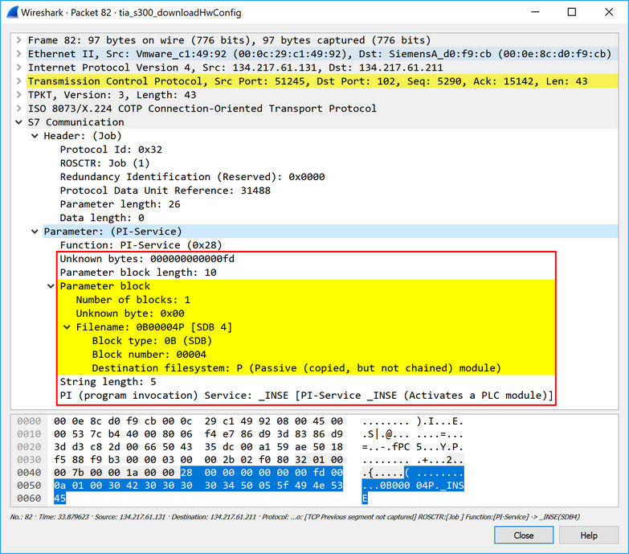

图 41 _INSE（激活 PLC 模块）的作业请求

上图可知服务名称是_INSE，参数是 0B0004P（SDB4），那么它的作业请求是激活 PLC 中 SDB 4，那么它的请求响应又是如何呢？如图 42 所示：

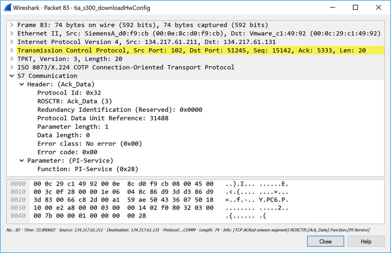

图 42 _INSE（激活 PLC 模块）的响应

而另一种情况，如图 43 所示：

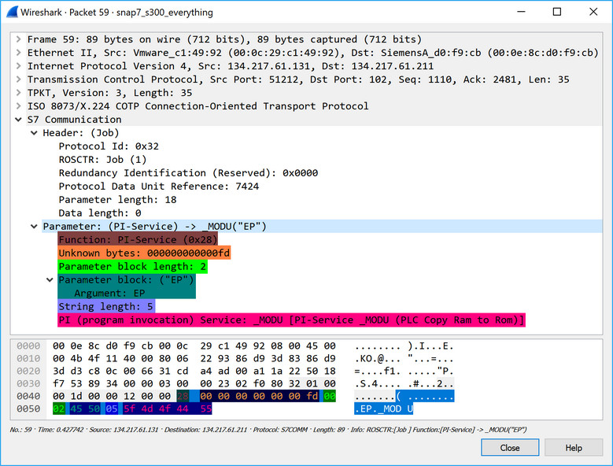

图 43_MODU（复制 RAM 到 ROM）的作业请求

上图中，其 Parameter block 中只有 Argument。

**5.2.7 PLC STOP [0x29]**

PLC STOP 基本上跟 [5.2.6 程序调用服务（PI service [0x28]）](https://laucyun.com/3aa43ada8cfbd7eca51304b0c305b523.html#5-2-6)一致，唯一的区别就是它没有 Parameter block，而它的 PI service 为 P_PROGRAM。搞不明白为啥单独占用一个功能码~~~

看个例子吧，如图 44 所示：

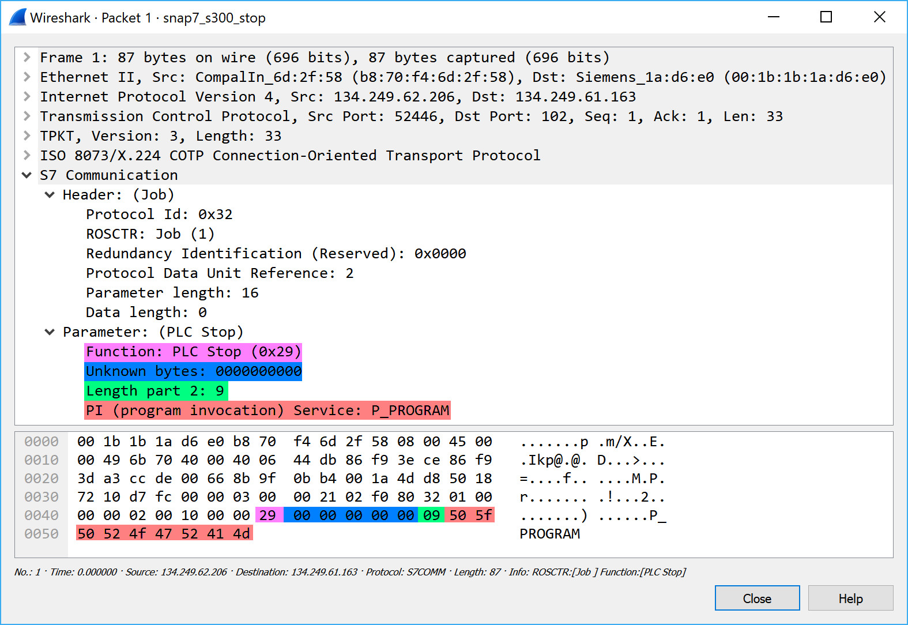

图 44 PLC STOP 的作业请求

到此为此 JOB 和 ACK_DATA 类型下的功能码都介绍完了，接下来介绍 S7commm 协议的扩展。

### 5.3 协议拓展（Userdata）

上面介绍了 S7Comm 的 JOB 和 ACK_DATA 两个 PDU 类型，那接着将介绍 PDU 类型是 UserData 的内容，它用于编程 / 调试、读取 SZL、安全功能、时间设置，循环读取等，可以说是 S7Comm 中最复杂的一部分。

大家不要慌哈，Are u ready?

Okay，当 PDU 类型为 UserData 时，其 S7Comm 结构，如图 45 所示：

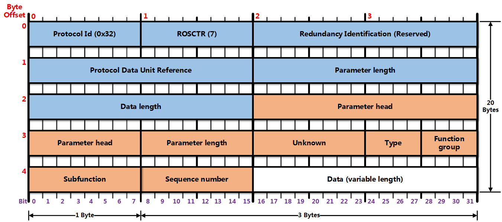

图 45 S7Comm 的结构（UserData）

图 45 中蓝色部分为 S7Comm 头部，橘色为 Parameter 部分，具体的 Parameter 结构如下：

```
1 (3 bytes)：参数头（Parameter head）；

2 (1 byte)：参数长度（Parameter length），它的可能是8字节或12字节；

3 (1 byte)：未知定义；

4 (1/2 byte，高位)：参数类型（Type），常见的类型可参考《6.9 拓展协议的参数类型》；

5 (1/2 byte，Low nibble)：功能组（Function group），常见的功能组可参考《6.10 拓展协议的功能组》；

6 (1 byte)：子功能码（SubFunction）；

7 (1 byte)：序号。

```

接着就是一一介绍各个功能组。

**5.3.1 转换工作模式（Mode-transition [0x0]）**

当功能组为转换工作模式（Mode-transition）时，请求报文中是没有 Data 部分的，而主要起作用的是子功能码（Subfunction），常见的子功能码有：

```
STOP（0x00）：STOP模式；

Warm Restart（0x01）：暖启动；

RUN（0x02）：RUN模式；

Hot Restart（0x03）：热启动；

HOLD（0x04）：HOLD模式；

Cold Restart（0x06）：冷启动；

RUN_R (H-System redundant)（0x09）：H-System冗余运行；

LINK-UP（0x0B）：LINK-UP模式；

UPDATE（0x0C）：UPDATE模式。

```

关于暖启动、冷启动、热启动的区别可参考：[S7-400 CPU 启动 (暖启动)，冷启动和热启动的区别是什么？ - ID: 34053758 - Industry Support Siemens](https://support.industry.siemens.com/cs/document/34053758/s7-400-cpu-%E5%90%AF%E5%8A%A8(%E6%9A%96%E5%90%AF%E5%8A%A8)%EF%BC%8C%E5%86%B7%E5%90%AF%E5%8A%A8%E5%92%8C%E7%83%AD%E5%90%AF%E5%8A%A8%E7%9A%84%E5%8C%BA%E5%88%AB%E6%98%AF%E4%BB%80%E4%B9%88%EF%BC%9F?dti=0&lc=zh-CN)，至于冗余可参考： [何为冗余 - 找答案 - 工业支持中心 - 西门子（中国）有限公司（SLC）](http://wap.siemens.com.cn/service/answer/solved/29593.html)。

来看个栗子消化一下吧，如图 46 所示：

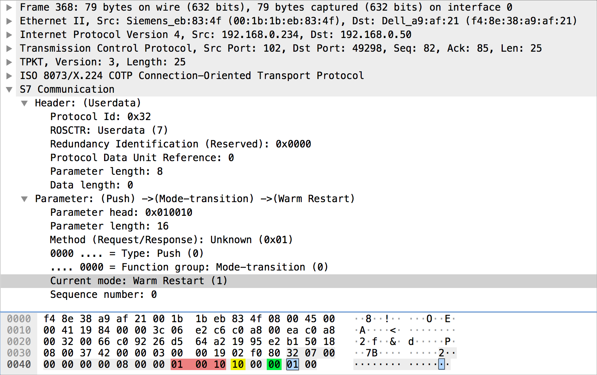

图 46 工作模式转换为暖启动

如图 46 中绿色部分为参数类型（Type）和功能组（Function group），蓝色框内容是子功能码（SubFunction），值是 0x01，即为暖启动。

**5.3.2 程序员命令（Programmer commands [0x1]）**

程序员命令（Programmer commands）主要是工程师用于编程或调试，比如：监视 / 修改变量、读取修改诊断数据。所有的子功能码有：

```
请求诊断数据（Request diag data (Type 1)）：0x01;

变量表（VarTab）：0x02;

读取诊断数据（Read diag data）：0x0c;

移除诊断数据（Remove diag data）：0x0e;

清除（Erase）：0x0f;

强制（Forces）：0x10;

请求诊断数据（Request diag data (Type 2)）：0x13;

```

这里的请求报文和响应报文都和图 45 有点不一样，具体如图 47 所示：

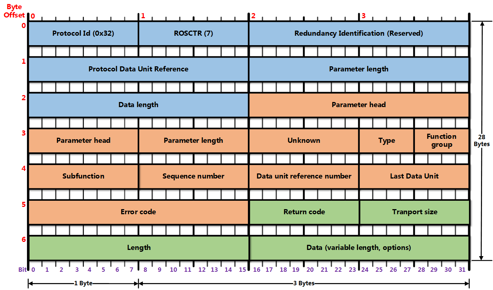

图 47 功能码组为 Programmer commands 的报文结构

下面以变量表为例，变量表如图 48 所示：

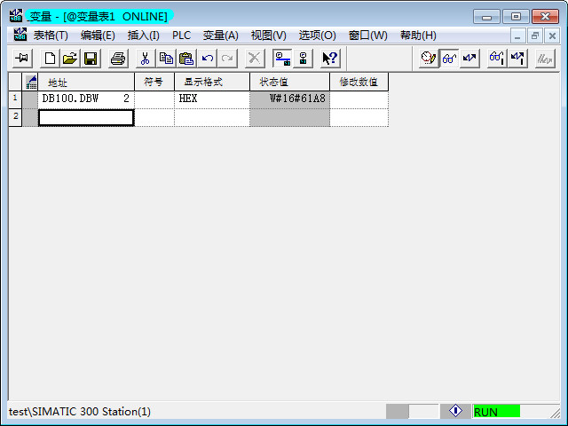

图 48 变量表

如果对 DB100.DBW 2 进行监视，那么他的请求报文如图 49 所示：

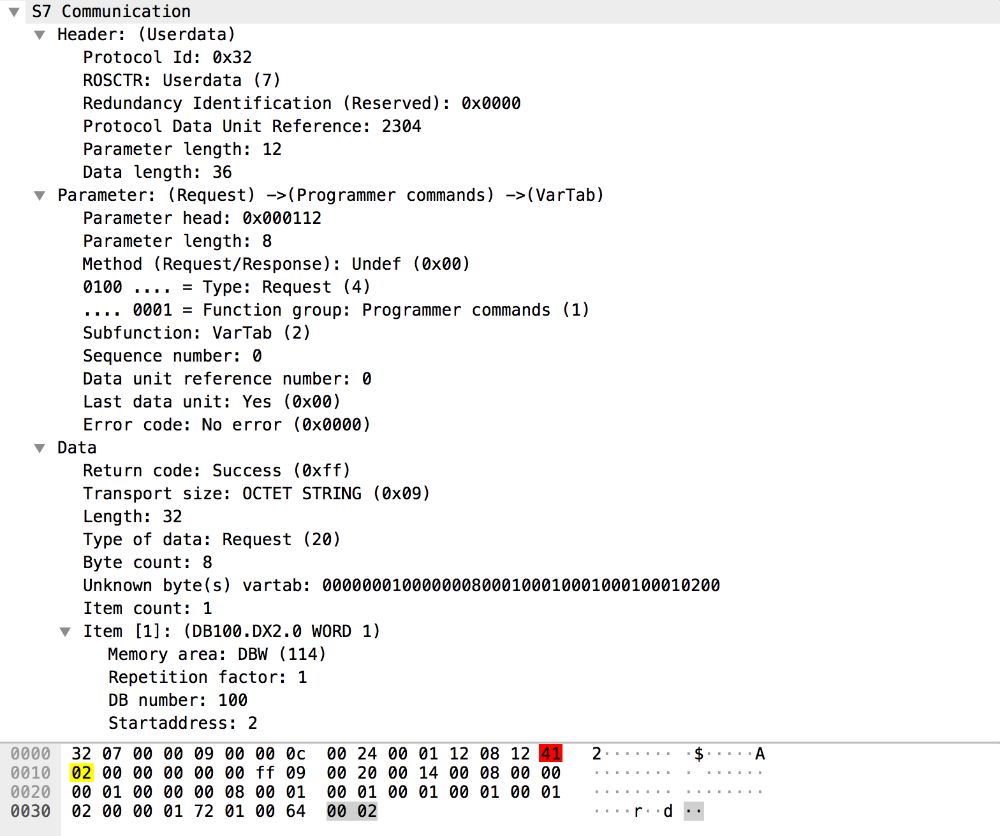

图 49 监视变量表的请求报文

图 49 中的 Header、Parameter 在前面已经介绍了，重点介绍 Data 部分的结构，请求报文的结构如下：

```
1 (1 byte) : 返回码，具体的可参考6.6.1；

2 (1 byte) :Transport sizes，指的数据类型，通常有bit、byte等，具体可参考6.4.2；

3 (2 bytes) : 往后的数据长度，如图49为32个字节；

4 (1 byte) : Unknown；

5 (1 byte) : 报文类型（type of data），分为请求（0x14）、响应（0x04）；

6 (2 bytes) : Item count和Item data的长度（Byte count）；

7 (20bytes) : Unknown；

8 (2bytes) : Item个数；

9 (varibalebytes) : Item 1；

  1 (1 byte) : 区域（Area）;

  2 (1 byte) : 长度（Length (repetition factor)）；

  3 (2 bytes) : 模块号（DB number）;

  4 (2 bytes) : 偏移地址（Startaddress）。

...

n (varibalebytes) : Item n；

```

响应报文跟请求非常的像，但是还是有所不一样，响应报文结构如下：

```
1 (1 byte) : 返回码，具体的可参考6.6.1；

2 (1 byte) :数据类型（Transport sizes），通常有bit、byte等，具体可参考6.4.2；

3 (2 bytes) : 往后的数据长度，如图49为32个字节；

4 (1 byte) : Unknown；

5 (1 byte) : 报文类型（type of data），分为请求（0x14）、响应（0x04）；

6 (2 bytes) : Item count和Item data的长度（Byte count）；

7 (4bytes) : Unknown；

8 (2bytes) : Item个数；

9 (varibalebytes) : Item 1；

  1 (1 byte) : 返回码，具体的可参考6.6.1；

  2 (1 byte) :数据类型（Transport sizes），通常有bit、byte等，具体可参考6.4.2；

  3 (2 bytes) : 往后的数据长度；

  4 (varibale bytes) : Data。

...

n (varibalebytes) : Item n；

```

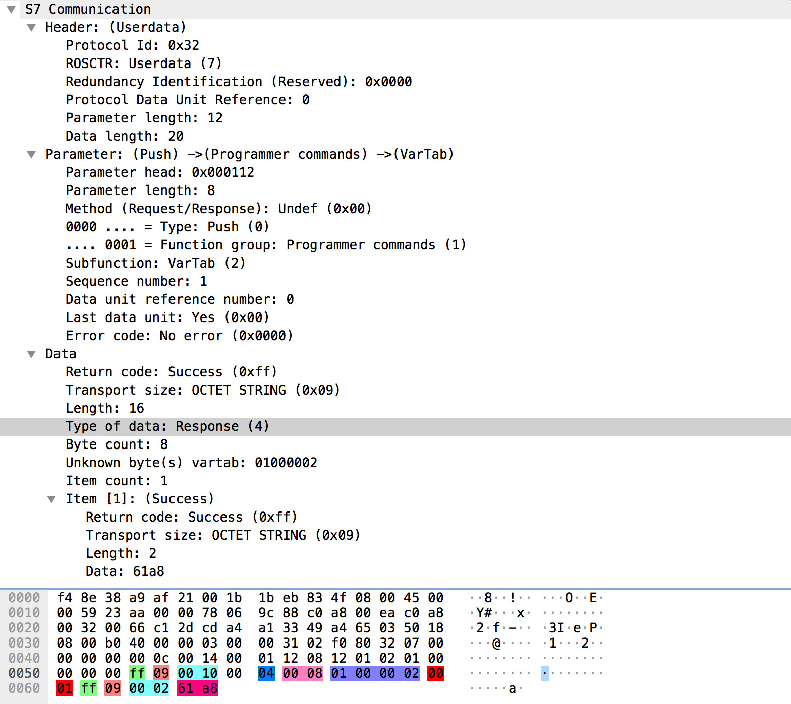

图 50 监视变量表的响应报文

从图 50 中，得知 DB100.DBW 2 的值是 61a8。

其它的子功能都比监视 / 修改变量表（VarTab）简单，在这就不一一介绍了，感兴趣的可以去研究研究。

**未完待续~**

*** 本文原创作者：LiukerTeam，本文属 FreeBuf 原创奖励计划文章，未经许可禁止转载**