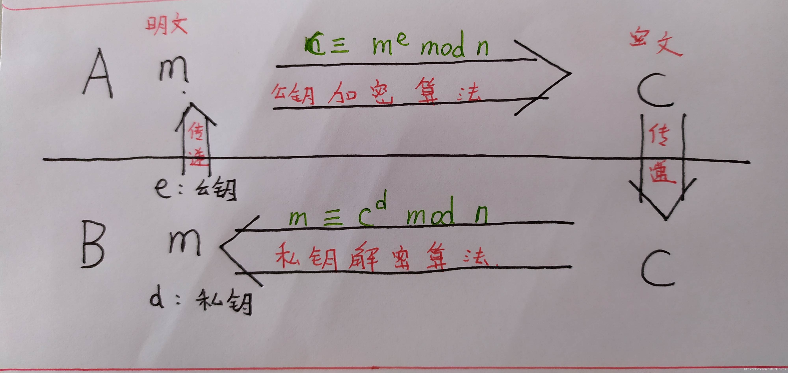

# RSA相关

RSA里面的几个基本参数。

N：大整数N，我们称之为模数（modulus）
p 和 q ：大整数N的两个因子（factor）
e 和 d：互为模反数的两个指数（exponent）
c 和 m：分别是密文和明文

而{N,e}称为公钥,{N,d}称为私钥。总的来说,明文m(一般为flag)就像是一个锁,而私钥就是打开这个锁的钥匙。我们要做的就是根 据公钥来生成这把钥匙来打开锁。而私钥中的N又是可以从公钥中获得的，所以关键就是在d的获取，d的值和p,q,e有关。p,q又是N的 两个因子，所以RSA题目关键便是对N的分解，分解出N的两个因子题目便解决了。这便是RSA题目的思路。



## 已知p,q,e，获取d

这种题目一般不难，是RSA里面的入门题目。通常可以使用python脚本解题。

```python
import gmpy2
p =gmpy2.mpz(336771668019607304680919844592337860739)
q =gmpy2.mpz(296173636181072725338746212384476813557)
e =gmpy2.mpz(65537)
phi_n= (p - 1) * (q - 1)
d = gmpy2.invert(e, phi_n)
print("d is:")
print (d)
```

## 已知e,d,N,求p,q

``` python
# coding=utf-8 import random
import libnum
d = 79636639378326691339908122673730404813380296570362148297604910660437221154417
e = 65537
n = 99742889480132178464693625265991467727088330702125690789109469022100733238623
k = e * d - 1
r = k
t = 0
while True:
    r = r / 2
    t += 1
    if r % 2 == 1:
        break
success = False
for i in range(1, 101):
    g = random.randint(0, n)
    y = pow(g, r, n)
    if y == 1 or y == n - 1:
        continue
    for j in range(1, t):
        x = pow(y, 2, n)
        if x == 1:
            success = True
            break
        elif x == n - 1:
            continue
        else:
            y = x
    if success:
        break
    else:
        continue
if success:
    p = libnum.gcd(y - 1, n)
    q = n / p
    print 'P: ' + '%s' % p
    print 'Q: ' + '%s' % q
else:
    print 'Cannot compute P and Q'
```

## 参考

* [CTF ——crypto ——RSA原理及各种题型总结](https://blog.csdn.net/vhkjhwbs/article/details/101160822)
* [CTF中的RSA套路](https://www.cnblogs.com/nul1/p/13489269.html)
* [CTF中RSA题型解题思路及技巧，附小白福利](https://www.freebuf.com/articles/others-articles/161475.html)
* [https://github.com/Ganapati/RsaCtfTool](https://github.com/Ganapati/RsaCtfTool)
* [https://github.com/3summer/CTF-RSA-tool](https://github.com/3summer/CTF-RSA-tool)