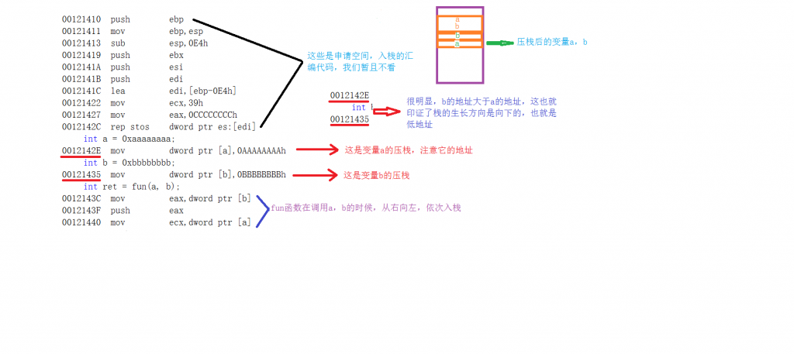

## 栈帧结构

含义：C语言中，每个栈帧对应着一个未运行完的函数。栈帧中保存了该函数的返回地址和局部变量。栈帧也叫过程活动记录，是编译器用来实现过程函数调用的一种数据结构。


参数调用


从逻辑上讲，栈帧就是一个函数执行的环境：函数参数、函数的局部变量、函数执行完后返回到哪里等等。实现上有硬件方式和软件方式(有些体系不支持硬件栈)首先应该明白，栈是从高地址向低地址延伸的。每个函数的每次调用，都有它自己独立的一个栈帧，这个栈帧中维持着所需要的各种信息。寄存器ebp指向当前的栈帧的底部（高地址），寄存器esp指向当前的栈帧的顶部（低地址）。

注意：`ebp`指向当前位于系统栈最上边一个`栈帧的底部`，而不是系统栈的底部。严格说来，`“栈帧底部”`和`“栈底”`是不同的概念;`esp`所指的`栈帧顶部`和系统栈的顶部是同一个位置。

首先画一个地址空间图给大家加深理解：


既然今天分析的是栈帧，那么肯定是在栈区展开研究，下面为大家总体上画一张栈帧结构图：


接下来，首先看一下变量压栈的次序以及对应的汇编代码：

```c
#include <stdio.h>
#include <windows.h>
int fun(int x, int y)
{
    int c = 0xcccccccc;
    printf("I am fun function!\n");
    return c;
}
int main()
{
    int a = 0xaaaaaaaa;
    int b = 0xbbbbbbbb;
    int ret = fun(a, b);
    printf("you should running here!\n");
    system("pause");
    return 0;
}
```



在main函数调用fun函数之前，也就是main的栈帧结构：main函数的栈底ebp，栈顶esp。从低地址esp到高地址ebp，就是main函数的栈帧：


现在开始调用fun函数：这里用到了一条汇编指令：call：调用函数。

call有两大功能：①保存当前指令的下一条指令②修改栈底指针ebp。换句话说：call指令的效果是将返回地址入栈，并跳转到被调用过程的起始点。返回地址是在程序中紧跟call后面的那条指令的地址，这样被调用过程返回时，执行会从此处开始。

同样的一点，我们首先看一下汇编代码：


从代码和图中不难看出，在main函数里面，地址为008B14A4 的call指令调用函数fun，其中指明了栈帧esp和程序计算器pc的值，call指令随即将返回地址008B14A9压栈，并跳转到fun的第一条指令。到此main栈帧结束。

Call命令出现预示着一个旧的栈帧的结束，也印证了新的栈帧的到来：（汇编代码过长，图中将取重要的点来说）

```asm
int fun(int x, int y)
{
008B13A0  push        ebp  
008B13A1  mov         ebp,esp  
008B13A3  sub         esp,0D8h  
008B13A9  push        ebx  
008B13AA  push        esi  
008B13AB  push        edi  
008B13AC  lea         edi,[ebp-0D8h]  
008B13B2  mov         ecx,36h  
008B13B7  mov         eax,0CCCCCCCCh  
008B13BC  rep stos    dword ptr es:[edi]  
int c = 0xcccccccc;
008B13BE  mov         dword ptr [c],0CCCCCCCCh  
int *p = &x;
008B13C5  lea         eax,[x]  
008B13C8  mov         dword ptr [p],eax  
printf("I am fun function!\n");
008B13CB  mov         esi,esp  
008B13CD  push        offset string "I am fun function!\n" (8B575Ch)  
008B13D2  call        dword ptr [__imp__printf (8B82B8h)]  
008B13D8  add         esp,4  
008B13DB  cmp         esi,esp  
008B13DD  call        @ILT+305(__RTC_CheckEsp) (8B1136h)  
p++;
008B13E2  mov         eax,dword ptr [p]  
008B13E5  add         eax,4  
008B13E8  mov         dword ptr [p],eax  
printf("before: %x\n", y);
008B13EB  mov         esi,esp  
008B13ED  mov         eax,dword ptr [y]  
008B13F0  push        eax  
008B13F1  push        offset string "before: %x\n" (8B574Ch)  
008B13F6  call        dword ptr [__imp__printf (8B82B8h)]  
008B13FC  add         esp,8  
008B13FF  cmp         esi,esp  
008B1401  call        @ILT+305(__RTC_CheckEsp) (8B1136h)  
*p = 0xdddddddd;
008B1406  mov         eax,dword ptr [p]  
008B1409  mov         dword ptr [eax],0DDDDDDDDh  
printf("after : %x\n", y);
008B140F  mov         esi,esp  
008B1411  mov         eax,dword ptr [y]  
008B1414  push        eax  
008B1415  push        offset string "after : %x\n" (8B573Ch)  
008B141A  call        dword ptr [__imp__printf (8B82B8h)]  
008B1420  add         esp,8  
008B1423  cmp         esi,esp  
008B1425  call        @ILT+305(__RTC_CheckEsp) (8B1136h)  
 
return c;
008B142A  mov         eax,dword ptr [c]  
}
008B142D  pop         edi  
008B142E  pop         esi  
008B142F  pop         ebx  
008B1430  add         esp,0D8h  
008B1436  cmp         ebp,esp  
008B1438  call        @ILT+305(__RTC_CheckEsp) (8B1136h)  
008B143D  mov         esp,ebp  
008B143F  pop         ebp  
008B1440  ret
```


```
.text:00000000004007AB ; __unwind {
.text:00000000004007AB                 push    rbp
.text:00000000004007AC                 mov     rbp, rsp
.text:00000000004007AF                 sub     rsp, 40h
.text:00000000004007B3                 mov     [rbp+var_24], edi
.text:00000000004007B6                 mov     [rbp+var_28], esi
.text:00000000004007B9                 mov     [rbp+var_2C], edx
.text:00000000004007BC                 mov     [rbp+var_30], ecx
.text:00000000004007BF                 mov     [rbp+var_34], r8d
.text:00000000004007C3                 mov     [rbp+var_38], r9d
.text:00000000004007C7                 mov     [rbp+num], 100h
.text:00000000004007CE                 mov     [rbp+buf], 0
.text:00000000004007D6                 mov     [rbp+var_18], 0
.text:00000000004007DE                 mov     edx, [rbp+var_24]
.text:00000000004007E1                 mov     eax, [rbp+var_28]
.text:00000000004007E4                 add     edx, eax
.text:00000000004007E6                 mov     eax, [rbp+var_2C]
.text:00000000004007E9                 add     edx, eax
.text:00000000004007EB                 mov     eax, [rbp+var_30]
.text:00000000004007EE                 add     edx, eax
.text:00000000004007F0                 mov     eax, [rbp+var_34]
.text:00000000004007F3                 add     edx, eax
.text:00000000004007F5                 mov     eax, [rbp+var_38]
.text:00000000004007F8                 add     edx, eax
.text:00000000004007FA                 mov     eax, [rbp+arg_0]
.text:00000000004007FD                 add     edx, eax
.text:00000000004007FF                 mov     eax, [rbp+arg_8]
.text:0000000000400802                 add     eax, edx
.text:0000000000400804                 mov     [rbp+num], eax
.text:0000000000400807                 mov     eax, [rbp+num]
.text:000000000040080A                 mov     esi, eax
.text:000000000040080C                 lea     rdi, format     ; "%d\n"
.text:0000000000400813                 mov     eax, 0
.text:0000000000400818                 call    _printf
.text:000000000040081D                 lea     rdi, s          ; "get name:"
.text:0000000000400824                 call    _puts
.text:0000000000400829                 lea     rax, [rbp+buf]
.text:000000000040082D                 mov     edx, 100h       ; nbytes
.text:0000000000400832                 mov     rsi, rax        ; buf
.text:0000000000400835                 mov     edi, 0          ; fd
.text:000000000040083A                 mov     eax, 0
.text:000000000040083F                 call    _read
.text:0000000000400844                 mov     eax, 0
.text:0000000000400849                 leave
.text:000000000040084A                 retn
.text:000000000040084A ; } // starts at 4007AB
```

返回地址 ebp+8 (x64)
canary   ebp-8(x64)


## 查看so库的方法

```
1.nm -D libxxx.so 打印出符号信息。
我一般这样用：nm -D libxxx.so |grep T
2.ldd libxxx.so 查看依赖关系
3.readelf -a libxxxx.so 用来读取elf信息
我一般这样用：readelf libxxx.so |grep NEEDED 这样也可以读取依赖关系
4.objdump -d libxxxx.so
5.rmp -qfl libxxx.so 这样可以查看so库里面包含的内容，头文件等
6.file libxxx.so 这样可以查看so库的属性
```